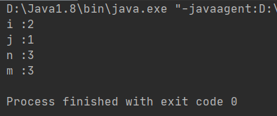

# i++,++i的区别
## 1. 基本含义
| 运算符 | 含义 | 实例 | 结果 |
| --- | --- | --- | --- |
| i++ | 将 i 的值先使用, 再加 1 赋值给 i 变量本身 | int i=1; int j=i++; | i=2 j=1 |
| ++i | 将 i 的值先加 1 赋值给变量 i 本身后, 再使用 | int i=1; int j=++i; | i=2 j=2 |
| i-- | 将 i 的值先使用, 再减 1 赋值给变量 i 本身 | int i=1; int j=i--; | i=0 j=1 |
| --i | 将 i 的值先减 1 后赋值给变量 i 本身, 再使用 | int i=1; int j=--i; | i=0 j=0 |

## 2. 代码示例
```java
public void test(){
    int i = 1;
    int j = i++; // i先赋值给j，j=1，然后i自身加1，i=2
    int n = 2;
    int m = ++n; // n自身先加1，n=3，然后赋值给m m=3;
    System.out.println("i :"+ i);
    System.out.println("j :"+ j);
    System.out.println("n :"+ n);
    System.out.println("m :"+ m);
}
```
## 3. 运行结果

