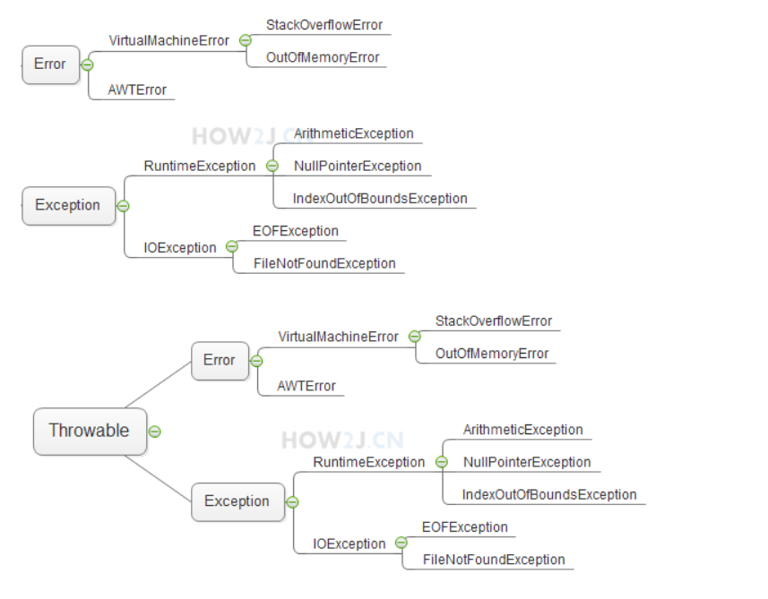

#草稿 #笔记 

SourceURL: https://how2j.cn

**元注解**
@Target({METHOD,TYPE}) 表示这个注解可以用用在类/接口上，还可以用在方法上
@Retention(RetentionPolicy.RUNTIME) 表示这是一个运行时注解，即运行起来之后，才获取注解中的相关信息，而不像基本注解如@Override 那种不用运行，在编译时eclipse就可以进行相关工作的编译时注解。
@Inherited 表示这个注解可以被子类继承
@Documented 表示当执行javadoc的时候，本注解会生成相关文档

**函数式接口**
@FunctionalInterface这是Java1.8 新增的注解，用于约定函数式接口。
函数式接口概念： 如果接口中只有一个抽象方法（可以包含多个默认方法或多个static方法），该接口称为函数式接口。函数式接口其存在的意义，主要是配合Lambda 表达式 来使用。

**@SuppressWarnings**
就对这些警告进行了抑制，即忽略掉这些警告信息。
@SuppressWarnings 有常见的值，分别对应如下意思
1.deprecation：使用了不赞成使用的类或方法时的警告(使用@Deprecated使得编译器产生的警告)；
2.unchecked：执行了未检查的转换时的警告，例如当使用集合时没有用泛型 (Generics) 来指定集合保存的类型; 关闭编译器警告
3.fallthrough：当 Switch 程序块直接通往下一种情况而没有 Break 时的警告;
4.path：在类路径、源文件路径等中有不存在的路径时的警告;
5.serial：当在可序列化的类上缺少 serialVersionUID 定义时的警告;
6.finally：任何 finally 子句不能正常完成时的警告;
7.rawtypes 泛型类型未指明
8.unused 引用定义了，但是没有被使用
9.all：关于以上所有情况的警告。


**反射机制**
与传统的通过new 来获取对象的方式不同
反射机制，会先拿到Hero的“类对象”,然后通过类对象获取“构造器对象”
再通过构造器对象创建一个对象

**异常处理**



**throws与throw**
这两个关键字接近，不过意义不一样，有如下区别：
1. throws 出现在方法声明上，而throw通常都出现在方法体内。
2. throws 表示出现异常的一种可能性，并不一定会发生这些异常；throw则是抛出了异常，执行throw则一定抛出了某个异常对象。

考虑如下情况：
主方法调用method1
method1调用method2
method2中打开文件
method2中需要进行异常处理
但是method2不打算处理，而是把这个异常通过throws抛出去
那么method1就会接到该异常。 处理办法也是两种，要么是try catch处理掉，要么也是抛出去。
method1选择本地try catch住 一旦try catch住了，就相当于把这个异常消化掉了，主方法在调用method1的时候，就不需要进行异常处理了

**Java的异常处理办法** 

```java
public class TestException {
 
    public static void main(String[] args) {
 
        File f = new File("d:/LOL.exe");
 
        try {
            System.out.println("试图打开 d:/LOL.exe");
            new FileInputStream(f);
            System.out.println("成功打开");
            SimpleDateFormat sdf = new SimpleDateFormat("yyyy-MM-dd");
            Date d = sdf.parse("2016-06-03");
        } catch (FileNotFoundException | ParseException e) {
            if (e instanceof FileNotFoundException)
                System.out.println("d:/LOL.exe不存在");
            if (e instanceof ParseException)
                System.out.println("日期格式解析错误");
 
            e.printStackTrace();
        }
 
    }
}
```

