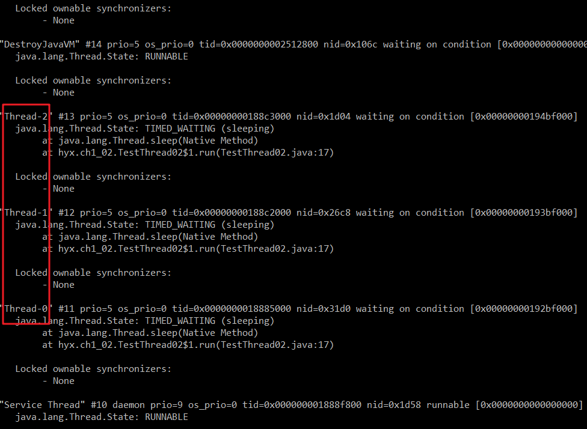

# 示例代码块
```java
package hyx.ch1_02;

/**
 * @author Yunxiong
 * @version 1.0
 * @date 8/21/2020
 */
public class TestThread02 {
    public static void main(String[] args) {
        for (int i = 0; i < 3; i++) {
            new Thread(){
                @Override
                public void run() {
                    try {
                        System.out.println(Thread.currentThread().getName() + "  正在运行！");
                        Thread.sleep(500000);
                    } catch (InterruptedException e) {
                        e.printStackTrace();
                    }
                }
            }.start();
        }
    }
}
```
# 运行结果

# 方法一： jps + jstack



# 方法二：jmc.exe
在bin目录下找到该可执行文件 D:\Java1.8\bin\jmc.exe


# 方法三：jvisualvm.exe
同理在bin目录下找到该程序即可。D:\Java1.8\bin\jvisualvm.exe，该可视化工具还能看到jvm内存结构的情况

