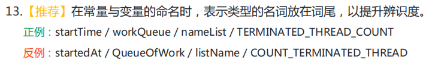
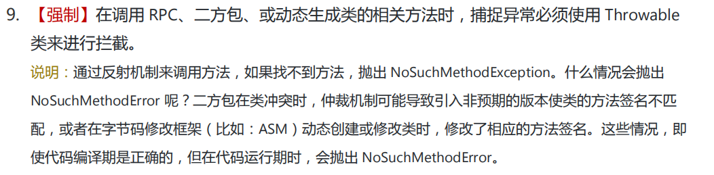
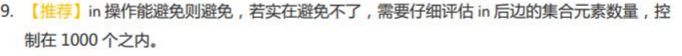

> 摘自「阿里巴巴 Java技术编程规范」

## 一、编程规约
### 命名风格
#### 哈哈。main里面的都被charge了。

#### POJO布尔类型不要用is前缀

#### 爸爸和儿子还是要区分一下，增强可读性

#### 名词在尾

#### 接口类中的方法和属性 不要添加修饰符

#### Enum类要大写

## 二、异常日志
### 异常处理
#### 关于大段地try-catch，需要细分捕获地错误

#### 使用Throwable进行拦截

### 日志规约
#### 日志级别的开闭问题

#### 使用占位符

## 三、单元测试
### 画圈的是什么意思？概念不同，理解不了。

### 如何理解语句覆盖率？

### 哈哈哈，说的就是自己，开始的时候做法

### 如何理解？需要学习策略模式，状态模式

## 四、安全规约
### 什么是反序列化注入？什么是ReDos？
### 什么是CSRF？具体的原理是什么？

## 五、MySQL数据库
### 建表规约
#### 表名，字段名都只能使用小写，虽然说在Windows上，MySQL大小写不敏感，但是对于Linux来说是敏感的
#### 小数的存放类型
什么时候需要分库分表？
#### 字符存储长度

### 索引规约
#### 这就很强了，是不是说超过三个表的就是慎重考虑join？还是说针对索引而言？

#### 索引的长度也是有要求的

#### 不太理解，需要去看下相关的索引的概念和要求

#### 什么是回表？

#### 延迟关联是什么？

#### 什么是组合索引？

### SQL语句
#### 开头就暴击，以后不适用select count(1)了，使用 select count(*) 更香！

#### NULL 大佬的就是 有排面

#### 啊？ 存储过程这么没有地位吗？

#### 为什么要避免 in？ 

#### 关于Truncate和Delete

### ORM映射
#### 什么是resultClass? MyBatis里面的吗？

#### 关于<isEqual>

## 八、工程结构
### 各种Object的模型规范

