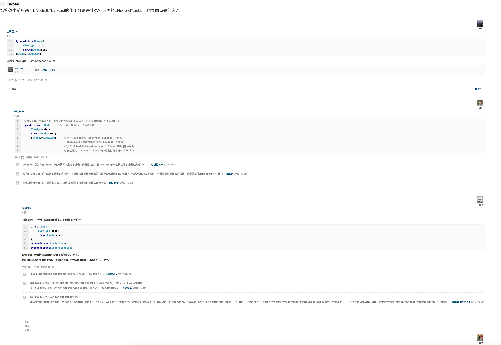

C-结构体中前后两个LNode和*LinkList的作用分别是什么？后面的LNode和*LinkList的异同点是什么

  

# 结构体中前后两个LNode和*LinkList的作用分别是什么？后面的LNode和*LinkList的异同点是什么？

[启明星Joe](http://www.dewen.net.cn/people/79196817)

1 票

62

  

1.  typedef struct LNode{
    
2.      ElemType data;
    
3.      struct LNode *next;
    
4.  }LNode,*LinkList;
    

其中ElemType已被typedef命名为int

6577

编辑于[2013-10-03](http://www.dewen.net.cn/question/7098/revision)

[评论 (](file:///Applications/%E5%8D%B0%E8%B1%A1%E7%AC%94%E8%AE%B0.app/Contents/Resources/common-editor-mac/uno-mac.html#)[0](#)) • [分享](file:///Applications/%E5%8D%B0%E8%B1%A1%E7%AC%94%E8%AE%B0.app/Contents/Resources/common-editor-mac/uno-mac.html#) • [链接](file:///Applications/%E5%8D%B0%E8%B1%A1%E7%AC%94%E8%AE%B0.app/Contents/Resources/common-editor-mac/uno-mac.html#) • 2012-10-27　

5个答案

[票 数 ](file:///Applications/%E5%8D%B0%E8%B1%A1%E7%AC%94%E8%AE%B0.app/Contents/Resources/common-editor-mac/uno-mac.html#) 

[HK_Max](http://www.dewen.net.cn/people/16666017)

68

最佳答案

  

1.  //你应该是在学单链表吧，我猜你的结构体可能写错了，附上我的猜测，若没错请@一下
    
2.  typedef struct LNode{    //此行的LNode是一个结构标签
    
3.      ElemType data;
    
4.      struct LNode *next;
    
5.      }LNode,*LinkList;    //此行的LNode是结构体struct LNode的一个别名
    
6.                           //*LinkList也是结构体struct LNode的一个别名
    
7.                           //换言之LinkList是结构体struct LNode类型的指针的别名
    
8.                           //也就是说  struct LNode *p;这条语句等同于LinkList p;
    

[评论 (](file:///Applications/%E5%8D%B0%E8%B1%A1%E7%AC%94%E8%AE%B0.app/Contents/Resources/common-editor-mac/uno-mac.html#)[3](#)) • [链接](file:///Applications/%E5%8D%B0%E8%B1%A1%E7%AC%94%E8%AE%B0.app/Contents/Resources/common-editor-mac/uno-mac.html#) • 2012-10-27

0

so good...那为什么LNode *P的P就可以指向单链表中的任意结点，而LinkList P的P就默认是单链表的头指针？？ – [启明星Joe](http://www.dewen.net.cn/people/79196817) 2012-10-27

0

没有说LinkList P的P就是单链表的头指针，不过通常都是把单链表的头指针赋值给P而已，这样可以让代码更加容易理解，一看就是到是链表头指针，这个就是使用typedef的一个作用 – [kelvin](http://www.dewen.net.cn/people/50203780) 2012-10-27

0

@启明星Joe p只是个变量名而已，只要你的变量名符合规则叫什么都无所谓 – [HK_Max](http://www.dewen.net.cn/people/16666017) 2012-10-28

[floatsky](http://www.dewen.net.cn/people/69198783)

2 票

[!
493

把代码改一下也许你就能看懂了。你的代码等价于：

  

1.  struct LNode {
    
2.      ElemType data;
    
3.      struct LNode next;
    
4.  };
    
5.  typedef struct LNode LNode；
    
6.  typedef struct LNode* LinkList;
    

LNode只是结构体struct LNode的简称、别名。

而LinkList则是指针类型，指向LNode（也就是struct LNode）的指针。

[评论 (](file:///Applications/%E5%8D%B0%E8%B1%A1%E7%AC%94%E8%AE%B0.app/Contents/Resources/common-editor-mac/uno-mac.html#)[3](#)) • [链接](file:///Applications/%E5%8D%B0%E8%B1%A1%E7%AC%94%E8%AE%B0.app/Contents/Resources/common-editor-mac/uno-mac.html#) • 2012-10-27

0

也就是说结构体名和结构体变量名相同为（LNode）也没冲突？？ – [启明星Joe](http://www.dewen.net.cn/people/79196817) 2012-10-27

0

@启明星Joe 注意！这里没有变量！这里定义的都是类型！LNode也是类型，只是struct LNode的别名。

至于你的问题，结构体名和结构体变量名能不能相同，你可以自己做实验来验证。 – [floatsky](http://www.dewen.net.cn/people/69198783) 2012-10-27

0

@启明星Joe 书上应该有很明确的解释的吧。

用白话来解释floatsky的话，意思就是：LNode只是起的一个名字，它并不是一个参数类型，这个名字只代表了一种数据结构，这个数据结构的样式就是花括号里面所括着的那两个成员：一个数据，一个指向下一个同样类型节点的指针。而typedef struct LNode* LinkList;这一句则是定义了一个名字叫LinkList的指针，这个指针指向一个也属于LNode这种类型数据结构的一个结点。 – [HandsomeKyle](http://www.dewen.net.cn/people/52585573) 2012-10-29

社区维基

2 票

499

typedef struct LNode{

ElemType data;

struct LNode next; }LNode,*LinkList;

其中第一个LNode是定义的结构体数据结构类型名，第二个LNode是定义结构体的别名，而LinkList是指向该结构体变量的指针

[评论 (](file:///Applications/%E5%8D%B0%E8%B1%A1%E7%AC%94%E8%AE%B0.app/Contents/Resources/common-editor-mac/uno-mac.html#)[0](#)) • [链接](file:///Applications/%E5%8D%B0%E8%B1%A1%E7%AC%94%E8%AE%B0.app/Contents/Resources/common-editor-mac/uno-mac.html#) • 2012-10-28

[Deffi](http://www.dewen.net.cn/people/59480332)

  

1.  typedef int ElemType
    
2.  typedef struct node
    
3.  {
    
4.    ElemType data;
    
5.    struct node *next;         //*next为指向struct node结构体的指针
    
6.  }Node,List;                  //Node（=struct node）为结构体变量名，*List为指向此结构体的指针类型（一般指向头结点）
    

[评论 (](file:///Applications/%E5%8D%B0%E8%B1%A1%E7%AC%94%E8%AE%B0.app/Contents/Resources/common-editor-mac/uno-mac.html#)[0](#)) • [链接](file:///Applications/%E5%8D%B0%E8%B1%A1%E7%AC%94%E8%AE%B0.app/Contents/Resources/common-editor-mac/uno-mac.html#) • 2012-10-27

[赵久辉](http://www.dewen.net.cn/people/23051843)

首先前面那个LNode是节点名称，自定义一个节点，里面包含数据和指想向下一个数据的指针。后面那个LNode是结构体名字，*LinkList是指向结构体的指针。

[评论 (](file:///Applications/%E5%8D%B0%E8%B1%A1%E7%AC%94%E8%AE%B0.app/Contents/Resources/common-editor-mac/uno-mac.html#)[0](#)) • [链接](file:///Applications/%E5%8D%B0%E8%B1%A1%E7%AC%94%E8%AE%B0.app/Contents/Resources/common-editor-mac/uno-mac.html#) • 2012-10-27

## 不是您所需，查看更多相关问题与答案

[linklist 中*](http://www.dewen.net.cn/search/q/linklist%20%E4%B8%AD*), [家谱结构](http://www.dewen.net.cn/search/q/%E5%AE%B6%E8%B0%B1%E7%BB%93%E6%9E%84), [结构体 前后](http://www.dewen.net.cn/search/q/%E7%BB%93%E6%9E%84%E4%BD%93%20%E5%89%8D%E5%90%8E), [lnode](http://www.dewen.net.cn/search/q/lnode), [内和齐是什么结构?](http://www.dewen.net.cn/search/q/%E5%86%85%E5%92%8C%E9%BD%90%E6%98%AF%E4%BB%80%E4%B9%88%E7%BB%93%E6%9E%84?)

德问是一个专业的编程问答社区，请 [登录](http://www.dewen.net.cn/q/7098#) 或 [注册](http://www.dewen.net.cn/account/reg) 后再提交答案