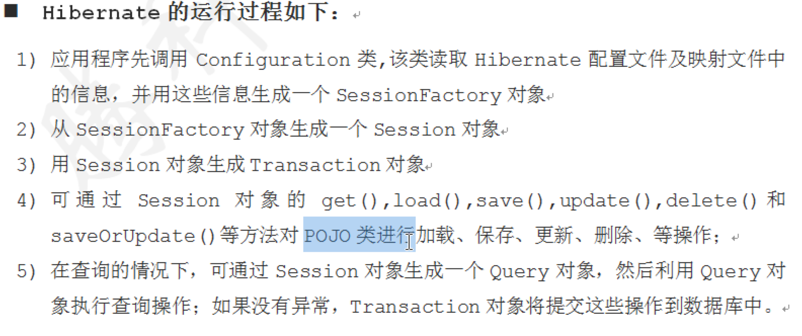

Hibernate简单记录

特点：

开源和轻量级： Hibernate框架是根据LGPL许可证和轻量级的开源工具。

快速性能： Hibernate框架的性能很快，因为缓存在Hibernate框架内部使用。 hibernate框架中有两种类型的缓存：一级缓存和二级缓存。一级缓存默认是启用的。

数据库独立查询： HQL(Hibernate查询语言)是面向对象的SQL版本。 它生成数据库独立查询。 所以你不需要编写数据库特定的查询语句。 在Hibernate之前，如果项目更改了数据库，我们需要更改SQL查询，从而导致维护变得非常复杂。

自动创建表： Hibernate框架提供了自动创建数据库表的功能。 因此，无需手动在数据库中创建表。

简化复杂连接： 在hibernate框架中可轻松获取多个表中的数据。

提供查询统计和数据库状态： Hibernate支持查询缓存，并提供有关查询和数据库状态的统计信息。

---

# hibernate 随堂笔记

day01_review

-   软件分层架构
    
    （一）概述
    
    在软件体系架构设计中，分层式结构是最常见，也是最重要的一种结构。微软推荐的分层式结构一般分为三层，从下至上分别为：数据访问层、业务逻辑层（又或称为领域层）、表示层。****
    
    1、表示层（UI）：通俗讲就是展现给用户的界面，即用户在使用一个系统的时候他的所见所得。（jsp,html) 　　
    
    2、业务逻辑层（BLL）：针对具体问题的操作，也可以说是对数据层的操作，对数据业务逻辑处理。(javabean)
    
    3、数据访问层（DAL）：该层所做事务直接操作数据库，针对数据的增添、删除、修改、查找等(jdbc,hibernate)
    
-   ORM概述
    
    object ralation mapping
    
    1 表---实体类
    
    2 字段-----属性
    
    3 对象---记录（都是操作对象）
    
    ORM相关的框架：hibernate，toplink.....
    
-   hibernate概述
    
    他是一个ORM的开源框架，是对jdbc做了封装的代码
    
-   hibernate 开发步骤
    
    1）导入hibernate所需要的jar包
    
    2）编写hibernate.cfg.xml文件

实体类：

vo : value-object，只用来封装数据

pojo:和数据库关联的vo

javabean ：除了数据的封装还有业务逻辑方法