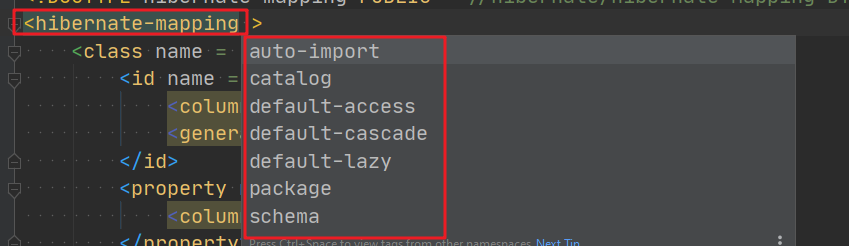

框架配置文件：hibernate.cfg.xml
主要配置数据库连接，映射文件等

```xml
<?xml version="1.0" encoding="utf-8"?>
<!DOCTYPE hibernate-configuration PUBLIC "-//Hibernate/Hibernate Configuration DTD 3.0//EN" "http://hibernate.sourceforge.net/hibernate-configuration-3.0.dtd">
<hibernate-configuration>

    <session-factory>
        
        <!--数据库源配置-->
        <property name="connection.username">root</property>
        <property name="connection.password">root</property>
        <property name="connection.driver_class">com.mysql.cj.jdbc.Driver</property>
        <property name="connection.url">jdbc:mysql://localhost:3306/mytest</property>

        <!-- C3P0 -->
      	<!-- 数据库连接池的最大连接数  -->
        <property name="hibernate.c3p0.max_size">20</property>
      	<!-- 数据库连接池的最小连接数  -->
        <property name="hibernate.c3p0.min_size">5</property>
      	<!-- 数据库连接池中的连接耗尽时，自动扩展多少个连接数  -->
        <property name="hibernate.c3p0.acquire_increment">10</property>
				<!-- 表示多久检测一次数据库连接池中连接对象，看是否超时  -->
        <property name="hibernate.c3p0.idle_test_period">10000</property>
      	<!-- 数据库连接池中的连接对象在多长时间没有使用后，应该被销毁  -->
        <property name="hibernate.c3p0.timeout">5000</property>
				<!-- 缓存Statement对象的数量  -->
        <property name="hibernate.c3p0.max_statements">10</property>

        <!--数据库方言-->
        <property name="dialect">org.hibernate.dialect.MySQLDialect</property>

        <!--打印，格式化SQL-->
        <property name="show_sql" >true</property>
        <property name="format_sql">true</property>

        <!--批量操作-->
        <property name="hibernate.jdbc.fetch_size"></property>
        <property name="hibernate.jdbc.batch_size"></property>

        <!--是否自动生成数据表-->
        <property name="hibernate.hbm2ddl.auto"></property>
      
        <!--注册实体关系映射文件-->
<!--        <mapping resource="com/sean/entity/People.hbm.xml"></mapping>
        <mapping resource="com/sean/entity/Customer.hbm.xml"></mapping>
        <mapping resource="com/sean/entity/Order.hbm.xml"></mapping>
        <mapping resource="com/sean/entity/Students.hbm.xml"></mapping>
        <mapping resource="com/sean/entity/Courses.hbm.xml"></mapping>-->
        <mapping resource="com/sean/entity/News.hbm.xml"></mapping>
    </session-factory>

</hibernate-configuration>
```
属性的介绍

- hibernate.hbm2ddl.auto
   - validate 加载hibernate时，验证创建数据库表结构
   - create 每次加载hibernate，重新创建数据库表结构，这就是导致数据库表数据丢失的原因。
   - create-drop 加载hibernate时创建，退出是删除表结构
   - update 加载hibernate自动更新数据库结构
- hibernate.jdbc.fetch_size
   - 设定JDBC的Statement读取数据的时候每次从数据库中取出的记录条数；实则调用Statement.setFetchSize方法；
   - 建议值 fetchSize=100
- hibernate.jdbc.batch_size
   - 设定对数据库进行批量删除、批量更新、批量插入的时候的批次大小；数字越大，批量操作发送sql的次数越少，速度越快。
   - 建议值 batchSize=30

对应的DTD文件，总的来说不是很复杂，主要就是session-factory,security两个子节点，可说的属性不多。security节点暂时没有接触使用过。
```
<!-- Hibernate file-based configuration document.

<!DOCTYPE hibernate-configuration PUBLIC
	"-//Hibernate/Hibernate Configuration DTD 3.0//EN"
	"http://hibernate.sourceforge.net/hibernate-configuration-3.0.dtd">

An instance of this document contains property settings and references
to mapping files for a number of SessionFactory instances to be listed
in JNDI.

-->

<!ELEMENT hibernate-configuration (session-factory,security?)>

<!ELEMENT property (#PCDATA)>
<!ATTLIST property name CDATA #REQUIRED>

<!ELEMENT mapping EMPTY> <!-- reference to a mapping file -->
<!ATTLIST mapping resource CDATA #IMPLIED>
<!ATTLIST mapping file CDATA #IMPLIED>
<!ATTLIST mapping jar CDATA #IMPLIED>
<!ATTLIST mapping package CDATA #IMPLIED>
<!ATTLIST mapping class CDATA #IMPLIED>

<!ELEMENT class-cache EMPTY>
<!ATTLIST class-cache class CDATA #REQUIRED>
<!ATTLIST class-cache region CDATA #IMPLIED>
<!ATTLIST class-cache usage (read-only|read-write|nonstrict-read-write|transactional) #REQUIRED>
<!ATTLIST class-cache include (all|non-lazy) "all">

<!ELEMENT collection-cache EMPTY>
<!ATTLIST collection-cache collection CDATA #REQUIRED>
<!ATTLIST collection-cache region CDATA #IMPLIED>
<!ATTLIST collection-cache usage (read-only|read-write|nonstrict-read-write|transactional) #REQUIRED>

<!ELEMENT event (listener*)>
<!ATTLIST event type (auto-flush|merge|create|create-onflush|delete|dirty-check|evict|flush|flush-entity|load|load-collection|lock|refresh|replicate|save-update|save|update|pre-load|pre-update|pre-insert|pre-delete|post-load|post-update|post-insert|post-delete|post-commit-update|post-commit-insert|post-commit-delete) #REQUIRED>

<!ELEMENT listener EMPTY>
<!ATTLIST listener type (auto-flush|merge|create|create-onflush|delete|dirty-check|evict|flush|flush-entity|load|load-collection|lock|refresh|replicate|save-update|save|update|pre-load|pre-update|pre-insert|pre-delete|post-load|post-update|post-insert|post-delete|post-commit-update|post-commit-insert|post-commit-delete) #IMPLIED>
<!ATTLIST listener class CDATA #REQUIRED>

<!ELEMENT session-factory (property*, mapping*, (class-cache|collection-cache)*, event*, listener*)>
<!ATTLIST session-factory name CDATA #IMPLIED> <!-- the JNDI name -->

<!ELEMENT security (grant*)>
<!ATTLIST security context CDATA #REQUIRED> <!--the JACC contextID-->

<!ELEMENT grant EMPTY>
<!ATTLIST grant role CDATA #REQUIRED>
<!ATTLIST grant entity-name CDATA #REQUIRED>
<!ATTLIST grant actions CDATA #REQUIRED>

```
对象关系映射文件 ： XXX.hbm.xml
示例文件配置：建议一个实体对象对应一个映射文件
```xml
<?xml version="1.0" encoding="utf-8"?>
<!DOCTYPE hibernate-mapping PUBLIC "-//Hibernate/Hibernate Mapping DTD 3.0//EN" "http://hibernate.sourceforge.net/hibernate-mapping-3.0.dtd">
<hibernate-mapping>
    <class name = "com.sean.entity.Customer" table="customer">
        <id name = "id" type="java.lang.Integer">
            <column name="id"></column>
            <generator class="identity"></generator>
        </id>
        <property name="name" type="java.lang.String">
            <column name="name"></column>
        </property>
    <set name="orderList" table="order"  lazy="false">
        <key column="cid"></key>
        <one-to-many class="com.sean.entity.Order"></one-to-many>
    </set>
    </class>

</hibernate-mapping>
```
DTD文件比较复杂，涉及的节点很多，挑出比较常用的节点，主节点是 hibernate-mapping
```xml
<!ELEMENT hibernate-mapping (
	meta*, 
	typedef*, 
	import*, 
	(class|subclass|joined-subclass|union-subclass)*,
    resultset*,
	(query|sql-query)*,
	filter-def*,
    database-object*
)>
	<!ATTLIST hibernate-mapping schema CDATA #IMPLIED>									<!-- default: none -->
	<!ATTLIST hibernate-mapping catalog CDATA #IMPLIED>									<!-- default: none -->
	<!ATTLIST hibernate-mapping default-cascade CDATA "none">
	<!ATTLIST hibernate-mapping default-access CDATA "property">
	<!ATTLIST hibernate-mapping default-lazy (true|false) "true">
	<!ATTLIST hibernate-mapping auto-import (true|false) "true">
	<!ATTLIST hibernate-mapping package CDATA #IMPLIED>									<!-- default: none -->
....
....
....
```

- 主元素节点



- <class>节点，可以理解成是对表的操作


   - dynamic-insert
      - 只会insert涉及到的column，默认false
      - 比如：people表有三个字段，id，name，money
      - 在dynamic-insert=false的时候，操作people.setName("sean"); session.save(people); 后台打印的sql是 insert into people （name，money） values（"sean", null）；仅仅修改了name，但这里没有涉及到money操作，也进行了置空操作。
      - 当dynamic-insert=true时，同样的操作，打印出来的sql就不包括money： insert into people （name） values（"sean"）；
   - dynamic-update（和dynamic-insert同理）默认是false
      - 只会update涉及到的列
   - lazy 是否使用延迟加载
   - mutable 如果是true，等同于在property元素的update属性为false，即该字段不被更新
   - where可以条件查询条件
- id元素节点， class的子节点


unsaved-value：hibernate会通过比较持久化类的OID值和该属性值来区分当前持久类的对象是否为临时对象
 id属性

- name：实体类属性名
- type：实体类属性数据类型 （可以是Java类型或者Hibernate映射类型）
- column：数据表的主键字段名
- generator：主键生成策略
   - hilo算法
      - 会创建一个id表；第一次id为1，第二次为最大值，第三次为2，第四次为最大值-1.高低算法
   - increment：hibernate自增
      - 读取表中的主键id最大值，下次进行插入操作时，主键id为：max(id) +1 ；因此OID必须是long，int，short类型
      - 不依赖数据库，适用于所有数据库；适用于单个数据库，不适用于集群；
   - identity：
      - 数据库自增，需要数据库底层支持id自增机制（oracle不支持）
      - OID需要是long，int，short类型
   - native：
      - 本地策略，根据数据库自动选择主键生成的策略（Oracle和MySQL的主键生成策略不一样）
   - uuid：哈希算法
   - select 算法

对象标识符OID
hibernate使用OID来建立内存中的对象和数据库表中记录的对应关系；hibernate推荐使用不具有业务含义的代理逐渐；
<id> 元素用来设置对象标识符；<generator> 子元素用来设定标识符生成器；


- property节点
- 问题：一对多的双方都在维护主外键关系，会出现重复维护的情况。
   - 解决：
   - 在java中，控制只有其中一方去维护关系
   - 配置：inverse = true 放弃维护，维护权交给别人；一般是让多的一方Orders维护，在一的一方Customer添加这个配置
- cascade：级联操作
   - 删除主表的信息，有外键约束，必须先删除从表中被关联的信息。
   - 在实体关系映射文件中，设置cascade=delete，会自动去删除对应地从表信息，不需要显示指定。
   - 

- formula属性
   - 可以进行一些数据库函数的操作
   - **formula**="(select concat(title,author) from news n where n.id = id )"
- 

- 


Java类型、Hibernate映射类型以及SQL类型之间的对应关系

| **Java类型** | **Hibernate映射类型** | **标准SQL类型** | **字节大小** |
| --- | --- | --- | --- |
| java.lang.Integer/int | integer/int | INTEGER | 4Byte |
| java.lang.Long/long | long | BIGINT | 8Byte |
| java.lang.Short/short | short | SMALLINT | 2Byte |
| java.lang.Byte/byte | byte | TINYINT | 1Byte |
| java.lang.Float/float | float | FLOAT | 4Byte |
| java.lang.Double/double | double | DOUBLE | 8Byte |
| java.math.BigDecimal | big_decimal | NUMERIC | 
 |
| java.lang.Character/java.lang.String/char | character | CHAR | 定长字符 |
| java.lang.String | string | VARCHAR | 变长字符 |
| java.lang.Boolean/boolean | boolean/yes_no/true_false | BIT | 布尔类型 |
| 实现java.io.Serializable接口的任意Java类 | serializable | BLOB | BLOB |
| java.lang.Class | class | VARCHAR | 定长字符 |
| java.util.Locale | locale | VARCHAR | 定长字符 |
| java.util.TimeZone | timezone | VARCHAR | 定长字符 |
| java.util.Currency | currency | VARCHAR | 定长字符 |

java.util.Date是java.sql.Date, java.sql.Time, java.sql.TimeStamp的父类


| **Java类型** | **Hibernate映射类型** | **标准SQL类型** | **描述(java中表示)** |
| --- | --- | --- | --- |
| java.util.Date/java.sql.Date | date | DATE | 日期：yyyy-MM-dd |
| java.util.Date/java.sql.Time | time | TIME | 时间：HH:mm:ss |
| java.util.Date/java.util.Timestamp | timestamp | TIMESTAMP | 日期和时间：
yyyy-MM-dd HH:mm:ss |
| java.util.Calendar | calendar | TIMESTAMP | 同上 |
| java.util.Calendar | calendar_dar | DATE | 日期：yyyy-MM-dd |


映射Java大对象（了解）

| **Java类型** | **Hibernate映射类型** | **标准SQL类型** | **MySQL类型** | **Oracle类型** |
| --- | --- | --- | --- | --- |
| byte[] | binary | VARCHAR/BLOB | BLOB | BLOB |
| java.lang.String | text | CLOB | TEXT | CLOB |
| java.sql.Clob | clob | CLOB | TEXT | CLOB |
| java.sql.Blob | blob | BLOB | BLOB | BLOB |


构建组成关系
例子：pay类没有id，依赖worker类，而这两个类在数据表中在同一张表中
使用component元素，
该元素用来映射组成关系，class设定组成关系属性的类型
<parent>元素指定组件属性所属的整体类
name指定整体类


| ID | WORKER_NAME | MONTHLY_PAY | YEARLY_PAY | VOCATION_WITH_PAY |
| --- | --- | --- | --- | --- |
| 1 | aaaa | 200000 | 5000000 | 5 |
|  |  |  |  |  |

