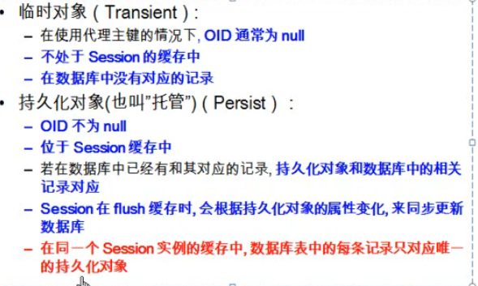
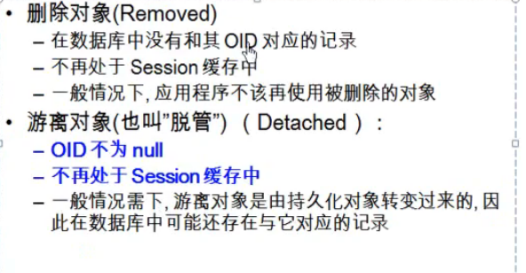
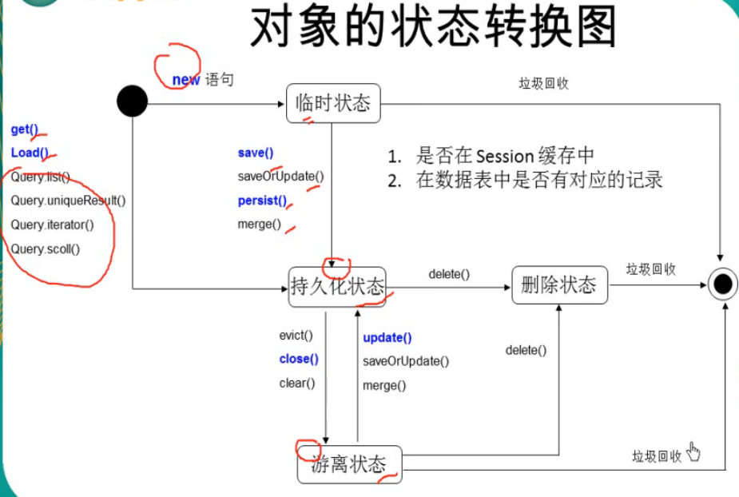
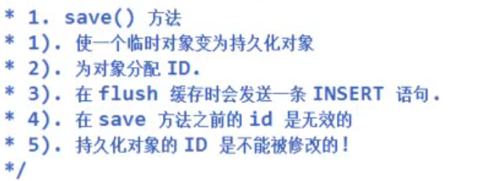
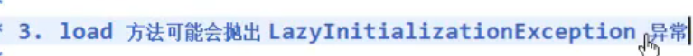
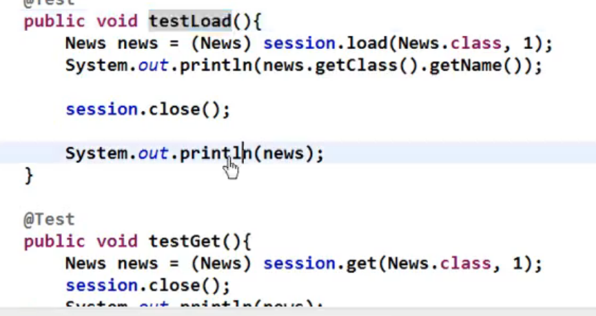
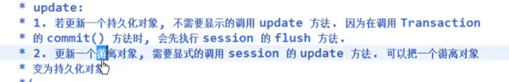
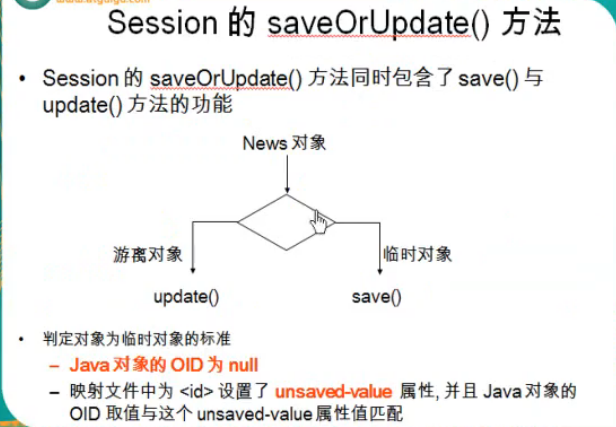
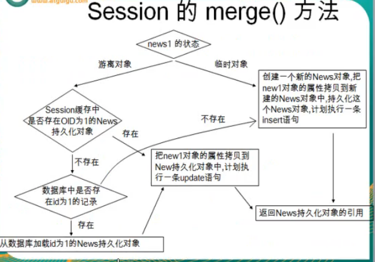
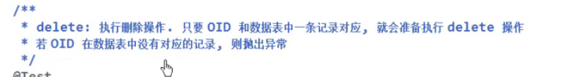

## session的核心方法
session的对象状态
临时对象
持久化对象

对象的状态转换图

# save方法

## persist方法
和save基本相同。也会执行insert操作
与save相比较下，在persist之前设置id会报错

# get方法，立即检索
获取对象
## load方法，延迟检索
与get也是类似的获取对象，
但是如果没有使用对象的话，不会去数据库拿数据，而get方法会立即去拿数据；
如果数据库表没有对应的记录，get返回null，load方法报错
在使用对象之前关闭session的话。get方法没有问题，因为执行get的时候已经去拿数据了。而load方法会懒加载异常

# update方法

# saveOrUpdate方法

## meger方法

## delete 方法
并不是马上删除。
配置 hibernate.use_identifier_rollback 为true，使删除对象后使OID为null

## evict方法
从session缓存把指定的持久化对象移除

调用存储过程
sessiong.dowork（）

