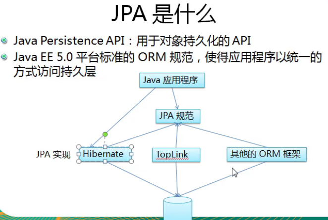
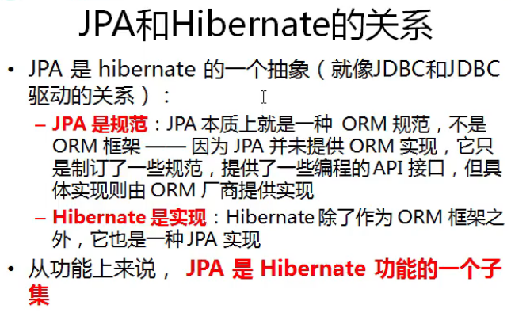
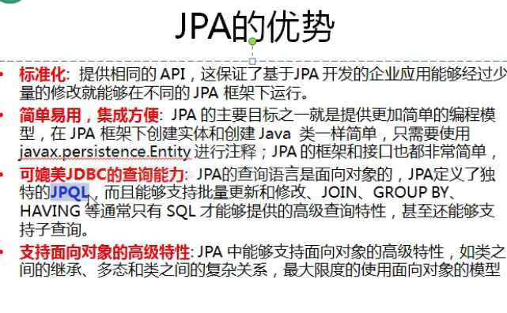
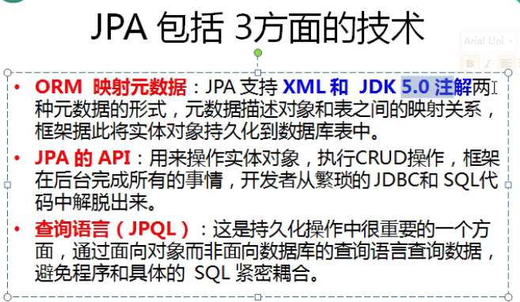
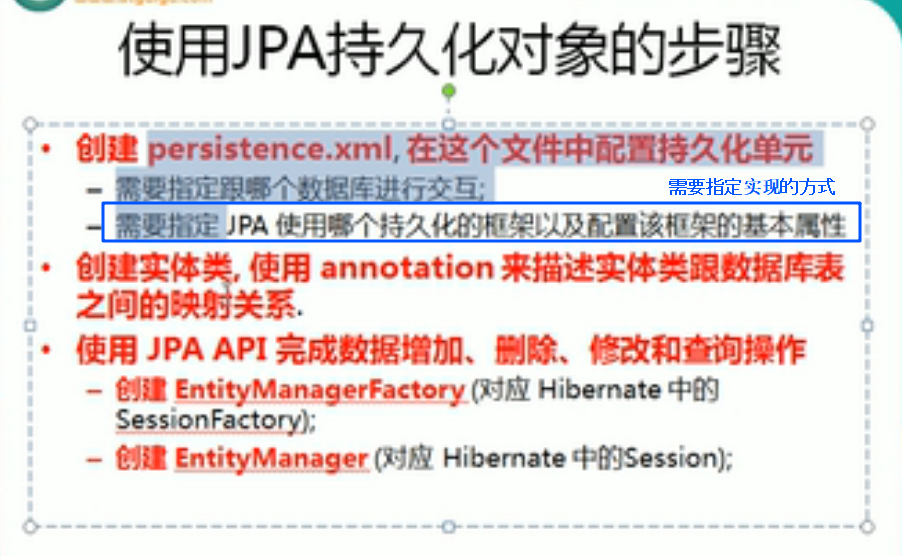
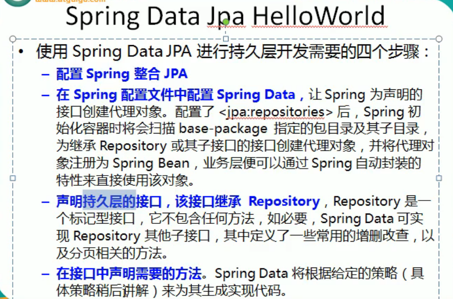
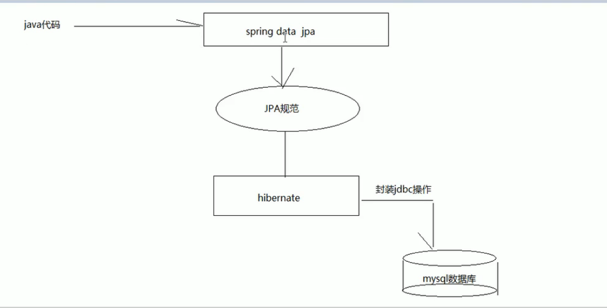
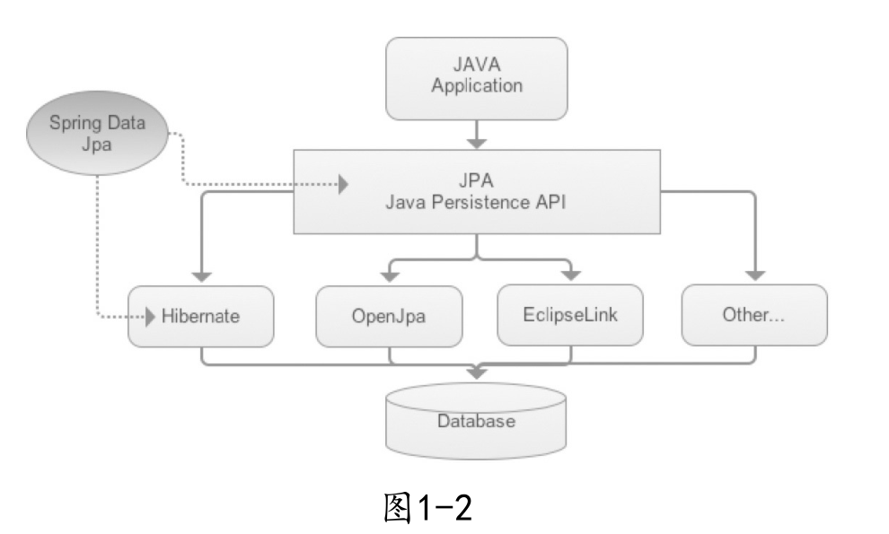

# Jpa

jpa： java persistence api  对象持久化的api

java ee 5.0 推出 orm规范

## 一直不明白的点

## jpa的优势

需要指定JPA的实现框架，比如hibernate

问：使用JPA的时候，配置hibernate实现去开发，和 直接使用hibernate有什么不同?

答：看这一集和自己的hibernate hello world对比，就大概只能知道在使用上什么区别了。

https://www.bilibili.com/video/BV1vW411M7zp?p=2

https://www.yuque.com/heyunxiong/knowledge/vh1cgt

---

## Spring data jpa

这里的图年份太久了。如果基于springboot的话完全可以不用前面两个步骤。直接引入依赖，然后声明接口即可

spring data jpa 是jpa规范的封装，本质上也是规范。干活的还是实现的ORM框架hibernate

