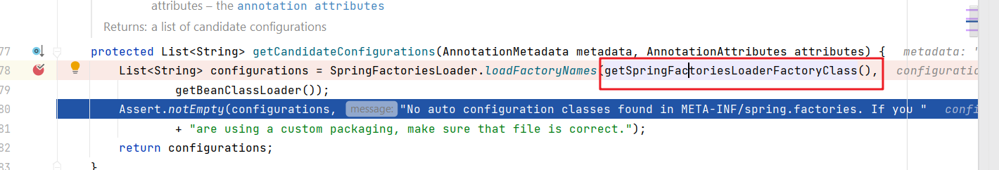

## 我的springboot启动过程整理

整理时间：2022年5月13日

spring boot源码版本：2.6.6

私认为，需要知道springboot的启动过程，才会对其“约定大于配置”有更深的理解。

## Main入口启动类

```java
@SpringBootApplication
public class ApplicationMain {
    public static void main(String[] args) {
        SpringApplication.run(ApplicationMain.class,args);
    }
}
```

先明确一点就是：run方法里面传入的class，并不一定是当前ApplicationMain.class； 可以是指定其他启动类，但是指定的类需要有@SpringbootApplication注解，说白了就是spring需要找到注解进行加载配置类

即：上面的写法可以分开：

```
//MainDemo 类只有启动方法，方法参数指定另外一个类
public class MainDemo {
    public static void main(String[] args) {
        SpringApplication.run(MainOther.class,args);
    }
}


//MainOther 使用@SpringBootApplication注解
@SpringBootApplication
public class MainOther {
	...
}

```


debug过程分析

run方法

```java
public static ConfigurableApplicationContext run(Class<?>[] primarySources, String[] args) {
		return new SpringApplication(primarySources).run(args);
	}
```

做了两件事：创建SpringApplication对象，然后执行run方法


```java
//Create a new SpringApplication instance. The application context will load beans from the specified primary sources 
public SpringApplication(ResourceLoader resourceLoader, Class<?>... primarySources) {
		this.resourceLoader = resourceLoader;
		Assert.notNull(primarySources, "PrimarySources must not be null");
		this.primarySources = new LinkedHashSet<>(Arrays.asList(primarySources));
    //推断web application的类型，Servlet、WebFlux还是普通的应用
		this.webApplicationType = WebApplicationType.deduceFromClasspath();
    //getSpringFactoriesInstances 方法里面会根据传入的class 创建对应的类
		this.bootstrapRegistryInitializers = new ArrayList<>(
				getSpringFactoriesInstances(BootstrapRegistryInitializer.class));
    // 
		setInitializers((Collection) getSpringFactoriesInstances(ApplicationContextInitializer.class));
		setListeners((Collection) getSpringFactoriesInstances(ApplicationListener.class));
		this.mainApplicationClass = deduceMainApplicationClass();
	}
```


来看getSpringFactoriesInstances方法


```java
	private <T> Collection<T> getSpringFactoriesInstances(Class<T> type, Class<?>[] parameterTypes, Object... args) {
		ClassLoader classLoader = getClassLoader();
		// Use names and ensure unique to protect against duplicates
        // 关注SpringFactoriesLoader.loadFactoryNames，从META-INF/spring.factories加载满足条件的工厂实现类名
		Set<String> names = new LinkedHashSet<>(SpringFactoriesLoader.loadFactoryNames(type, classLoader));
		List<T> instances = createSpringFactoriesInstances(type, parameterTypes, classLoader, args, names);
		AnnotationAwareOrderComparator.sort(instances);
		return instances;
	}
```

loadFactoryNames方法

```
	//Load the fully qualified class names of factory implementations of the given type from "META-INF/spring.factories", using the given class loader.
	public static List<String> loadFactoryNames(Class<?> factoryType, @Nullable ClassLoader classLoader) {
		ClassLoader classLoaderToUse = classLoader;
		if (classLoaderToUse == null) {
			classLoaderToUse = SpringFactoriesLoader.class.getClassLoader();
		}
		String factoryTypeName = factoryType.getName();
		return loadSpringFactories(classLoaderToUse).getOrDefault(factoryTypeName, Collections.emptyList());
	}
```

loadSpringFactories方法从META-INF/spring.factories获取并加载


```
	
	private static Map<String, List<String>> loadSpringFactories(ClassLoader classLoader) {
		Map<String, List<String>> result = cache.get(classLoader);
		if (result != null) {
			return result;
		}

		result = new HashMap<>();
		try {
		//加载当前project所有的资源文件 FACTORIES_RESOURCE_LOCATION = META-INF/spring.factories，
			Enumeration<URL> urls = classLoader.getResources(FACTORIES_RESOURCE_LOCATION);
			while (urls.hasMoreElements()) {
				URL url = urls.nextElement();
				UrlResource resource = new UrlResource(url);
				Properties properties = PropertiesLoaderUtils.loadProperties(resource);
				for (Map.Entry<?, ?> entry : properties.entrySet()) {
					String factoryTypeName = ((String) entry.getKey()).trim();
					String[] factoryImplementationNames =
							StringUtils.commaDelimitedListToStringArray((String) entry.getValue());
					for (String factoryImplementationName : factoryImplementationNames) {
						result.computeIfAbsent(factoryTypeName, key -> new ArrayList<>())
								.add(factoryImplementationName.trim());
					}
				}
			}

			// Replace all lists with unmodifiable lists containing unique elements
			result.replaceAll((factoryType, implementations) -> implementations.stream().distinct()
					.collect(Collectors.collectingAndThen(Collectors.toList(), Collections::unmodifiableList)));
			cache.put(classLoader, result);
		}
		catch (IOException ex) {
			throw new IllegalArgumentException("Unable to load factories from location [" +
					FACTORIES_RESOURCE_LOCATION + "]", ex);
		}
		return result;
	}
```


对这段代码的佐证：Enumeration<URL> urls = classLoader.getResources(FACTORIES_RESOURCE_LOCATION);


而在debug的过程中我也观察到就循环了这三个jar包里面的spring.factories


到此。。SpringApplication初始化完成。

主要做的事情：

- 判断应用类型
	- WebApplicationType.deduceFromClasspath()
- 设置Spring初始化器
	- BootstrapRegistryInitializer
	- ApplicationContextInitializer 
- 设置Spring监听器
	- ApplicationListener


然后进入到run方法中：

```java
	/**
	 * Run the Spring application, creating and refreshing a new
	 * {@link ApplicationContext}.
	 * @param args the application arguments (usually passed from a Java main method)
	 * @return a running {@link ApplicationContext}
	 */
	 public ConfigurableApplicationContext run(String... args) {
		long startTime = System.nanoTime();
		DefaultBootstrapContext bootstrapContext = createBootstrapContext();
		ConfigurableApplicationContext context = null;
		configureHeadlessProperty();
         //获取运行监听器，监控springboot应用启动的过程
		SpringApplicationRunListeners listeners = getRunListeners(args);
         // 监听器开始工作，开始监听主启动类
		listeners.starting(bootstrapContext, this.mainApplicationClass);
		try {
			ApplicationArguments applicationArguments = new DefaultApplicationArguments(args);
		// prepareEnvironment准备启动环境
            ConfigurableEnvironment environment = prepareEnvironment(listeners, bootstrapContext, applicationArguments);
			configureIgnoreBeanInfo(environment);
			Banner printedBanner = printBanner(environment);
			// 根据应用类型，创建对应的应用上下文
            context = createApplicationContext();
			context.setApplicationStartup(this.applicationStartup);
            // 上下文准备
			prepareContext(bootstrapContext, context, environment, listeners, applicationArguments, printedBanner);
			// 刷新上下文的作用，可以理解成正在开始去处理对应应用类型
            refreshContext(context);
			afterRefresh(context, applicationArguments);
			Duration timeTakenToStartup = Duration.ofNanos(System.nanoTime() - startTime);
			if (this.logStartupInfo) {
				new StartupInfoLogger(this.mainApplicationClass).logStarted(getApplicationLog(), timeTakenToStartup);
			}
			listeners.started(context, timeTakenToStartup);
			callRunners(context, applicationArguments);
		}
		catch (Throwable ex) {
			handleRunFailure(context, ex, listeners);
			throw new IllegalStateException(ex);
		}
		try {
			Duration timeTakenToReady = Duration.ofNanos(System.nanoTime() - startTime);
			listeners.ready(context, timeTakenToReady);
		}
		catch (Throwable ex) {
			handleRunFailure(context, ex, null);
			throw new IllegalStateException(ex);
		}
		return context;
	}
```


来看createApplicationContext，

Creates the application context for a SpringApplication, respecting the given

```
	/**
	 * Strategy method used to create the {@link ApplicationContext}. By default this
	 * method will respect any explicitly set application context class or factory before
	 * falling back to a suitable default.
	 * @return the application context (not yet refreshed)
	 * @see #setApplicationContextFactory(ApplicationContextFactory)
	 */
	protected ConfigurableApplicationContext createApplicationContext() {
		return this.applicationContextFactory.create(this.webApplicationType);
	}
```


```java
	@Override
	public final void refresh() throws BeansException, IllegalStateException {
		try {
			super.refresh();
		}
		catch (RuntimeException ex) {
			WebServer webServer = this.webServer;
			if (webServer != null) {
				webServer.stop();
			}
			throw ex;
		}
	}
```


开始读取启动类头上的注解了


---


把主启动类作为一个bean注入


开始注册bean了


找到元凶了




这玩意不就是主启动类头顶上的注解，此时就会去解析这个注解里面的东西了。这个时候就可以去AutoConfigurationImportSelector.class里面查看怎么加载的


这就是为什么自动配置类有133的由来


创建bean


启动类中的关注两个地方

- 注解@SpringBootApplication
- main方法中的SpringBootApplication.run( )


## @SpringBootApplication 的分析

```java
@Target({ElementType.TYPE})
@Retention(RetentionPolicy.RUNTIME)
@Documented
@Inherited
@SpringBootConfiguration
@EnableAutoConfiguration
@ComponentScan(
    excludeFilters = {@Filter(
    type = FilterType.CUSTOM,
    classes = {TypeExcludeFilter.class}
), @Filter(
    type = FilterType.CUSTOM,
    classes = {AutoConfigurationExcludeFilter.class}
)}
)
public @interface SpringBootApplication {
    @AliasFor(annotation = EnableAutoConfiguration.class)
    Class<?>[] exclude() default {};
    
//	 ...more...
         
}
  
```

三个关键注解：

@SpringBootConfiguration
@EnableAutoConfiguration
@ComponentScan

### @SpringBootConfiguration注解

没什么特别的，就是底层就是一个标注为注解类。

```java
@Target({ElementType.TYPE})
@Retention(RetentionPolicy.RUNTIME)
@Documented
@Configuration
@Indexed
public @interface SpringBootConfiguration {
    @AliasFor(
        annotation = Configuration.class
    )
    boolean proxyBeanMethods() default true;
}
```

###  @EnableAutoConfiguration 注解

十分关键重要的注解。

```java
@Target({ElementType.TYPE})
@Retention(RetentionPolicy.RUNTIME)
@Documented
@Inherited
@AutoConfigurationPackage
@Import({AutoConfigurationImportSelector.class})
public @interface EnableAutoConfiguration {
    String ENABLED_OVERRIDE_PROPERTY = "spring.boot.enableautoconfiguration";

    Class<?>[] exclude() default {};

    String[] excludeName() default {};
}
```

关键点：

- @AutoConfigurationPackage
- @Import({AutoConfigurationImportSelector.class})

**@AutoConfigurationPackage**

```java
@Target({ElementType.TYPE})
@Retention(RetentionPolicy.RUNTIME)
@Documented
@Inherited
@Import({Registrar.class})
public @interface AutoConfigurationPackage {
    String[] basePackages() default {};

    Class<?>[] basePackageClasses() default {};
}
```

看@Import({Registrar.class})， 导入注册相关的类到spring容器中。

```
   static class Registrar implements ImportBeanDefinitionRegistrar, DeterminableImports {
        Registrar() {
        }

        public void registerBeanDefinitions(AnnotationMetadata metadata, BeanDefinitionRegistry registry) {
            AutoConfigurationPackages.register(registry, (String[])(new AutoConfigurationPackages.PackageImports(metadata)).getPackageNames().toArray(new String[0]));
        }

        public Set<Object> determineImports(AnnotationMetadata metadata) {
            return Collections.singleton(new AutoConfigurationPackages.PackageImports(metadata));
        }
    }
```


**@Import({AutoConfigurationImportSelector.class})**


### @ComponentScan注解

扫描的 `Spring` 对应的组件，如 **@Componet**，**@Repository**。

我们可以通过 **basePackages** 等属性来**细粒度**的定制 `@ComponentScan` 自动**扫描的范围**，如果不指定，则**默认**Spring框架实现会从声明 `@ComponentScan` **所在类的package**进行扫描，所以 `SpringBoot` 的**启动类**最好是放在**根package**下，我们**自定义的类就放在对应的子package**下，这样就可以不指定 `basePackages`


---


