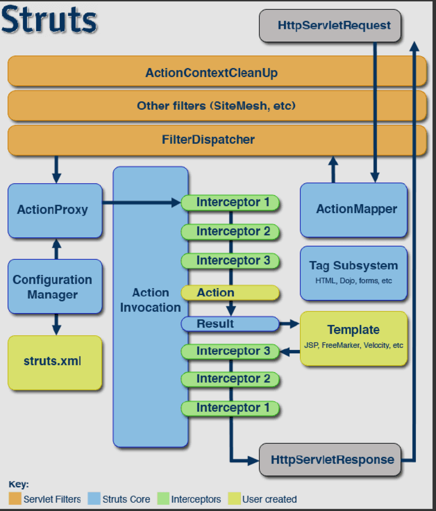

# Struts2工作原理流程概述

strut2（根据工作流程图，能口述一边工作流程原理）

[https://wenku.baidu.com/view/515ad9d250e2524de5187e49.html](https://wenku.baidu.com/view/515ad9d250e2524de5187e49.html)

我写的：

来了一个请求，（一开始有个叫ActionContextCleanUp的可选过滤器）FilterDispatcher 去问ActionMapper，这个请求有没有对应的Action（动作）,

ActionMapper说有，那么，FilterDispatcher 就会把这个请求扔给ActionProxy(动作代理，中介的感觉),

ActionProxy拿到这个请求，就会通过configurationManger调用Struts.xml的配置信息（这玩意是自己写的）

拿到关于这个请求的配置信息后，ActionProxy就会创建这个请求的ActionInvocation实例，实例调用Action的方法（前后会有各种拦截器）

Action执行完毕后，返回一个在struts.xml配置好的对应结果的用来表示的jsp

响应返回也会有过滤，自己手动配置的。

文档：

基本简要流程如下： 1 、客户端初始化一个指向Servlet容器的请求； 2、 这个请求经过一系列的过滤器（Filter） （这些过滤器中有一个叫做ActionContextCleanUp的可选过滤器， 这个过滤器对于Struts2和其他框架的集成很有帮助，例如：SiteMesh Plugin） 3 、接着FilterDispatcher被调用， FilterDispatcher询问ActionMapper来决定这个请是否需要调用某个Action 4、如果ActionMapper决定需要调用某个Action， FilterDispatcher把请求的处理交给ActionProxy 5、ActionProxy通过Configuration Manager询问框架的配置文件， 找到需要调用的Action类 6、ActionProxy创建一个ActionInvocation的实例。 7、ActionInvocation实例使用命名模式来调用， 在调用Action的过程前后，涉及到相关拦截器（Intercepter）的调用。 8、一旦Action执行完毕，ActionInvocation负责根据struts.xml中的配置找到对应的返回结果 。返回结果通常是（但不总是，也可 能是另外的一个Action链）一个需要被表示的JSP或者FreeMarker的模版。 在表示的过程中可以使用Struts2 框架中继承的标签。 在这个过程中需要涉及到ActionMapper

9、响应的返回是通过我们在web.xml中配置的过滤器 10、如果ActionContextCleanUp是当前使用的，则FilterDispatecher将不会清理sreadlocal ActionContext;如果ActionContextCleanUp不使用，则将会去清理sreadlocals

