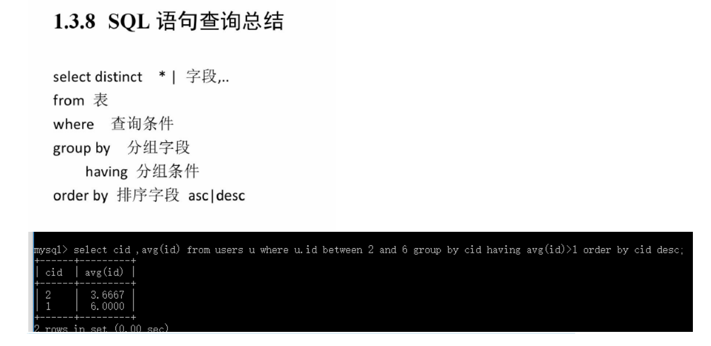

# MySQL
#database #mysql
## 基础操作  
### DDL（Data Definition Language）数据库定义语言
statements are used to define the database structure or schema  即系对表的结构进行操作  
```sql
CREATE, ALTER, DROP, TRUNCATE, COMMENT, RENAME
```

### DML（Data Manipulation Language）数据操纵语言 
statements are used for managing data within schema objects.  即系对表的数据进行操作  
```sql
SELECT, INSERT, UPDATE, DELETE //数据操作：增删改查
MERGE, CALL, EXPLAIN PLAN, LOCK TABLE
```

### DCL（Data Control Language）数据库控制语言 
授权，角色控制  
```sql
GRANT 授权
REVOKE 取消授权
```

### TCL（Transaction Control Language）事务控制语言  
```sql SAVEPOINT 设置保存点
ROLLBACK 回滚
SET TRANSACTION
```

```SQL
SELECT * FROM user;
SELECT u.name FROM user u where u.id = 100;
```

提示
鉴于SQL语法上不区分大小写，个人使用关键字全大写的习惯，表名和列名小写，别名缩写用前两个字母或者多个单词的首字母。  

## 进阶操作  
参考资料 [https://www.cnblogs.com/henryhappier/archive/2010/07/05/1771295.html](https://www.cnblogs.com/henryhappier/archive/2010/07/05/1771295.html)




