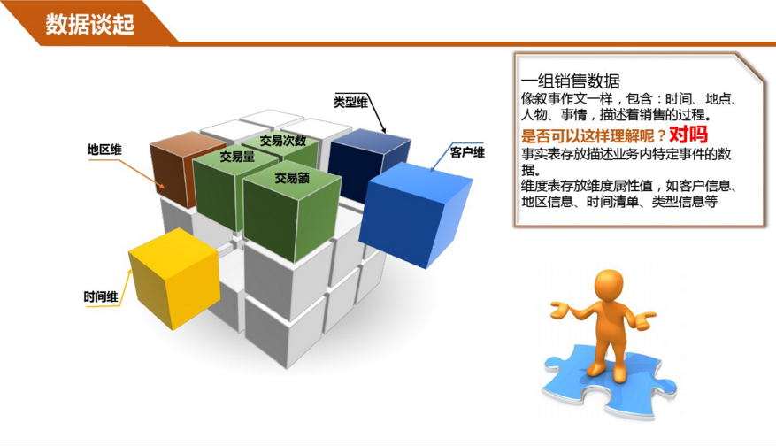

数据仓库与数据库的主要区别在于：
 [https://www.zhihu.com/question/20623931/answer/56269324](https://www.zhihu.com/question/20623931/answer/56269324)

（1）数据库是面向事务的设计，数据仓库是面向主题设计的。

（2）数据库一般存储在线交易数据，数据仓库存储的一般是历史数据。

（3）数据库设计是尽量避免冗余，数据仓库在设计是有意引入冗余。

（4）数据库是为捕获数据而设计，数据仓库是为分析数据而设计

事实表、维表
http://www.jianshu.com/writer#/notebooks/12581088/notes/12424122/preview

一个典型的例子是，把逻辑业务比作一个立方体，产品维、时间维、地点维分别作为不同的坐标轴，而坐标轴的交点就是一个具体的事实。也就是说事实表是多个维度表的一个交点。而维度表是分析事实的一个窗口。

事实表

每个数据仓库都包含一个或者多个事实数据表。事实数据表可能包含业务销售数据，如现金登记事务所产生的数据，事实数据表通常包含大量的行。事实数据表的主要特点是包含数字数据（事实），并且这些数字信息可以汇总，以提供有关单位作为历史的数据，每个事实数据表包含一个由多个部分组成的索引，该索引包含作为外键的相关性纬度表的主键，而维度表包含事实记录的特性。事实数据表不应该包含描述性的信息，也不应该包含除数字度量字段及使事实与纬度表中对应项的相关索引字段之外的任何数据。

包含在事实数据表中的“度量值”有两中：一种是可以累计的度量值，另一种是非累计的度量值。最有用的度量值是可累计的度量值，其累计起来的数字是非常有意义的。用户可以通过累计度量值获得汇总信息，例如。可以汇总具体时间段内一组商店的特定商品的销售情况。非累计的度量值也可以用于事实数据表，单汇总结果一般是没有意义的，例如，在一座大厦的不同位置测量温度时，如果将大厦中所有不同位置的温度累加是没有意义的，但是求平均值是有意义的。

一般来说，一个事实数据表都要和一个或多个纬度表相关联，用户在利用事实数据表创建多维数据集时，可以使用一个或多个维度表。

维度表

维度表可以看作是用户来分析数据的窗口，纬度表中包含事实数据表中事实记录的特性，有些特性提供描述性信息，有些特性指定如何汇总事实数据表数据，以便为分析者提供有用的信息，维度表包含帮助汇总数据的特性的层次结构。例如，包含产品信息的维度表通常包含将产品分为食品、饮料、非消费品等若干类的层次结构，这些产品中的每一类进一步多次细分，直到各产品达到最低级别。

在维度表中，每个表都包含独立于其他维度表的事实特性，例如，客户维度表包含有关客户的数据。维度表中的列字段可以将信息分为不同层次的结构级。

结论

  

1、事实表就是你要关注的内容；

2、维度表就是你观察该事务的角度，是从哪个角度去观察这个内容的。

例如，某地区商品的销量，是从地区这个角度观察商品销量的。事实表就是销量表，维度表就是地区表。

---

以前一直对维度表, 事实表, 数据分析, BI等概念等有一些模糊. 这几天的学习终于让这些有了一些眉目了:

维度表示你要对数据进行分析时所用的一个量, 比如你要分析产品销售情况, 你可以选择按类别来进行分析,或按区域来分析. 这样的按..分析就构成一个维度。前面的示例就可以有两个维度：类型和区域。另外每个维度还可以有子维度（称为属性），例如类别可以有子类型，产品名等属性。下面是两个常见的维度表结构：

产品维度表：Prod_id, Product_Name, Category, Color, Size, Price

时间维度表：TimeKey, Season, Year, Month, Date

而事实表是数据聚合后依据某个维度生成的结果表。它的结构示例如下：

销售事实表：Prod_id(引用产品维度表), TimeKey(引用时间维度表), SalesAmount(销售总量，以货币计), Unit(销售量)

上面的这些表就是存在于数据仓库中的。从这里可以看出它有几个特点：

1.  维度表的冗余很大，主要是因为维度一般不大(相对于事实表来说的)，而维度表的冗余可以使事实表节省很多空间。
    
2.  事实表一般都很大，如果以普通方式查询的话，得到结果一般发的时间都不是我们可以接受的。所以它一般要进行一些特殊处理。如SQL Server 2005就会对事实表进行如预生成处理等。
    
3.  维度表的主键一般都取整型值的标志列类型，这样也是为了节省事实表的存储空间。
