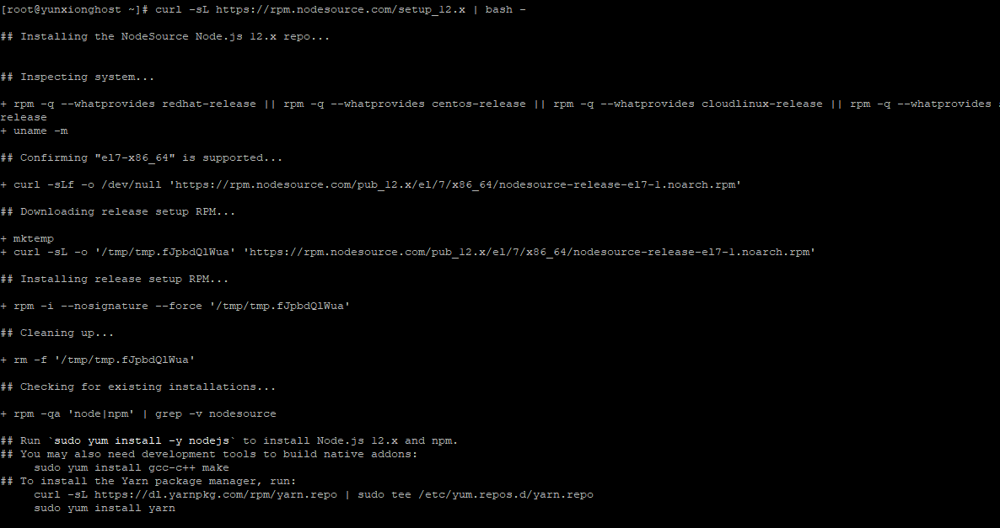
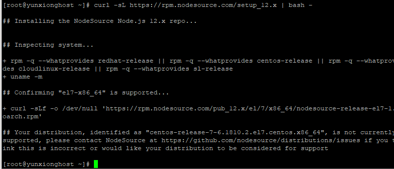
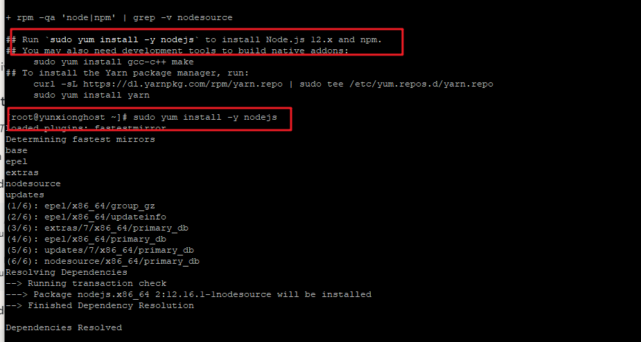

# Linux上搭建Hexo步骤_部分
  

安装git

```
yum install git

[root@localhost ~]# git --version

git version 1.8.3.1

[root@localhost ~]#
```

配置git信息
```
//配置基本信息[root@localhost ~]# git config --global user.name "flymegoc"[root@localhost ~]# git config --global user.email 343672271@qq.com

//查看配置[root@localhost ~]# git config --list

user.name=flymegoc

user.email=343672271@qq.com

[root@localhost ~]#
```
  
安装hexo

```
npm install hexo-cli -g

hexo init blog

cd blog

npm install

hexo server
```

修改端口
hexo s -p 80 临时暂用80端口，下次启动hexo又还是4000了。
默认的linux hexo 端口是4000， 去 找到node_modules\hexo-server\index.js文件，可以修改默认的port值 为 80

永远启动服务
因为关掉远程连接，会关闭服务
nohup命名， &表示后台启动 
nohup hexo s -p 80 &

部分截图





