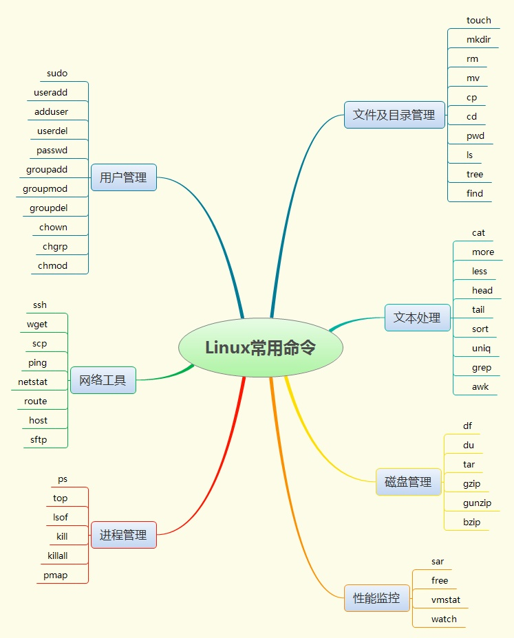

# Linux基础入门命令
## 0.文件及目录管理
| 命令 | 描述 | 举例 |
| --- | --- | --- |
| mkdir 目录名 | 创建目录 | mkdir mydir |
| rm 文件名 | 删除文件 | rm test.txt |
|  rm -rf 目录名 | 强制删除目录及其包含的文件 | rm -rf mydir |
| mv  | 移动文件/重命名文件 |  |
| find ./ &#124; wc -l  | 查询当前目录下的文件个数 |  |
| cp 源地址 目标地址 | 复制文件到目标地址 |  |

## 1.切换目录命令
| 命令 | 描述 |
| --- | --- |
| cd app   |  切换到app目录 |
| cd .. | 切换到上一层目录 |
| cd / | 切换到系统根目录 |
| cd ~ | 切换到用户主目录 |
| cd - | 切换到上一个所在目录 |
| pwd | 显示当前路径 |

## 2.列出文件列表
ls(list)是一个非常有用的命令，用来显示当前目录下的内容。配合参数的使用，能以不同的方式显示目录内容。    格式：ls[参数] [路径或文件名]
常用：在linux中以 . 开头的文件都是隐藏的文件

| 命令 | 描述 |
| --- | --- |
| ls | 显示当前目录的文件 |
| ls -a | 显示所有文件或目录（包含隐藏的文件） |
| ls -l | 缩写成 ll |
| ls -lrt | 按时间排序，以列表的方式显示目录项 |
| ls &#124; cat -n | 在前面加个编号 |
| alias lsl = 'ls -lrt'  | 取别名，以后就可以直接输入lsl 来实现 ls -lrt 功能了 |
| alias lm = 'ls -al&#124;more' | 取别名，以后就可以直接输入lm来实现 ls -al&#124;more 功能了 |

## 3.创建目录和移除目录
| 命令 | 描述 |
| --- | --- |
| mkdir(make directory) | 可用来创建子目录。 |
| mkdir app |  在当前目录下创建app目录 |
| mkdir –p app2/test   | 级联创建aap2以及test目录 |
| rmdir(remove directory) | 可用来删除“空”的子目录： |
| rmdir app   | 删除app目录  |

## 4.浏览文件
| 命令 | 描述 | 格式 |
| --- | --- | --- |
| cat | cat用于显示文件的内容 | cat[参数]<文件名>
cat yum.conf  |
| cat -n 文件名 | 查看的同时显示行号 |  |
| move | more一般用于要显示的内容会超过一个画面长度的情况。按空格键显示下一个画面
回车显示下一行内容, 按 q 键退出查看 | more yum.conf
空格显示下一页数据  回车显示下一行的数据  |
| less | less 用法和more类似，不同的是less可以通过PgUp、PgDn键来控制 |  less yum.conf
* PgUp 和 PgDn 进行上下翻页. |
| head -10 文件名 | 显示前十行 |  |
| tail | tail命令是在实际使用过程中使用非常多的一个命令，它的功能是：用于显示文件后几行的内容 | 用法:
tail -10 /etc/passwd    查看后10行数据
tail -f catalina.log   动态查看日志(*****)
ctrl+c 结束查看 |
| tail -10 文件名 | 显示最后十行 |  |

## 5.文件操作
| 命令 | 描述 |  |
| --- | --- | --- |
| rm | 删除文件 | rm [选项]... 文件... |
| rm a.txt    | 删除a.txt文件，删除需要用户确认 |  |
| rm -f a.txt | 不询问，直接删除rm 删除目录 |  |
| rm -r a | 递归删除不询问递归删除（慎用） |  |
| rm -rf a | 不询问递归删除 |  |
| rm -rf /* | 删除所有文件 |  |
| rm -rf /* | 自杀，删库跑路 |  |
|  |  |  |
| cp(copy) | 命令可以将文件从一处复制到另一处。一般在使用cp命令时将一个文件复制成另一个文件或复制到某目录时，需要指定源文件名与目标文件名或目录。 |  |
| cp a.txt b.txt | 将a.txt复制为b.txt文件 |  |
| cp a.txt ../  |  将a.txt文件复制到上一层目录中  |  |
| mv  | 移动或者重命名 |  |
| mv a.txt ../     | 将a.txt文件移动到上一层目录中 |  |
| mv a.txt b.txt  |    将a.txt文件重命名为b.txt |  |
|  |  |  |
| tar 命令 | tar命令位于/bin目录下，它能够将用户所指定的文件或目录打包成一个文件，但不做压缩。
常用参数：
- -c：创建一个新tar文件
- -v：显示运行过程的信息
- -f：指定文件名
- -z：调用gzip压缩命令进行压缩
- -t：查看压缩文件的内容
- -x：解开tar文件
 | 一般Linux上常用的压缩方式是选用tar将许多文件打包成一个文件，再以gzip压缩命令压缩成xxx.tar.gz(或称为xxx.tgz)的文件。  |
 | 打包 | tar –cvf xxx.tar ./* |  |
 | 打包并且压缩 | tar –zcvf xxx.tar.gz ./* |  |
 | 解压 | tar –xvf xxx.tar
 tar -xvf xxx.tar.gz -C /usr/aaa |  |
 |  |  |  |
 | grep 命令 | 查找符合条件的字符串。 | 用法: grep [选项]... PATTERN [FILE]...示例 |
 | grep lang anaconda-ks.cfg   | 在文件中查找lang |  |
 | grep lang anaconda-ks.cfg –color |  高亮显示 |  |
 | pwd | 显示当前所在目录 |  |
 |  |  |  |
 | touch | 创建一个空文件 touch a.txt |  |
 | ll -h | 友好显示文件大小 |  |
 | wget | 下载资料: wget [http://nginx.org/download/nginx-1.9.12.tar.g](http://nginx.org/download/nginx-1.9.12.tar.g) |  |

[这是参考资料😉](https://mp.weixin.qq.com/s?__biz=MzI2NjE1OTMxMw==&mid=2247485504&idx=1&sn=f8ff31add403733408a52a88a68be316&chksm=ea931dfedde494e8875b277df21b7d1dcf7bf8821da09f20a5b4fea8f8f4c9183a192ebf05ca&mpshare=1&scene=1&srcid=0823LUvEFFZCMwe9T85XFLEd#rd)
## 6.查找
| 命令 | 描述 |  |
| --- | --- | --- |
| find | find是实时查找，如果需要更快的查询，可试试locate； |  |
| locate | locate会为文件系统建立索引数据库，如果有文件更新，需要定期执行更新命令来更新索引库: |  |
|  |  |  |

## 7.一个小问题：关于命令参数前面的 - 和 -- 的区别
Linux中命令参数中 -和—的区别 一个破折号，两个破折号
我的猜想：- 跟缩写，-- 跟全拼？
查找的资料回答：风格问题

- 前面不加破折线GNU 风格
- 前面加单破 -折线BSD风格
- 前面加双破 --折线Unix 风格
## 8.Linux目录介绍
| 目录 | 说明 | 备注 |
| --- | --- | --- |
| bin | 存放普通用户可执行的指令 | 即使在单用户模式下也能够执行处理 |
| boot | 开机引导目录 | 包括Linux内核文件与开机所需要的文件 |
| dev | 设备目录 | 所有的硬件设备及周边均放置在这个设备目录中 |
| etc | 各种配置文件目录 | 大部分配置属性均存放在这里 |
| lib/lib64 | 开机时常用的动态链接库	bin及sbin指令也会调用对应的lib库 |  |
| media | 可移除设备挂载目录 | 类似软盘 U盘 光盘等临时挂放目录 |
| mnt | 用户临时挂载其他的文件系统 | 额外的设备可挂载在这里,相对临时而言 |
| opt

 | 第三方软件安装目录 | 现在习惯性的放置在/usr/local中 |
| proc | 虚拟文件系统	通常是内存中的映射,特别注意在误删除数据文件后，比如DB，只要系统不重启,还是有很大几率能将数据找回来 |  |
| root | 系统管理员主目录 | 除root之外,其他用户均放置在/home目录下 |
| run | 系统运行是所需文件 | 以前防止在/var/run中,后来拆分成独立的/run目录。重启后重新生成对应的目录数据 |
| sbin | 只有root才能运行的管理指令 | 跟bin类似,但只属于root管理员 |
| snap | ubunut全新软件包管理方式 | snap软件包一般在/snap这个目录下 |
| srv | 服务启动后需要访问的数据目录 |  |
| sys | 跟proc一样虚拟文件系统	记录核心系统硬件信息 |  |
| tmp | 存放临时文件目录 | 所有用户对该目录均可读写 |
| usr | 应用程序放置目录 | 很长一段时间,我都认为是user的意义,最近才知道,原来不是 ,这里留下摆渡知道的解释,方便后来人

usr是user的缩写，是曾经的HOME目录，然而现在已经被/home取代了，现在usr被称为是Unix System Resource，即Unix系统资源的缩写。
 |
| var | 存放系统执行过程经常改变的文件 |  |
| vmlinuz | 软连接到boot下的vmlinuz-4.4.0-87-generic |  |

## #其他命令

- yum 命令

基於RPM包管理，能够从指定的服务器自动下载RPM包并且安装，可以自动处理依赖性关系，并且一次安装所有依赖的软体包，无须繁琐地一次次下载、安装。

- centos 命令行和图形桌面模式的切换
1. 安装系统时建议安装图形界面，毕竟图形桌面下安装程序，比较方便
2. 系统部署完成后可以切换到命令行界面：打开一个SHELL窗口运行 init 3即可进入命令行界面恢复图形用init 5
3. 进入图形界面后修改/etc/inittab 文件的 id:5:initdefault: 这行改成 id:3:initdefault: ，下次启动就直接进入命令行界面。
