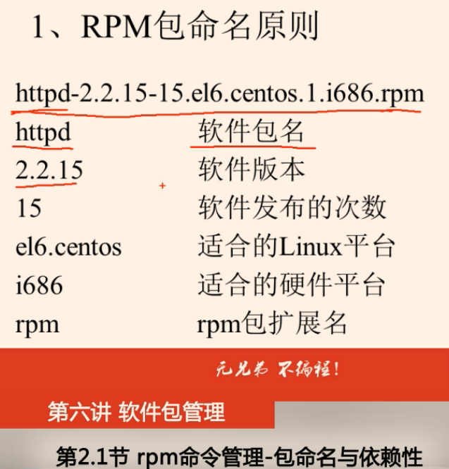
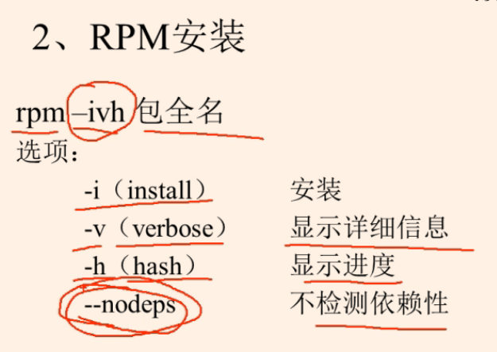
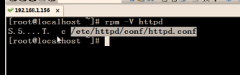
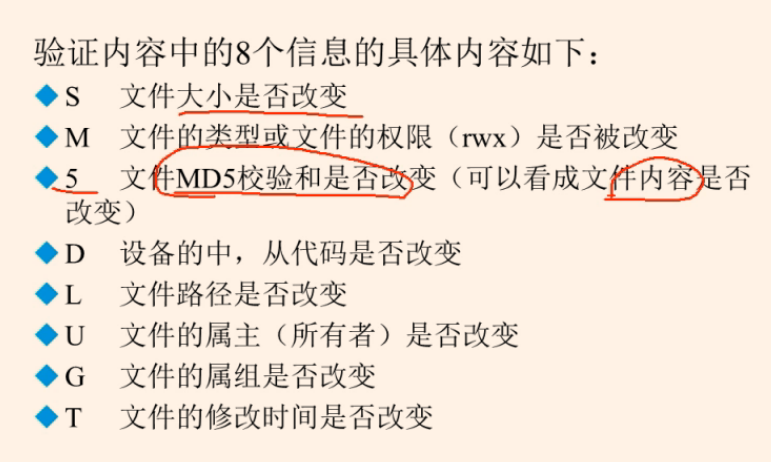
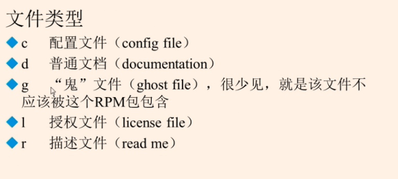
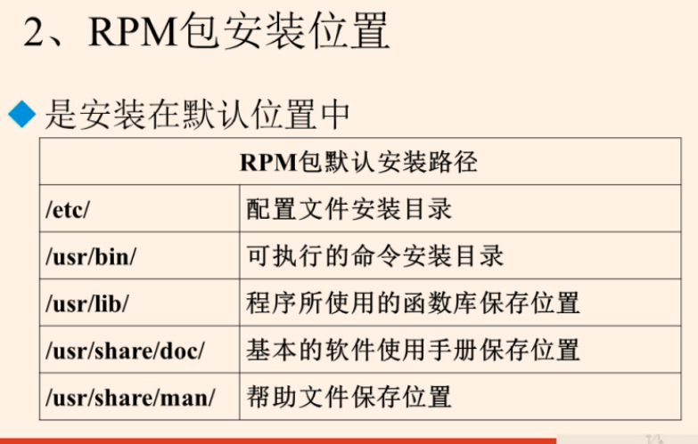

Linux小疑问
https://zhuanlan.zhihu.com/p/32274264

RPM包命名规则Author: Yunxiong

 

## CentOS、Ubuntu、Debian三个linux比较异同
SourceURL: https://zhuanlan.zhihu.com/p/32274264

商业版本以Redhat为代表，开源社区版本则以debian为代表

## Linux中命令参数中-和—的区别
SourceURL: https://www.cnblogs.com/everfight/p/para_name.html

Linux中命令参数中 -和—的区别
-跟缩写
--跟全拼？

前面不加破折线GNU 风格
前面加单破-折线BSD风格
前面加双破---折线Unix 风格

## centos 命令行和图形桌面模式的切换
Author: Yunxiong

centos 命令行和图形桌面模式的切换

1.安装系统时建议安装图形界面，毕竟图形桌面下安装程序，比较方便

2.系统部署完成后可以切换到命令行界面：打开一个SHELL窗口运行 init 3 即可进入命令行界面。恢复图形用init 5

3.进入图形界面后修改/etc/inittab 文件的 id:5:initdefault: 这行改成 id:3:initdefault: ，下次启动就直接进入命令行界面。

　　恢复图形界面：在命令行界面下把/etc/inittab的id:3:initdefault: 这行改成 id:5:initdefault: ，下次重启就直接进入图形界面。
另外，若安装centos时未选择桌面，后来想安装桌面可以通过yum groupinstall Gome的方式进行安装，然后将/etc/inittab配置改成5即可
注:centos7 以后版本
ln -sf /lib/systemd/system/multi-user.target /etc/systemd/system/default.target  命令行
ln -sf /lib/systemd/system/graphical.target /etc/systemd/system/default.target  图形界面

