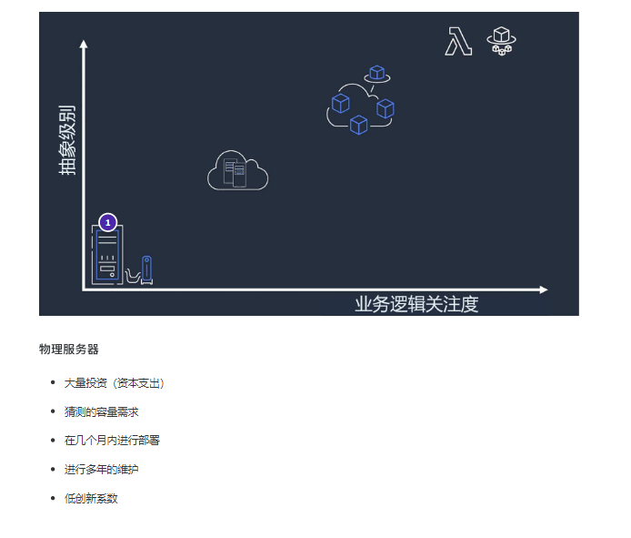
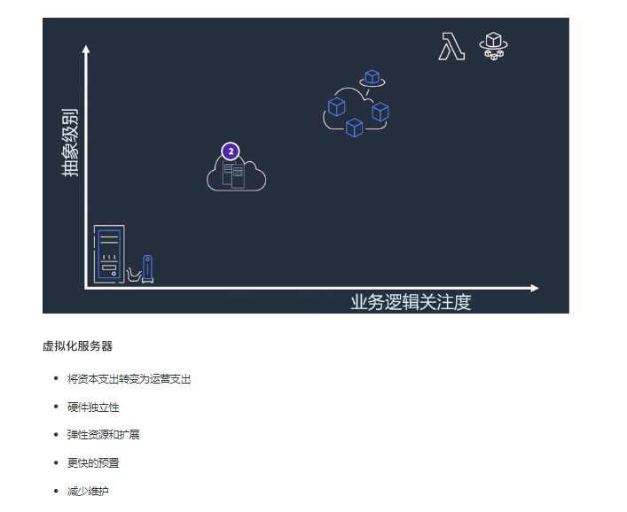
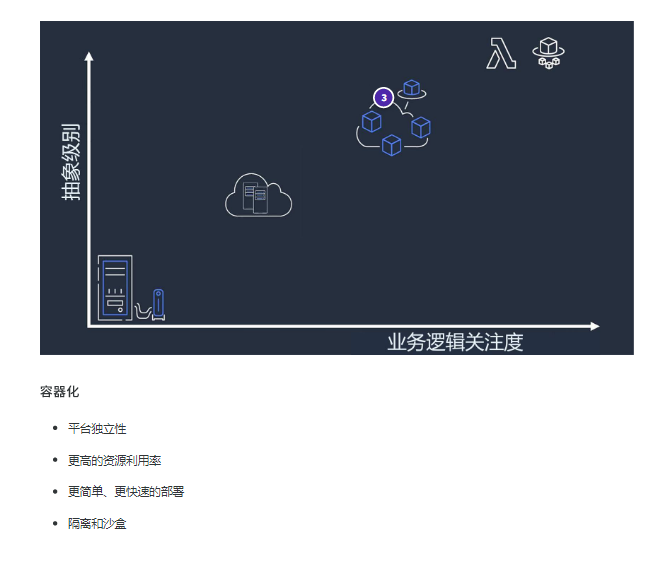
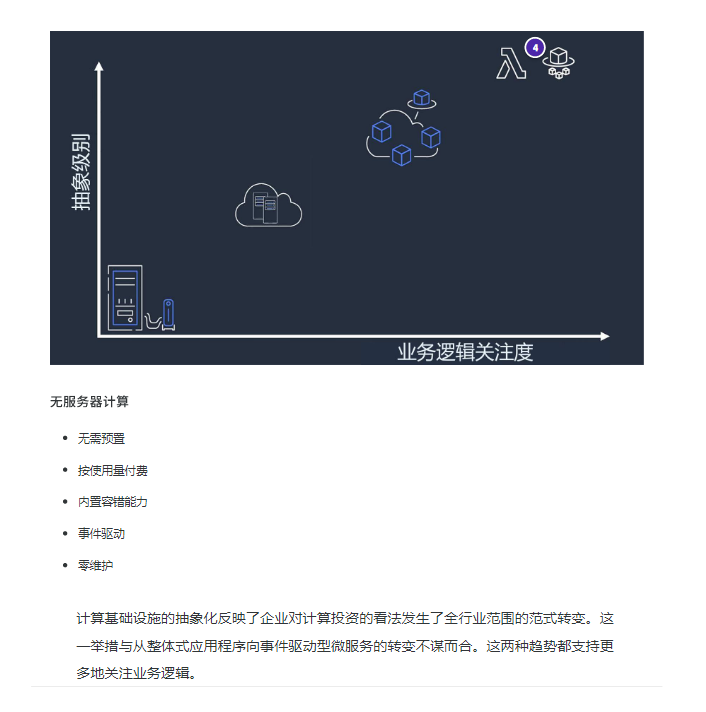
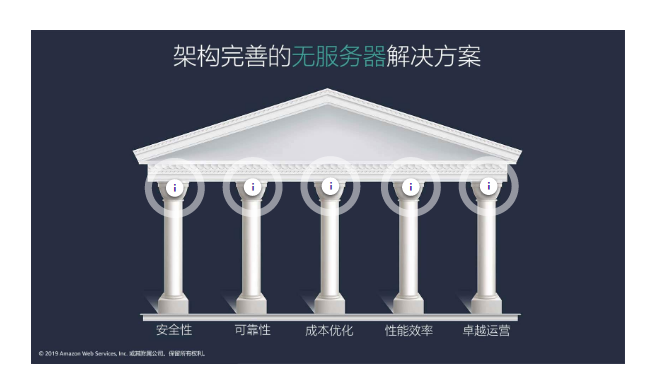
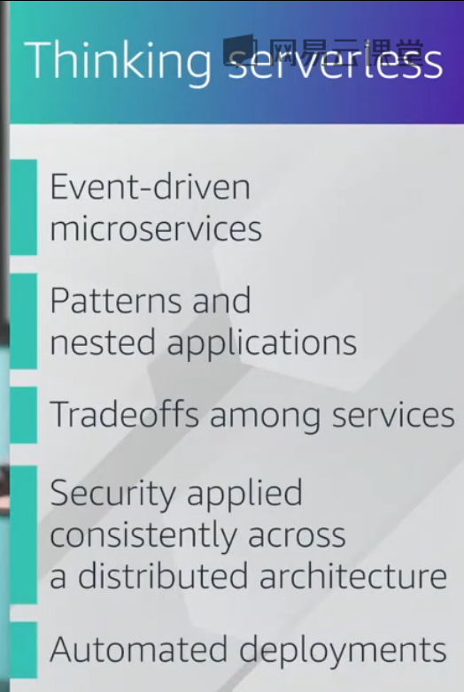
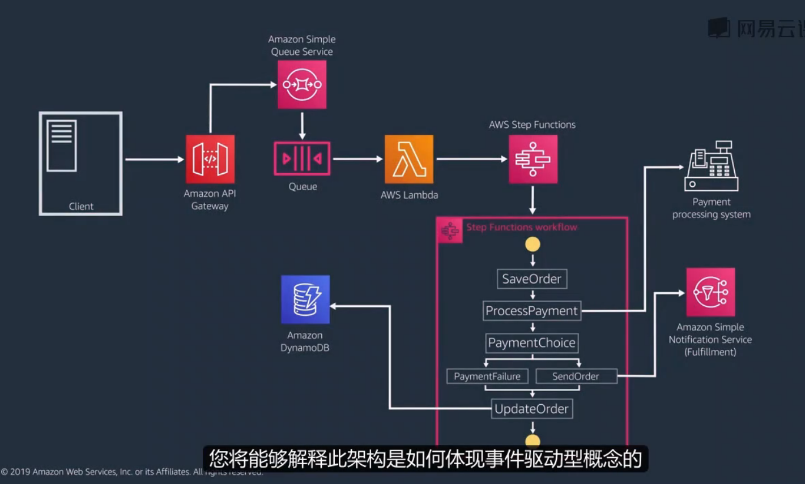
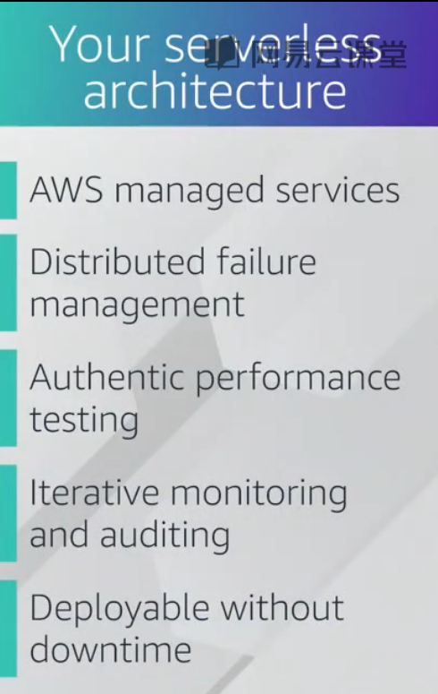
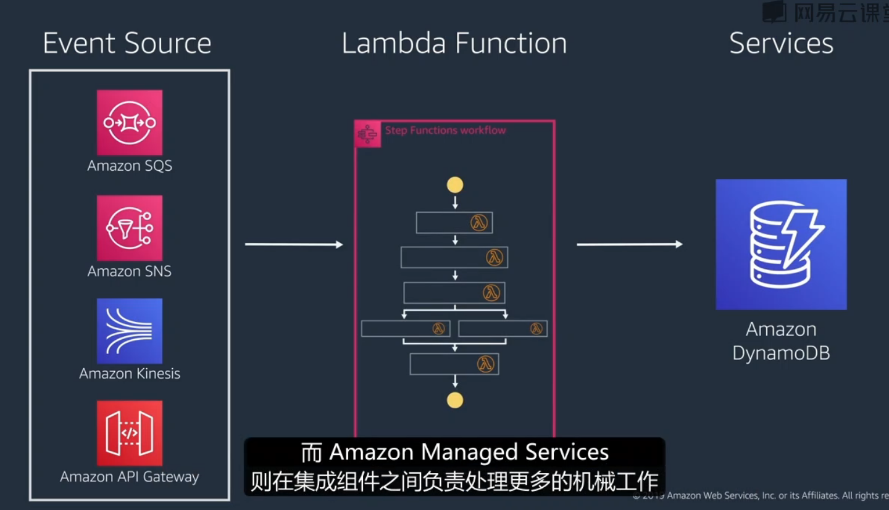

构建无服务器解决方案

基础设施抽象化

教材：

无服务思维

学完后需要知道此图架构的意思

## 事件驱动型架构

无服务器提交模式pdf：https://study.163.com/course/courseLearn.htm?courseId=1212167803#/learn/text?lessonId=1283475064&courseId=1212167803

