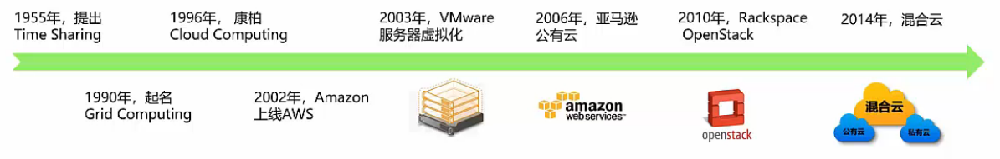
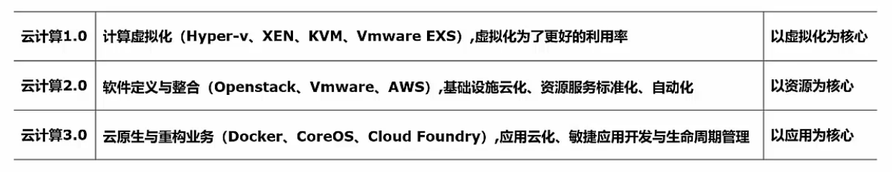
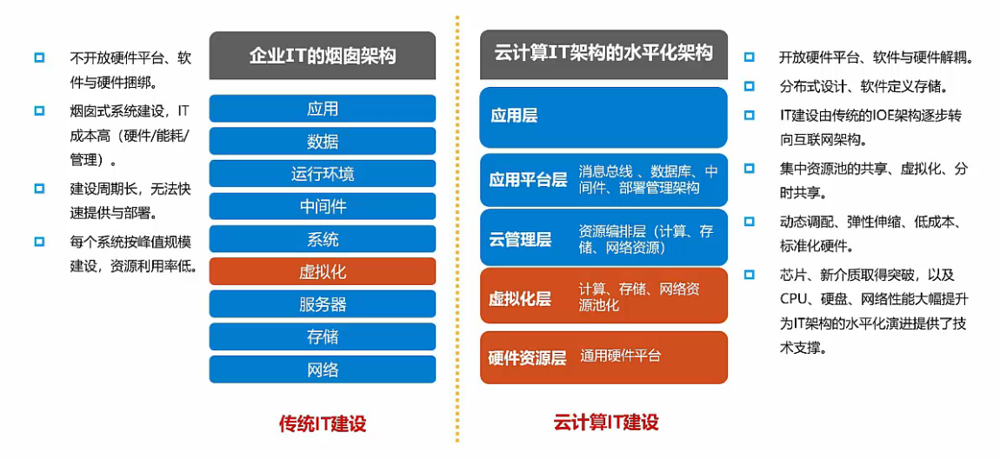
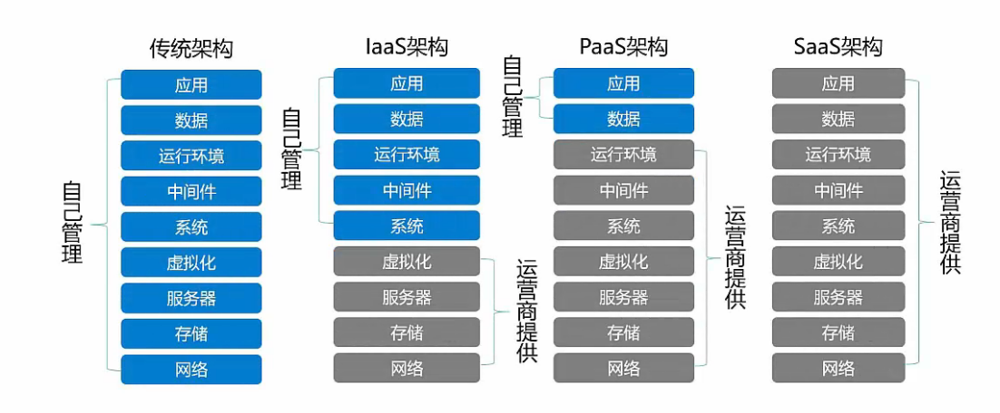
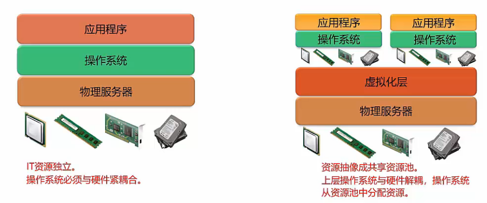
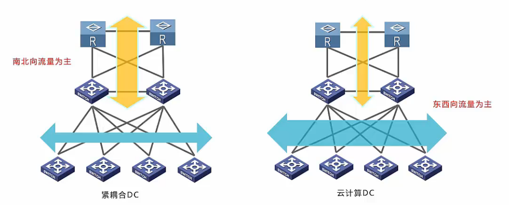
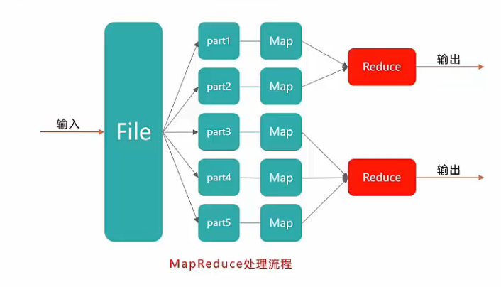
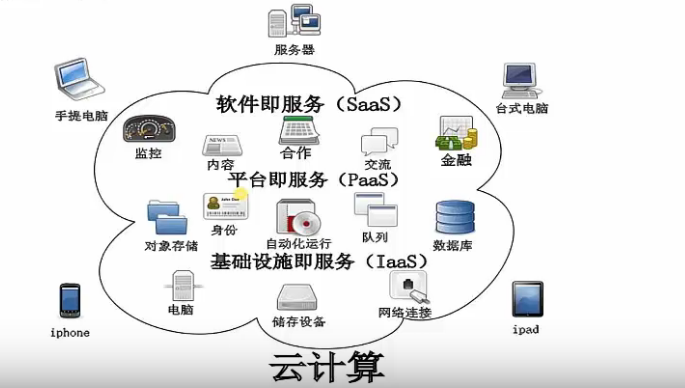
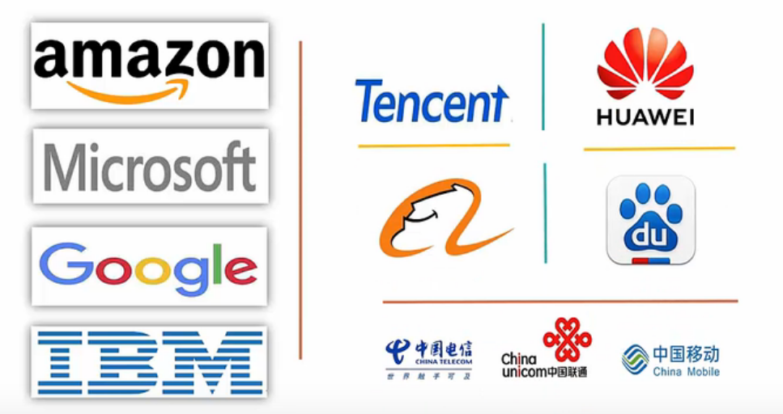
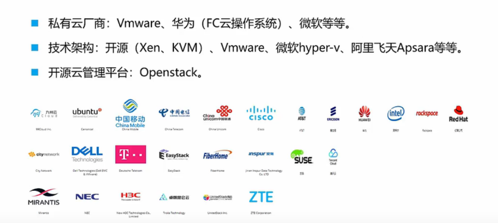

> 云计算无处不在，例如 电子日历，地图，电子邮件，个人网盘等，这些都是云计算的应用场景

## 什么是云计算？
美国国家标准与技术硏究院（NIST）定义：云计算是一种模型，它可以实现随时随地，便捷地，随需应变地从可配置计算資源共享池中获取所需的资源（例如，网络、服务器、存储、应用、及服务），资源能够快速倛应并释放，使管理资源的工作量和与服务提供商的交互减小到最低限度。

**个人理解：云计算是对IT资源的整合，一般由财力雄厚和技术够硬的公司扛起大旗（Amazon、Google、Microsoft、华为等），通过这些公司对IT资源的统一管理，作为开发者或者企业使用者，向他们租用或者购买相关的服务达到自己业务需求，能减少对于前期的固定投入，快速开展任务。**

通俗点说：云计算就是一种特殊的网络服务。通过计算、存储等一系列先进技术能够给人们提供更加安全、便宜、高效、快捷的资源及应用的使用方式。
## 云计算发展史

## 传统架构与云计算对比

## 云计算优势和特点
**优势：省时、省力、省钱、省人、省地、省电**
**特点：**

- 虚拟化技术 - docker/kubernetes
- 动态可扩展性 - 增加删除设备
- 按需部署 - 需要多少核cpu就部署多少核，要多少内存就给多少内存
- 灵活性高
- 可靠性： 分布式备份恢复，
- 性价比高： 不需要承担设备升级成本
- 地理分布： 一般是两地三份 
- 安全：有可靠的网络安全方案
## 云计算的服务类型
**基础设施即服务 IaaS - Infrastructure as a Service**
服务商出租处理能力、存储空间、网络容量等基本计算资源，如：服务器、存储、网络设备
**平台即服务 PaaS - Platform as a Service**
服务商提供可编程、可开发的云环境（对于开发者而言）
**软件即服务 SaaS - Software as a Service**
服务商提供一套运行在云环境中的工具、应用程序
如：运行在阿里云上的 天猫、淘宝web 和 应用程序
**服务架构类型对比**

## 云计算类别
以数据安全性为中心作为分类标准的话，有以下这么几种部署云的方式，或者叫云的分类
**私有云**
利用已有或租用基础设施资源自我构建的云。云端资源只给一个单位组织内的用户使用，是私有云的核心特征。
优点：可根据自己要求构建，安全性高
缺点：需要IT团队

**社区云/行业云**
为特定社区或行业所构建的共享基础设施的云。云端资源专门给固定的几个单位内的用户使用，而这些单位对云端具有相同诉求。
优点：有一套用户体系，方便
缺点：需要IT团队进行维护

**公有云**
构建大型的基础设施的云出租给公众。云端资源开放给社会公众使用，基本上只要给钱谁都可以用，因此公有云的规模往往也更大。阿里云、腾讯云就都属于公有云
优点：对用户来说成本低，服务多
缺点：安全性相对来说有点限制，数据泄露，服务被攻击

**混合云**
由两种或两种以上部署形式组成的云。它们各自独立，用标准/专有的技术将它们组合起来，实现云之间数据和应用程序的平滑流转。**不重要的数据放在公有云，财务敏感的放在私有云中**
优点：敏捷，灵活，降低成本
缺点：兼容性问题
## 云计算关键技术
### 虚拟化
虚拟化是一种计算机资源管理技术，将各种∏实体资源抽象、转换成另-种形式的技术都是虚拟化。虚拟化是资源的逻辑表示，其不受物理限制的约束。（一个物理主机只能运行一个操作系统，虚拟化可以多个操作系统。

### 分布式数据存储技术
将数据存储在不同的物理设备中。这种模式不仅摆脱了硬件设备的限制，同时扩展性更好，能够快速响应用户需求的变化（整合存储资源**提供动态可伸缩资源池**的分布式存储技术）
### 数据中心联网
东西向流量增长并行计算业务（如：搜索）霈要服务器集群协同运算，产生大量横向交互流量虚拟机的自由部署和动态迁移，虚机间需要实时同步大量的数据。

### 并行编程技术
在并行编程模式下，并发处理、容错、数据分布、负载均衡等细节都被抽象到-个函数库中，通过统一接口，用户大尺度的计算任务被自动并发和分布执行，即将一个任务自动分成多个子任务，并行地处理海量数据。

### 自动化部署
对云资源进行自动化部署指的是基于脚本调节的基础上实现不同厂商对于设备工具的自动配置，用以减少人机交互比例、提高应变效率，避免超负荷人工操作等现象的发生，最终推进智能部署进程

## 云计算体系结构
云计算平台体系结构由用户界面、服务目录、管理系统、部署工具、监控和服务器集群组成
（1）用户界面：主要用于云用户传递信息，是双方互动的界面。
（2）服务目录：顾名思义是提供用户选择的列表。
（3）管理系统：指的是主要对应用价值较髙的资源进行管理。
（4）部署工具：能够根据用户请求对资源进行有效地部署与匹配。
（5）监控：主要对云系统上的资源迸行管理与控制并制定措施。
（6）服务器集群：服务器集群包括虚拟服务器与物理服务器，隶属管理系统。

## 云服务提供商
**公有云提供商**
**私有云厂商**
VMWare、EasyStack

参考资料：

- 视频：[云计算基础知识教程](https://www.bilibili.com/video/BV17k4y167Hg?p=1)
