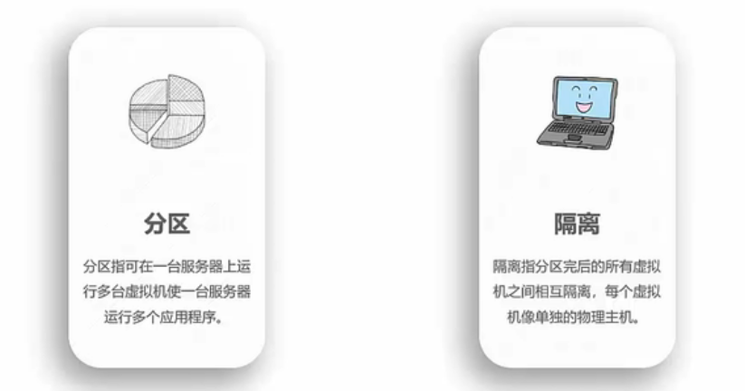
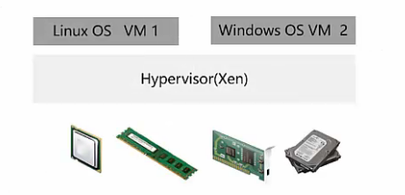

> 虚拟化技术和容器概念

# 虚拟化
虚拟化：一种计算机资源管理技术，将各种实体资源抽象、转换成另一种形式的技术都是虚拟化。

作用：通过该技术将一台计算机虛拟为多台逻辑计算机。在一台计算机上同时运行多个逻辑计算机，毎个逻辑计算机可运行不同的操作系统，并且应用程序都可以在相互独立的空间内运行而互不影响，从而显著提高计算机的工作效率

理解：自己的电脑上装一个VMWare Workstations，每个虚拟机镜像里面是独立的一个操作系统，但是都共享同一台物理计算机资源

云计算与虚拟化的关系
从行业数据互相关联的角度来说，云计算是极度依赖虚拟化的。但虚拟化并非云计算，云计算也并非虚拟化。
虚拟化只是云计算的核心技术，但并非云计算的核心关注点。
云计算：一种网路资源服务。
虚拟化：一种技术实现基础。
服务需要有技术支撑才能提供服务，所以说云计算极度依赖虚拟化
## 虚拟化中的概念

## 虚拟化的特点

## 虚拟化的类型
#### 寄居虚拟化
在主机（宿主）操作系统上安装和运行虚拟化程序

特点：
简单、易于实现。
安裝和运行应用程序依赖于主机操作系统对设备的支持。
有两层OS，管理开销较大，性能损耗大。
虛拟机对各种物理设备（cpu、内存、硬盘等)的调用，都通过虚拟化层和宿主机的OS一起协调才能完成
应用：
VmWare Workstations 和 Virtual Box都是基于这种方式实现的

#### 裸金属虚拟化
直接将VMM安装在硬件设备上，VMM在这种模式下又叫做Hypervisor，虚拟机有指令要执行时， hypervisor会接管该指令，模拟相应的操作
特点
不依赖于操作系统
支持多种操作系统，多种应用
依赖虚拟层内核和服务器控制台进行管理
需要对虚拟层的内核进行开发
应用：
VMware ESX、Xen、华为 Fusion Sphere基于这种方式
#### 混合虚拟化
在一个现有的正常操作系统下安装—个内核模块，内核拥有虚拟化能力。（相当于寄居与裸金属的混合）

特点
相对于寄居虚拟化架构，性能高
相对于裸金属虚拟化架构，不需要开发內核
可支持多种操作系统
需底层硬件支持虚拟化扩展功能
应用
Redhat KVM基于这种方式

## 虚拟化层架构
虚拟化层架构有：全虚拟化、半虚拟化、硬件辅助虚拟化

### 全虚拟化
即所抽象的VVM具有完全的物理特性，虚拟化层负责捕获CPU指令，为指令访问硬件充当媒介

典型的有 VMware, Virtua|box, irtua|PC，KVM-x86
特点：
OS无需修改
速度和功能都非常不错，使用非常简单
移植性好

### 全虚拟化：KvM
KVM（ Kerne|- Based virtual machines）是一个基于 Linux內核的虚拟化技术，可以直接将 Linux内核转换为 Hypervisor。从而使得Linuⅹ内核能够直接管理虚拟机，直接调用Linux内核中的内存管理、进程管理子系统来管理虚拟机。
组成：由处于内核态的KVM模块和用户态的QEMU两部分组成。

### 半虚拟化
起初是为了解决全虚拟化效率不高的困难，它需要修改OS，工作效率相对全虚拟化要高很多。 Hypervisor直接安装在物理机上，多个虚拟机在 Hypervisor上运行。 Hypervisor实现方式一般是一个特殊定制的 Linux系统。

典型的有Xen、 VMWare ESXi、微软 Hyper-V
特点
架构更精简。
在整体速度上有一定的优势。
需要对OS进行修改，在用户体验方面比较麻烦。

### 半虚拟化：Xen
Ⅹen：直接把操作系统内核改了，把OS改成一个轻量级 Hypervisor在里面运行了一个
管理所有资源作资源调度的 Domain0
组成：由 Xen Hypervisor（虚拟化层）、 DomainO（管理主机）、 DomainU（用户虚拟机）

### 硬件辅助虚拟化
硬件辅助虛拟化：硬件辅助虚拟化是随着虚拟化技术的应用越来越广泛lnηte、AMD等
硬件厂商通过对硬件的改造来支持虚拟化技术。

常用于优化全虚拟化和半虚拟化产品，像 VMware Workstation，它虽然属于全虚拟化，但它在6.0版本中引入了硬件辅助虚拟化技术，比如lnηte的ⅥT-×和AMD的AMD-V。主流全虚拟化和半虚拟化产品都支持硬件辅助虚拟化。（ VirtualBox,KVM,Xen等）

# 容器
容器：包装或装载物品的贮存器，利用一个开源的应用容器引擎，让开发者可以打包他们的应用以及依赖包到一个可移植的镜像中，然后发布到任— Linux或 Windows机器上，也可以实现虛拟化。相互之间不会有仼何接口，实现APP与操作系统的解耦

镜像是可执行的独立软件包，包含软件运行的内容：代码，运行时环境，系统工具，系统库和设置。（容器就是将OS上层的应用进行了隔离）

## 主流容器技术 Docker
定义：Docker属于 Linux容器的一种封装，提供简单易用的容器使用接口，他是目前最流行的 Linux容器解决方案
作用：将应用程序与该程序的依赖，打包在一个文件里。运行这个文件，就会生成一个虚拟容器。程序在这个虚拟容器里运行，就好像在真实的物理机上运行一样。有了Docker，就不用担心环境问题。
核心：实现应用与运行环境整体打包以及打包格式统一。
## Docker的组成
一个完整的 Docker有以下几个部分组成：
客户端（ Docker Client）
守护进程（ Docker daemon）
镜像（ Docker Image）
容器（ DockerContainer）
仓库（ Docker Registry）

## 容器特点
容器本质上是一款轻量级虚拟化技术
用户需要高效运行环境，而非整个机器
一次构建、到处运行
部署方便（创建的速度快，秒级）
隔离性好
成本低

# 物理计算资源虚拟化
云计算1.0时代以虚拟化为主，并在此基础上进一步发展，因此虚拟化也成为云计算的入门技术。
**在资源上可以将虚拟化技术分为：**

- 计算虚拟化
- 存储虚拟化
- 网络虚拟化

一个虚拟机的完整创建正是通过虚拟化技术这三部分

**从服务器组建角度来看，计算虚拟化可分为：**

- CPU虚拟化：  保障CPU资源的合理调度以及∨M上的指令能够正常高效的执行。
- 内存虚拟化：  保障内存空间的合理分配、管理，隔离，以及高效可靠地使用。
- I/o虚拟化：	保障M的O隔离与正常高效的执行。

详细的物理资源虚拟化介绍还是看视频，都是些概念性的东西。

参考资料：

- -视频：[云计算基础知识教程](https://www.bilibili.com/video/BV17k4y167Hg?p=1)
