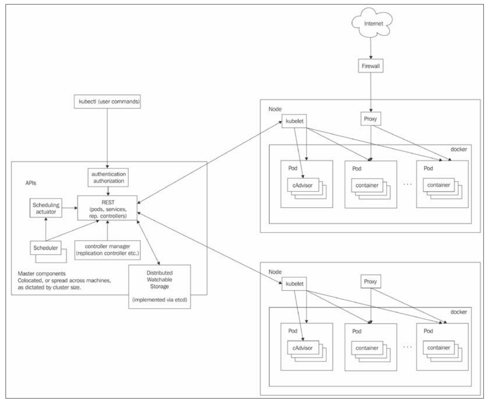
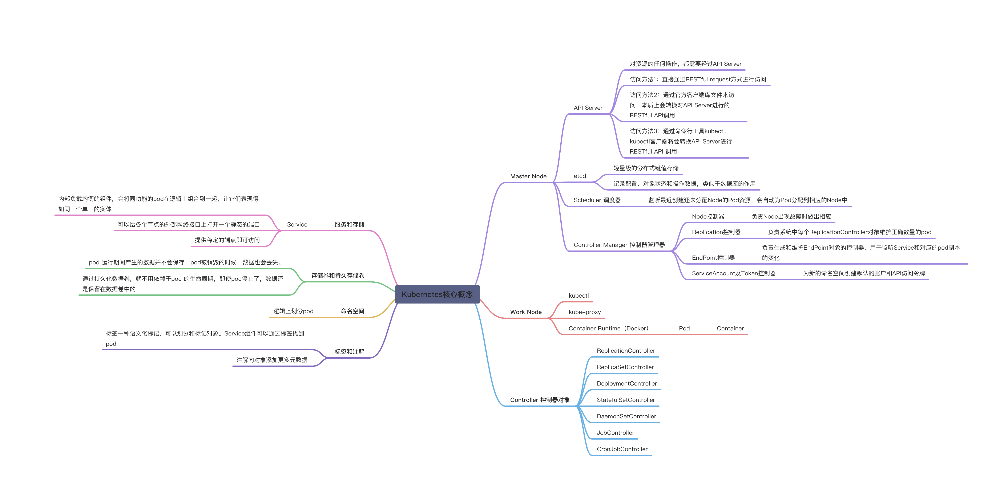

> 《Kubernetes从入门到实践》赵卓

Kubernetes起源于Google内部的容器集群系统Borg，用于管理集群环境中的容器化应用程序
Kubernetes解决的问题：

- 组件复制
- 自动缩放
- 负载均衡
- 滚动更新
- 组件记录
- 检测和健康检查
- 服务发现
- 认证授权

架构

核心概念

Pod
pod是k8s的基本单位，所有的操作有基于此上。
容器本身并不会直接分配到主机上，而是会封装到pod的对象中

创建pod
查询pod
pod的详细模板信息
