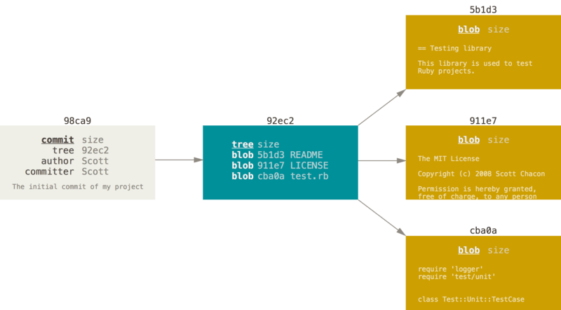

> ref： git官方文档

分支的主要目的：
分支意味着你可以把你的工作从开发主线上分离开来，以免影响开发主线

Git保存的不是文件的变化或者差异，而是系列不同时刻的快照snapshot。在进行提交操作时，Git 会保存一个提交对象（commit object）。该提交对象会包含一个指向暂存内容快照的指针，首次提交产生的提交对象没有父对象，普通提交操作产生的提交对象有一个父对象， 而由多个分支合并产生的提交对象有多个父对象
当使用 `git commit` 进行提交操作时，Git 会先计算每一个子目录（本例中只有项目根目录）的校验和， 然后在 Git 仓库中这些校验和保存为树对象


修改后再次提交，产生的提交对象会包含一个之喜丧上次提交对象的指针

Git 的分支，其实本质上仅仅是指向提交对象的可变指针

你可以简单地使用 git log 命令查看各个分支当前所指的对象。 提供这一功能的参数是 --decorate。

/
```bash
$ git log --oneline --decorate
f30ab (HEAD -> master, testing) add feature #32 - ability to add new formats to the central interface
34ac2 Fixed bug #1328 - stack overflow under certain conditions
98ca9 The initial commit of my project
```
项目分叉历史:
因为刚才你创建了一个新分支，并切换过去进行了一些工作，随后又切换回 master 分支进行了另外一些工作。 上述两次改动针对的是不同分支：你可以在不同分支间不断地来回切换和工作，并在时机成熟时将它们合并起来


由于 Git 的分支实质上仅是包含所指对象校验和（长度为 40 的 SHA-1 值字符串）的文件，所以它的创建和销毁都异常高效。 创建一个新分支就相当于往一个文件中写入 41 个字节（40 个字符和 1 个换行符.
在 Git 中，任何规模的项目都能在瞬间创建新分支。 同时，由于每次提交都会记录父对象，所以寻找恰当的合并基础（译注：即共同祖先）也是同样的简单和高效。 这些高效的特性使得 Git 鼓励开发人员频繁地创建和使用分支

切换分支需要注意的点：
要留意你的工作目录和暂存区里那些还没有被提交的修改， 它可能会和你即将检出的分支产生冲突从而阻止 Git 切换到该分支。 最好的方法是，在你切换分支之前，保持好一个干净的状态。

合并分支
相同父节点
```
$ git checkout master
$ git merge hotfix
Updating f42c576..3a0874c
Fast-forward
 index.html | 2 ++
 1 file changed, 2 insertions(+)
```
在合并的时候，你应该注意到了“快进（fast-forward）”这个词。 由于你想要合并的分支 `hotfix` 所指向的提交 `C4` 是你所在的提交 `C2` 的直接后继， 因此 Git 会直接将指针向前移动。换句话说，当你试图合并两个分支时， 如果顺着一个分支走下去能够到达另一个分支，那么 Git 在合并两者的时候， 只会简单的将指针向前推进（指针右移），因为这种情况下的合并操作没有需要解决的分歧——这就叫做 “快进（fast-forward）”

不同父节点
```
$ git checkout master
Switched to branch 'master'
$ git merge iss53
Merge made by the 'recursive' strategy.
index.html |    1 +
1 file changed, 1 insertion(+)
```
这和你之前合并 `hotfix` 分支的时候看起来有一点不一样。 在这种情况下，你的开发历史从一个更早的地方开始分叉开来（diverged）。 因为，`master` 分支所在提交并不是 `iss53` 分支所在提交的直接祖先，Git 不得不做一些额外的工作。 出现这种情况的时候，Git 会使用两个分支的末端所指的快照（`C4` 和 `C5`）以及这两个分支的公共祖先（`C2`），做一个简单的三方合并

### 遇到冲突时的分支合并
有时候合并操作不会如此顺利。 如果你在两个不同的分支中，对同一个文件的同一个部分进行了不同的修改，Git 就没法干净的合并它们。 如果你对 #53 问题的修改和有关 `hotfix` 分支的修改都涉及到同一个文件的同一处，在合并它们的时候就会产生合并冲突

```
<<<<<<< HEAD:index.html
<div id="footer">contact : email.support@github.com</div>
=======
<div id="footer">
 please contact us at support@github.com
</div>
>>>>>>> iss53:index.html
```
这表示 `HEAD` 所指示的版本（也就是你的 `master` 分支所在的位置，因为你在运行 merge 命令的时候已经检出到了这个分支）在这个区段的上半部分（`=======` 的上半部分），而 `iss53` 分支所指示的版本在 `=======` 的下半部分。 为了解决冲突，你必须选择使用由 `=======` 分割的两部分中的一个


如何避免每次输入密码
如果你正在使用 HTTPS URL 来推送，Git 服务器会询问用户名与密码。 默认情况下它会在终端中提示服务器是否允许你进行推送。
如果不想在每一次推送时都输入用户名与密码，你可以设置一个 “credential cache”。 最简单的方式就是将其保存在内存中几分钟，可以简单地运行 `git config --global credential.helper cache` 来设置它。

```
$ git branch -vv
  iss53     7e424c3 [origin/iss53: ahead 2] forgot the brackets
  master    1ae2a45 [origin/master] deploying index fix
* serverfix f8674d9 [teamone/server-fix-good: ahead 3, behind 1] this should do it
  testing   5ea463a trying something new
```
这里可以看到 `iss53` 分支正在跟踪 `origin/iss53` 并且 “ahead” 是 2，意味着本地有两个提交还没有推送到服务器上。 也能看到 `master` 分支正在跟踪 `origin/master` 分支并且是最新的。 接下来可以看到 `serverfix` 分支正在跟踪 `teamone` 服务器上的 `server-fix-good` 分支并且领先 3 落后 1， 意味着服务器上有一次提交还没有合并入同时本地有三次提交还没有推送。 最后看到 `testing` 分支并没有跟踪任何远程分支。


### **拉取**
当 `git fetch` 命令从服务器上抓取本地没有的数据时，它并不会修改工作目录中的内容。 它只会获取数据然后让你自己合并。 然而，有一个命令叫作 `git pull` 在大多数情况下它的含义是一个 `git fetch` 紧接着一个 `git merge` 命令。 如果有一个像之前章节中演示的设置好的跟踪分支，不管它是显式地设置还是通过 `clone` 或 `checkout` 命令为你创建的，`git pull` 都会查找当前分支所跟踪的服务器与分支， 从服务器上抓取数据然后尝试合并入那个远程分支。
由于 `git pull` 的魔法经常令人困惑, 所以通常单独显式地使用 `fetch` 与 `merge` 命令会更好一些

变基
 你可以使用 `rebase` 命令将提交到某一分支上的所有修改都移至另一分支上，就好像“重新播放”一样。

在这个例子中，你可以检出 `experiment` 分支，然后将它变基到 `master` 分支上：

```
$ git checkout experiment
$ git rebase master
First, rewinding head to replay your work on top of it...
Applying: added staged command
```
它的原理是首先找到这两个分支（即当前分支 `experiment`、变基操作的目标基底分支 `master`） 的最近共同祖先 `C2`，然后对比当前分支相对于该祖先的历次提交，提取相应的修改并存为临时文件， 然后将当前分支指向目标基底 `C3`, 最后以此将之前另存为临时文件的修改依序应用。 （译注：写明了 commit id，以便理解，下同）
现在回到 `master` 分支，进行一次快进合并。
```
$ git checkout master
$ git merge experiment
```


请注意，无论是通过变基，还是通过三方合并，整合的最终结果所指向的快照始终是一样的，只不过提交历史不同罢了。 变基是将一系列提交按照原有次序依次应用到另一分支上，而合并是把最终结果合在一起。


### 变基的风险
呃，奇妙的变基也并非完美无缺，要用它得遵守一条准则：
**如果提交存在于你的仓库之外，而别人可能基于这些提交进行开发，那么不要执行变基。**
变基操作的实质是丢弃一些现有的提交，然后相应地新建一些内容一样但实际上不同的提交
**变基的例子举得比较复杂，而且现实开发中应该不会这么傻逼吧**

### 变基 vs. 合并
至此，你已在实战中学习了变基和合并的用法，你一定会想问，到底哪种方式更好。 在回答这个问题之前，让我们退后一步，想讨论一下提交历史到底意味着什么。
有一种观点认为，仓库的提交历史即是 **记录实际发生过什么**。 它是针对历史的文档，本身就有价值，不能乱改。 从这个角度看来，改变提交历史是一种亵渎，你使用 谎言 掩盖了实际发生过的事情。 如果由合并产生的提交历史是一团糟怎么办？ 既然事实就是如此，那么这些痕迹就应该被保留下来，让后人能够查阅。
另一种观点则正好相反，他们认为提交历史是 **项目过程中发生的事**。 没人会出版一本书的第一版草稿，软件维护手册也是需要反复修订才能方便使用。 持这一观点的人会使用 `rebase` 及 `filter-branch` 等工具来编写故事，怎么方便后来的读者就怎么写。
现在，让我们回到之前的问题上来，到底合并还是变基好？希望你能明白，这并没有一个简单的答案。 Git 是一个非常强大的工具，它允许你对提交历史做许多事情，但每个团队、每个项目对此的需求并不相同。 既然你已经分别学习了两者的用法，相信你能够根据实际情况作出明智的选择。
**总的原则是，只对尚未推送或分享给别人的本地修改执行变基操作清理历史， 从不对已推送至别处的提交执行变基操作，这样，你才能享受到两种方式带来的便利。（即，自己本地仓库，你整理好就行，远程的你瞎整理，别人的还要重新根据你的整理再弄一次。）**
