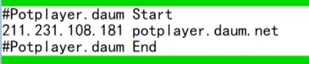
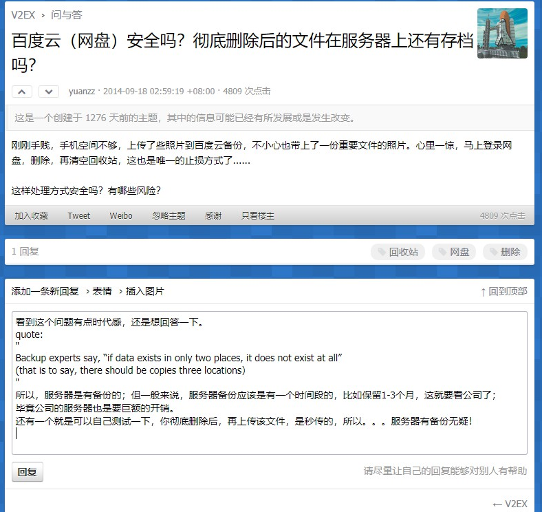
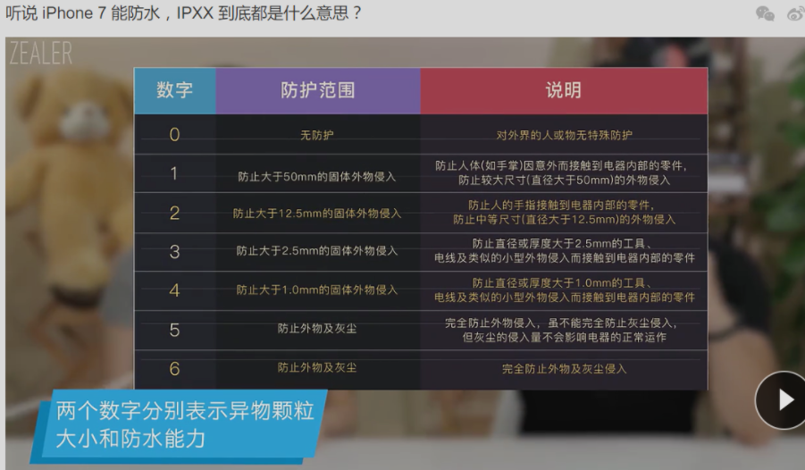
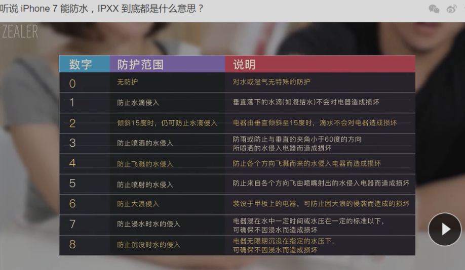

## 英特尔处理器数字解释 from official

https://www.intel.com/content/www/us/en/processors/processor-numbers-data-center.html

## 关于OneDrive的服务器存放地理位置的问题——官方：国外！

[https://answers.microsoft.com/zh-hans/msoffice/forum/all/%E8%AF%B7%E9%97%AEoffice/7f87bb36-9384-4d0b-8d2e-648b7decc1db](https://answers.microsoft.com/zh-hans/msoffice/forum/all/请问office/7f87bb36-9384-4d0b-8d2e-648b7decc1db)

### OneDrive客户数据位于何处？

https://products.office.com/zh-cn/where-is-your-data-located

我看到有在香港，大陆没有数据中心

## 如何访问Potplayer官网（DNS科普）

我们只需在hosts文件里填写上：211.231.108.181 [potplayer.daum.net](http://potplayer.daum.net/)

填写方法如图。hosts文件路径：C盘\windows\system32\drivers\etc\hosts

## 比特币最高价格 --> 18674美元 2017年12月

比特币在全球的影响力越来越大，年产量却越来越少，国内很多投资者都跃跃欲试，这场收益亏损并存的数字货币大战还将持续很多年。从0.003美元的价格起步，到18674美元“前无古人”的宏伟战绩，再到如今7000多美元的中庸表现，纵观比特币这十一年发展史，可谓“暴涨暴跌永不休，一家欢喜一家愁”。比特币的初衷是推广区块链技术，如今区块链被越来越多的投资者看重，无数科技公司吸收了这种先进的技术理念，准备将它投入市场运用，不管比特币以后还会涨停多少次，未来的技术前景一定是开阔

## iPad充电器不能为iPhone充电吗？——能

能！https://www.guokr.com/article/83521/

结论：谣言粉碎。 用iPad充电器为iPhone充电是完全可行的，对iPhone和充电器都不会有损伤。而iPhone充电器为iPad充电也可以，只不过所需的充电时间更长

## 为何「John」要译成「约翰」？ 

https://www.zhihu.com/question/19562087

John 起源于《新约圣经》里的人物 John the Baptist（基督教和合本译为施洗约翰，天主教译为圣若翰洗者）。施洗约翰在约旦河中为人施洗礼，劝人悔改，是基督教的先行者，为耶稣宣讲教义打下了基础。 
施洗约翰的名字在希伯来语中读作「约翰南」（יוֹחָנָן, Yôḥanan）。我猜测，今世汉译「约翰」即由此来。

\##涨知识：北京为什么叫Peking？南京为什么叫Nanking？

[解释链接](https://mp.weixin.qq.com/s?__biz=MzIxNzUzODY1OA==&chksm=97faf1faa08d78ec91959699cd88063721d38b21376dc2d0bd7341db7ba6abff8eb33788f7d4&idx=1&mid=2247497975&scene=0&sn=19229b03e8696ffcf9b0bc8359fd07d0#rd)

来自老式拼音，它们跟半世纪前才实行的「汉语拼音方案」很不一样。比如还有像是北京【Peking】、南京【Nanking】、青岛【Tsingtao】这些地名的英文！

## Is Google Photos a safe place to upload photos and videos as a backup? - Quora

Backup experts say, “if data exists in only two places, it does not exist at all” (that is to say, there should be copies three locations).

## 摩尔定律

**定义：**摩尔定律是由英特尔（Intel）创始人之一戈登·摩尔（Gordon Moore）提出来的。其内容为：当价格不变时，集成电路上可容纳的元器件的数目，约每隔18-24个月便会增加一倍，性能也将提升一倍。换言之，每一美元所能买到的电脑性能，将每隔18-24个月翻一倍以上。这一定律揭示了信息技术进步的速度。**简单归纳：**集成电路芯片上所集成的电路的数目，每隔18个月就翻一倍。微处理器的性能每隔18个月提高一倍，或价格下降一半。用一个美元所能买到的计算机性能，每隔18个月翻两倍。
//这说明了数码产品的迭代速度快，购买数码产品保值也是很重要的一方面。比如iPhone的保值就很高，而国产的手机，基本上一年半载就大幅度的降价了。

## “#”符号是从啥时候开始兴起的？ ---> 2007年8月从Twitter开始兴起的。

http://jingxuan.guokr.com/pick/84667/

## 什么是八皇后问题？

[详细链接](https://zh.wikipedia.org/wiki/八皇后问题)

8×8的国际象棋中摆放8个皇后,使得任意一个皇后不被其它皇后吃掉,问共有多少种摆放方法。八个皇后在8x8棋盘上共有4,426,165,368（64C8）种摆放方法，但只有92个互不相同的解。如果将旋转和对称的解归为一种的话，则一共有12个独立解

## A Quick Guide for New Developers

https://www.colemanm.org/post/a-quick-guide-for-new-developers/

## How can I cleanup/clear the "Open More Notebooks" List?

Hi All,

There is a simple solution that worked for me. Credit goes to someone else's reply that I found on the net, but have lost the link to it. Basically, if you have Microsoft Onenote 2016, go to >File >Open, then scroll down to "Recent" documents. You will see a list of all recently opened Onenote documents. Right click on those documents and remove from list. Close Onenote 2016. Open "Windows Version Onenote". Click on "More Notebooks", then all those previously deleted Onenote docs will no longer appear in the listing.

Good Luck!

## 关于文件在服务器上是否有存档的问题——看公司良心！

## Wordpress.com 和 Wordpress.org 是有区别的！

前者这CSND，博客园那种博客差不多！简洁方便，适合用来记录文章。

后者需要自己搭建环境啊，域名之类的！比较繁琐，但是一切代码都掌握在自己手里！安全！

## 浏览器的无痕模式真的不记录用户操作的信息吗？无痕模式和自己手动删除记录有没有区别？

网上的信息，没有真正意义上的安全与隐私，一切都在别人的监视之下，只是除非不得已，不然网站管理员不会公布你的IP地址及访问记录

无痕模式- 只是在计算机本地没有记录，网络设备或者网站后台还是有记录的。这要看制作网页的人是否希望被浏览过的IP公布，绝大多数网站是不会给你放出这个的.每个浏览网页的IP都可以被网站的后台记录，管理网站的人可以看到，但是一般他是不会去看这些东西的，除非是有必要，或者是特殊原因才会去查看这些，每个在这个网页上浏览的IP都会有记录的.

## IPR(Ingress Protection Rating)

iphone7 的IPR为 IP67

第一个数字代表防尘，第二个数字代表防水

说明： 并不是数字越高防护能力越强，并不是迭代关系！ 能防沉水的不一定能防喷洒！

## 关于广告牌上的带宽100M的解释

电信100M/s ， 其实内在的意思是：100 x 1000 x 1000 位（bit）。注意是“位”，这就是运营商的套路~！

而8bit=1B ，所以说，需要在100M/8才是下载的字节数。

反正见到什么 联通100M，意思就是100x1000x1000位，需要除以8，才是理论下载速度。

先要普及下：宽带所标的“M”跟我们平常所理解的下载文件速度的“M”是有区别的。我们通常说现在的下载速度（或某文件的大小）是1M。这里的“M”的最基础单位是指“字节”，即下载的速度或这个文件的大小有1024K×1024字节这么快（或这么大）。而平常说我下载了一个100M的文件，就是指这个文件的大小有100×1024K×1024字节这么大。

而字节并不是电子数据的最小单位，最小单位是“位”，8个位保存一个字节（英文字母或数字等单字节字符），而1个中文占16个位。而电信等标的宽带速度是100M/s，这里就是指它的理论下载带宽每秒最高是：

100×1000×1000＝100000000位

因为8个位等于1个字节，所以这个速度每秒可下载

100000000位÷8=12500000字节，而1024字节＝1K字节，所以换算结果：

12500000字节÷1024≈12207.03K字节，1024K字节就等于1M字节，换算结果：

12207.03K字节÷1024≈11.92M

即这个电信标的100M宽带在下载文件时，理论上每秒可以下载11.92M，即如果我要下载一首20M的高音质歌曲，以这个速度还不用2秒就可以下载完了。