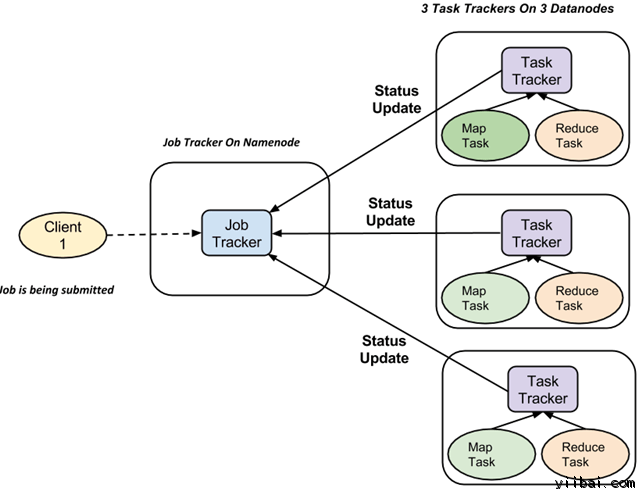

## 请求转发（Forward）和重定向（Redirect）的区别 

转发是服务器行为，重定向是客户端行为。

### Forward（转发）

服务器请求资源，服务器内部转发。 服务器直接访问目标地址的URL, 把那个URL的响应内容读取过来,然后把这些内容再发给浏览器。浏览器根本不知道服务器发送的内容从哪里来的，因为这个跳转过程实在服务器内部实现的，并不是在客户端实现的所以客户端并不知道这个跳转动作，所以它的地址栏还是原来的地址.

### Redirect（重定向）

服务端根据逻辑，发送一个状态码，告诉浏览器重新去请求那个地址，所以地址栏显示的是新的地址（URL） 

## i++ 和 ++i 的区别

原文地址：https://juejin.im/post/5ad82d106fb9a045e511b4da

int x=5;

x++;

其中x++中的++是一个方法，作用是给x加1值改为6，同时返回值是加之前的值！（即：先赋值后操作+1）

当我们给另外一个值赋值时，x的值是6，返回值是加之前的值5，所以y的值就是5


当++x,放在前面,是x先加1，返回加一后的值，本例中是6。


**总结：无论在前在后，对x都是一样的自身加1。**

只是对返回值存在差别，++放在前面返回值是加1后的值,放在后面返回原始值！

## 关于邮件的服务

POP3/IMAP/SMTP/Exchange/CardDAV/CalDAV服务

SMTP 管发 同一个domain直接转发local（qq发qq）不同domain需要寻找DNS进行转发（qq发163）

POP3 管收 电子邮箱客户端（foxmail.exe）收取邮件并删除服务器上的存根

IMAP 同pop3 不删除邮件存根

## 微信公众号冻结条例

3.5 浪费帐号资源行为，**长期未登录将会被冻结**

完成注册后，应正当使用帐号，不得浪费帐号资源，若存在包括但不限于**连续90日未登录**等情形，公众号的部分或全部功能，均可能被终止使用。终止使用后，帐号名称等相关限制将被解除或释放，注册所使用的邮箱、身份证、微信号等信息也将被取消注册状态。

## SS + Telegram 的正确使用方法

你需要一直运行着 SS，就算不启用系统代理都行。

打开 Telegram 的设置，找到“连接类型”，点“默认（使用 TCP）”

选择“通过 SOCKS5 代理”，服务器地址写 “127.0.0.1”，端口是你在 SS 里面设置的本地端口，一般为“1080”。保存即可。

## classpath是指 WEB-INF文件夹下的classes目录

解释classes含义：

存放各种资源配置文件，如：init.properties，log4j.properties，struts.xml

存放模板文件，如：actionerror.ftl

存放class文件，对应的是项目开发时的src目录编译文件

总结：这是一个定位资源的入口

classpath:与classpath*:的区别在于，前者只会从第一个classpath中加载，而后者会从所有的classpath中加载

## mysql \g \G

g代表的是go


## Difference between portable and installer editions

便携版/绿色版和安装版的区别

Some of our software products are offered in two editions: portable and installed.

- Portable application is just an executable file. It can be placed in a folder on your computer, a USB flash drive or any other removable media and launched from there. Portable software creates configuration files in its folder and usually doesn’t change anything in the system it runs on. If you copy the configuration files together with the executable file to another media, all your settings will be carried across too.
- Installer is an application packaged into an installation program. The installer places the application into a specific folder (usually in Program Files), creates shortcuts and adds an uninstaller. The installer may also register extra components in the system to enable additional functionality in the application.

Unless you have specific reasons to use the portable edition, it is best to use the installer. 

## Navicat 破解码

名称和组织不用填写：NAVH-WK6A-DMVK-DKW3

## information_schema

这个数据库中保存了MySQL服务器所有数据库的信息。 如数据库名，数据库的表，表栏的数据类型与访问权限等。 再简单点，这台MySQL服务器上，到底有哪些数据库、各个数据库有哪些表， 每张表的字段类型是什么，各个数据库要什么权限才能访问，等等信息都保存在information_schema里面。

- information_schema的表schemata中的列schema_name记录了所有数据库的名字
- information_schema的表tables中的列table_schema记录了所有数据库的名字
- information_schema的表tables中的列table_name记录了所有数据库的表的名字
- information_schema的表columns中的列table_schema记录了所有数据库的名字
- information_schema的表columns中的列table_name记录了所有数据库的表的名字
- information_schema的表columns中的列column_name记录了所有数据库的表的列的名字

## 【问题解决】bean ,domain,pojo,entries的区别

bean ,domain,pojo,entries....基本的意思都一样

## 如何在Sublime Text 3运行java代码

今天搞了下sublime3的环境配置和简单的操作

解决的问题有：

1.中文乱码

2.java代码在sublime里面运行！

java配置教程：

http://www.tuicool.com/articles/I7RZfi

乱码解决办法：

http://segmentfault.com/a/1190000002461891

## MapReduce的工作阶段

### MapReduce 如何工作

MapReduce分两个阶段：Map阶段，Reduce阶段


### MapReduce 如何组织工作

Hadoop 划分工作为任务。有两种类型的任务：Map 任务 (分割及映射)、Reduce 任务 (重排，还原)



## Chrome 截屏技巧

F12 打开开发者工具 调试界面, 然后 ctrl+shift+p, 调出命令输入, screenshot

## 有趣的排序 - 图

```java
for（int = 0；i<num.length;i++）{
	int temp=0;
	if(num[i]<num[i+1]){
		temp=num[i];
		num[i]=num[i+1];
		num[i+1]=temp;
	}
}
```

## [TO-DO]几个常见注释的区别

```java
@Resouce
@Autowaried
@Repository 
@Mapper
```

equals ， ==

Integer a= 127 与 Integer b = 127相等吗

对于对象引用类型：==比较的是对象的内存地址。

对于基本数据类型：==比较的是值

## 父引用 = 子对象

Parent p = new  Son( );  即：接口 变量名 = new 类（）；的问题

解释下为什么要用 接口变量做子类对象的引用？

先把结论丢出来吧，应该优先使用接口而不是类来引用对象，但只有存在适当的接口类型时。

也就是说，使用接口类去引用对象是有前提条件的——即实现类中全是接口类的方法的实现，没有自己单独的方法。当实现类存在自己的方法时，使用实现类来声明变量。

https://blog.csdn.net/summerxiachen/article/details/79733800

## [TO-DO]Ribbon和Nginx都有负载均衡的功能，有什么区别呢

待回答

## 什么是转义字符

某些字符无法在ASCII码里面找到对应的表达，于是有了 \ 加上一些字符的特定表达形式

\n 表示换行，而换行在ASCII 码表里没有对应的。

\t 表示tab制表符，ASCII 码也没有对应的.

## 解决Cannot download https://github.com/sass/node-sass/releases/download/binding.nod的问题

操作


## what's the difference between "hadoop fs" shell commands and "hdfs dfs" shell commands?

from StackOverflow


## 如何找到Hadoop的Linux安装路径

whereis Hadoop

## ORALCE 的 between ..and ..

ORALCE 的 between ..and ..包含边界值,mysql的不包含结束边界

ORALCE ：between 1 and 100, 1<=x<=100;  包含1,100

MySQL： between 1 and 100 ，1<= x <100;   不包含结束100

## 数据粒度的概念

数据粒度是指数据仓库中数据的细化和综合程度。根据数据粒度细化标准：细化程度越高，粒度越小；细化程度越低，粒度越大。

## 排序的稳定性含义

排序的稳定性 针对相同关键字而言；相同关键字在排序前后得相对位置不变的，具有稳定性！

## Having与Where的区别

where 子句的作用是在对查询结果进行分组前，将不符合where条件的行去掉，即在分组之前过滤数据，where条件中不能包含聚组函数，使用where条件过滤出特定的行。

having 子句的作用是筛选满足条件的组，即在分组之后过滤数据，条件中经常包含聚组函数，使用having 条件过滤出特定的组，也可以使用多个分组标准进行分组。

示例8

select 类别, sum(数量) as 数量之和 from A

group by 类别

having sum(数量) > 18

示例9：Having和Where的联合使用方法

select 类别, SUM(数量)from A

where 数量 gt;8

group by 类别

having SUM(数量) gt; 10

## 什么是脏读，不可重复读，幻读

- 脏读

- - 脏读就是指当一个事务正在访问数据，并且对数据进行了修改，而这种修改还没有提交到数据库中，这时，另外一个事务也访问这个数据，然后使用了这个数据。

- 不可重复读

- - 是指在一个事务内，多次读同一数据。在这个事务还没有结束时，另外一个事务也访问该同一数据。那么，在第一个事务中的两 次读数据之间，由于第二个事务的修改，那么第一个事务两次读到的的数据可能是不一样的。这样就发生了在一个事务内两次读到的数据是不一样的，因此称为是不 可重复读。例如，一个编辑人员两次读取同一文档，但在两次读取之间，作者重写了该文档。当编辑人员第二次读取文档时，文档已更改。原始读取不可重复。如果 只有在作者全部完成编写后编辑人员才可以读取文档，则可以避免该问题。

- 幻读:

- - 是指当事务不是独立执行时发生的一种现象，例如第一个事务对一个表中的数据进行了修改，这种修改涉及到表中的全部数据行。 同时，第二个事务也修改这个表中的数据，这种修改是向表中插入一行新数据。那么，以后就会发生操作第一个事务的用户发现表中还有没有修改的数据行，就好象 发生了幻觉一样。例如，一个编辑人员更改作者提交的文档，但当生产部门将其更改内容合并到该文档的主复本时，发现作者已将未编辑的新材料添加到该文档中。 如果在编辑人员和生产部门完成对原始文档的处理之前，任何人都不能将新材料添加到文档中，则可以避免该问题。

- 补充 :基于元数据的 Spring 声明性事务 :

Isolation 属性一共支持五种事务设置，具体介绍如下：

l DEFAULT 使用数据库设置的隔离级别 ( 默认 ) ，由 DBA 默认的设置来决定隔离级别 .

l READ_UNCOMMITTED 会出现脏读、不可重复读、幻读 ( 隔离级别最低，并发性能高 )

l READ_COMMITTED 会出现不可重复读、幻读问题（锁定正在读取的行）

l REPEATABLE_READ 会出幻读（锁定所读取的所有行）

l SERIALIZABLE 保证所有的情况不会发生（锁表）

不可重复读的重点是修改:

同样的条件 , 你读取过的数据 , 再次读取出来发现值不一样了

幻读的重点在于新增或者删除

同样的条件 , 第 1 次和第 2 次读出来的记录

## 数据仓库与数据库的主要区别在于：

（1）数据库是面向事务的设计，数据仓库是面向主题设计的。

（2）数据库一般存储在线交易数据，数据仓库存储的一般是历史数据。

（3）数据库设计是尽量避免冗余，数据仓库在设计是有意引入冗余。

（4）数据库是为捕获数据而设计，数据仓库是为分析数据而设计

## 数据结构的逻辑结构和存储结构

数据的逻辑结构也称为数据结构,分两大类：线性结构和非线性结构.

例如：线性表、栈、队列、串

存储结构分四类：顺序存储、链接存储、索引存储和散列存储.

例如：树、图等。

逻辑结构：指各数据元素之间的逻辑关系。

存储结构：就是数据的逻辑结构用计算机语言的实现

一种逻辑结构在计算机里可以用不同的存储结构实现。

比如逻辑结构中简单的线性结构可以用数组（顺序存储）或单向链表（链接存储）来实现。

同一逻辑结构采用不同的存储方法，可以得到不同的存储结构

【例】线性表是一种逻辑结构，用顺序方法的存储表示，称其为顺序表；用链式存储方法，称为链表；用散列存储方法，称为散列表。

## 同比和环比

同比：今年的第几个月和去年的第几个月比！ 比如：2016年3月和2017年3月比。（这两年都只是进行3月的比较，其他时间不比较。）

环比：今年的某个月和今年的前一个月比！比如：2016年3月和2016年2月比。

微服务CAP的概念

## CAP的概念

Consistency 一致性， Availability 可用性，Partition Tolenrance 分区容错性，CAP 关注的粒度是数据。

**组合情况**

CA 单点集群，满足一致性和高可用，适用于扩展性不大的应用，因为一旦进行分布，分区容错必须有

CP 满足一致性，分区容错，但通常可用性不太高，意味着可能会出现服务中断

AP 满足可用性，分区容错，但一致性要求低一些，这个通常出现在高并发的应用中，例如淘宝的双十一这类活动性的，数据的一致性可以到过后在修复，首先满足可用性。（这就是为什么你看到有时候明明显示还有2-3件产品，但是你死活下不了单，因为库存已经没有了，只是数据还没有更新过来）

## 服务注册组件的区别


## git pull = git fetch + git merge

git & github 的区别

git是大佬，github是放代码的地方


## What is the difference between open project and import project in Intellij?

https://stackoverflow.com/questions/37304297/what-is-the-difference-between-open-project-and-import-project-in-intellij

Basically you can use Open every time as it works both for new and existing projects.

The only additional feature of Import is that you can set new project name and location if you wish to and additionaly do some basic config stuff such as Add Framework support (but thiis you can do even if you open project later). 

My personal preference is to use only Open as Import is rarely necessary for me.

## GBK和UTF-8编码

我们这里将以最简单最容易理解的方式来描述GBK和UTF8的区别，以及它们分别是什么

GBK编码：

它是指中国的中文字符，其它它包含了简体中文与繁体中文字符，另外还有一种字符“gb2312”，这种字符仅能存储简体中文字符。

UTF-8编码：

它是一种全国家通过的一种编码，如果你的网站涉及到多个国家的语言，那么建议你选择UTF-8编码。

各自优点：

UTF8编码格式很强大，支持所有国家的语言，正是因为它的强大，才会导致它占用的空间大小要比GBK大，对于网站打开速度而言，也是有一定影响的。

GBK编码格式，它的功能少，仅限于中文字符，当然它所占用的空间大小会随着它的功能而减少，打开网页的速度比较快。

## 响应页面乱码解决

response.setContentType("text/html;charset=utf-8");

## URI URL URN三者之间的关系


## 什么是spring web flow

有时候，Web 应用程序需要控制网络冲浪者的方向，引导他们一步步地访问应用。比较典型的例子就是电子商务站点的结账流程，从购物车开始，应用程序会引导你依次经过派送详情、账单信息以及最终的订单确认流程。

Spring Web Flow 是一个 Web 框架，它适用于元素按规定流程运行的程序。

Spring Web Flow作为Spring MVC 的扩展，它支持开发基于流程的应用程序。它将流程的定义与实现流程行为的类和视图分离开来。

## XShell 无法连接VMware

宿主机和虚拟机都可以ping通,但是不知道为什么用XShell连接时候就无法连接了. 

也不知道怎么回事,被我找到了这个文件( vi /etc/ssh/sshd_config), 然后看到这个Port 22被注释掉了. 然后尝试着放开, 保存. 

重启 /sbin/service sshd restart 

然后居然可以连接上了.


## [TO-DO]三次握手 四次挥手

## 关于字节char的一些碎片

一个字节的长度限制是-128 127

char(10) 中的数字表示存放的字符大小，而不是字节数 说明可以存放10个字符！这10字符需要用xxx 个字节存储

字节是计量单位，字符是abcde 这些人认识的东西， a字符可以用一个字节存储 类似于千克是字节，一个重量单位，一个人重50千克 

## 并发，异步，多线程的概念混淆

并发

异步

多线程

## 人工智能、机器学习、深度学习之间的层次

- 人工智能

- - 机器学习 交叉领域的学科

- - - 深度学习 专注于数据特征分析

## Spring Framework中用到的设计模式

单例模式

工厂模式

AOP里面有用到动态代理模式

## 什么是Mybatis的逆向工程？

Mybatis 通过数据库的表生成对应的entity /pojo类， xml mapper之类的配置文件

## 关于字节流 字符流

- 字节流可以读取字符串和二进制

- - 就是说 简单的文本和 图片视频
    - 字节流最小的数据单位是byte

- 字符流无法读取二进制的文件

- - 只能读取字符串文本文件。一图片视频什么的读不了
    - 字符流最小的数据单位是char

- 使用场景

- - 如果数据源出了文本还有其他类型的文件，使用InputStream
    - 如果数据源只是文本，使用Reader方便点
    - Output/Writer 类似