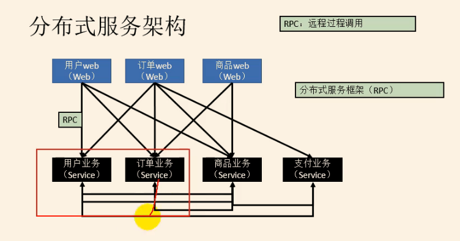

Dubbo学习笔记，整理后发布到目录中

笔记参考：[https://blog.csdn.net/qq_41157588/article/details/106737191](https://blog.csdn.net/qq_41157588/article/details/106737191)

RPC (remote procedure call) 远程过程调用

RPC框架有很多如：

Dubbo、gRPC、 Thrift、HsF（ High Speed Service Framework）

Dubbo是一种Java RPC框架，来自阿里巴巴，11年给了Apache。

# **服务注册中心**

推荐使用zookeeper

1. 安装zookeeper

# **UI可视化界面 ops / admin**

安装 admin

[https://github.com/apache/dubbo-admin](https://github.com/apache/dubbo-admin)
