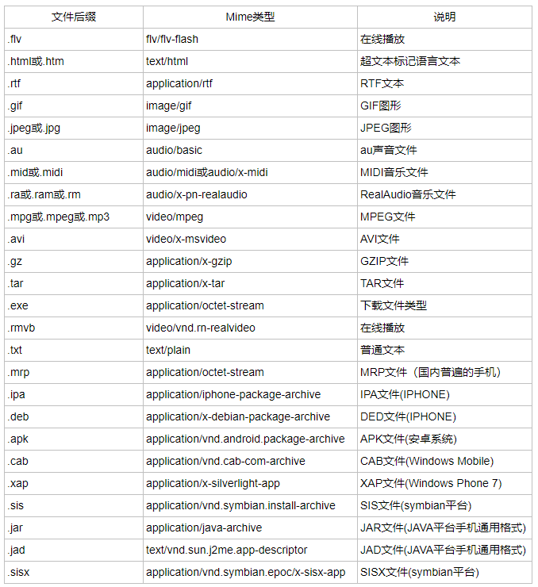

# jQuery
## jQuery 库 - 特性

- jQuery 是一个 JavaScript 函数库。
- jQuery 库包含以下特性：
- HTML 元素选取
- HTML 元素操作
- CSS 操作
- HTML 事件函数
- JavaScript 特效和动画
- HTML DOM 遍历和修改
- AJAX
- Utilities
## jQuery 语法

- jQuery 语法是为 HTML 元素的选取编制的，可以对元素执行某些操作。
- 基础语法是：$(selector).action()
- 美元符号定义 jQuery
- 选择符（selector）“查询”和“查找” HTML 元素
- jQuery 的 action() 执行对元素的操作
## 示例

- $(this).hide() - 隐藏当前元素
- $("p").hide() - 隐藏所有段落
- $(".test").hide() - 隐藏所有 class="test" 的所有元素
- $("#test").hide() - 隐藏所有 id="test" 的元素
- 提示：jQuery 使用的语法是 XPath 与 CSS 选择器语法的组合。在本教程接下来的章节，您将学习到更多有关选择器的语法。
# MIME类型是什么？
MIME(Multipurpose Internet Mail Extensions)多用途互联网邮件扩展类型。是设定某种扩展名的文件用一种应用程序来打开的方式类型，当该扩展名文件被访问的时候，浏览器会自动使用指定应用程序来打开。

# JS中(function(){xxx})(); 这种写法是什么意思？
自执行匿名函数：常见格式：(function() { /* code */ })( );

- 解释：包围函数（function(){})的第一对括号向脚本返回未命名的函数，随后一对空括号立即执行返回的未命名函数，括号内为匿名函数的参数。
- 作用：可以用它创建命名空间，只要把自己所有的代码都写在这个特殊的函数包装内，那么外部就不能访问，除非你允许(变量前加上window，这样该函数或变量就成为全局)。各JavaScript库的代码也基本是这种组织形式。

总结一下，执行函数的作用主要为 匿名 和 自动执行,代码在被解释时就已经在运行了。
其他写法
```javascript
(function ( ) { /* code */ } ( ));
!function ( ) { /* code */ } ( );
~function ( ) { /* code */ } ( );
-function ( ) { /* code */ } ( );
+function ( ) { /* code */ } ( );
```
# java web 之 WebRoot和WebContent目录
> [http://www.cnblogs.com/jokerjason/p/5727901.html](http://www.cnblogs.com/jokerjason/p/5727901.html)

WebRoot和WebContent都是程序的根文件夹，无本质区别，一下是两者的共同点和不同点：

- 共同点：都有一个WEB-INF文件夹，其下文件不可直接访问；WEB-INF是安全目录，所谓安全，就是用户客户端无法访问，只有服务器端可以访问。如果想在页面中直接访问，需要通过web.xml对要访问的文件进行映射。WEB-INF下除了web.xml，还有一个classes文件夹，放置*.class文件，类库，其下还有lib目录；
- 不同点：WebRoot是MyEclipse中的web project结构，可添加一些开源框架的支持（struts,hibernate等），也就是说，web project是MyEclipse拓展过后的项目；web project具有dynamic web project的特性，并具有一些方便开发的集成功能；WebContent是Eclipse下 dynamic web project结构；
# HTML中属性ID和属性NAME有何区别？
ID和Name都可以用来标识一个标记，Javascript分别有两个方法getElementById和getElementByName来定位Dom节点。
区别如下：
1、我们知道在网页做Post提交时，是以Form（即表单域）为单位进行提交的，一个Form里有若干个表单对象(如<input type="text" name="UserName" value="请输入姓名"/>)，同一个页面里可以为多个Form（Asp.net不同，它只允许有一个，且名字必须为Form1），在表单表提交到服务器端后，可以直接通过Name属性取到表单域的值，却无法通过ID直接取到该表表单对象的值。
2、同一个Form里不能有多个name属性相同的HTML标记，但如果一个网页中有多个Form，则不同的Form里可以有同个Name属性的标记。而ID是全局的，在一个HTML文档里不能有多个节点使用相同的ID，无论它处在哪个Form里。
3、在建立CSS样式的时候，可以建立ID样式表（以＃为前缀），使具有该ID的样式直接应用该样式，而无法建立Name样式表。
4、在进行网页编辑时建议使用ID来标识一个节点，而不是使用Name（除非是为了Post提交的需要），同样使用Javascript进行Dom节点定位时建议使用getElementById方法，因为只有ID能唯一标识一个节点，而同一个网页里可能会有多个Name属性相同的节点，它们分别处在不同的Form里。
# web.xml中load-on-startup的作用
<load-on-startup>x</load-on-startup>，中x的取值1，2，3，4，5代表的是优先级，而非启动延迟时间。正数的值越小，该servlet的优先级越高
