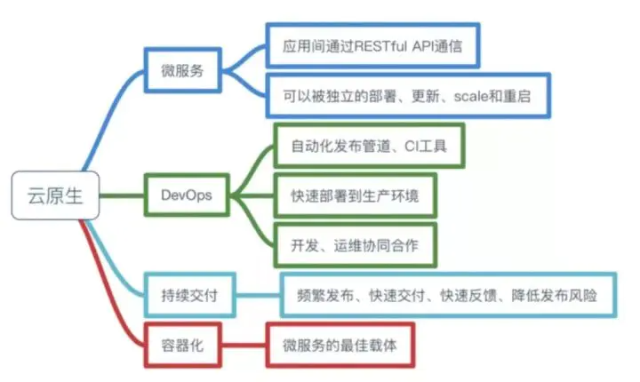

[链接：什么是Istio？](https://www.tetrate.io/blog/how-istio-got-its-name/)
istio  是希腊语Istio (ιστίο)， 翻译成英语是 sail ，也就是 启航 的意思
发音： Istio (ISS-tee-oh)

云原生其实没有一个准确的定义，都是改了又改的感觉。

1. [云原生的定义](https://jimmysong.io/kubernetes-handbook/cloud-native/cloud-native-definition.html)
2. [CNCF Cloud Native Definition v1.0](https://github.com/cncf/toc/blob/master/DEFINITION.md)
3. [华为云社区](https://juejin.cn/post/6844904197859590151) ：而Pivotal最新官网对云原生概括为4个要点：**DevOps+持续交付+微服务+容器**

[https://cdn.nlark.com/yuque/0/2020/webp/1587784/1607769533778-f8666b48-2370-4179-b38f-92f5e4dfe01b.webp](https://cdn.nlark.com/yuque/0/2020/webp/1587784/1607769533778-f8666b48-2370-4179-b38f-92f5e4dfe01b.webp)
