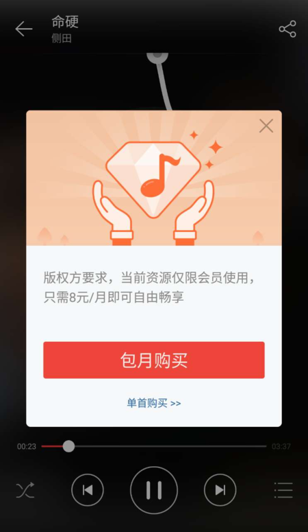
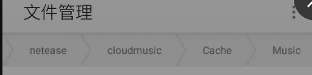
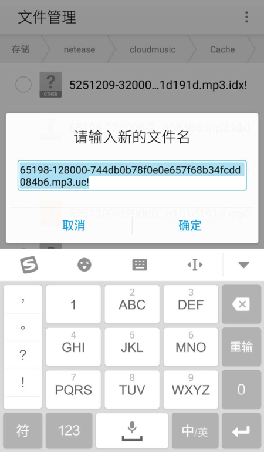
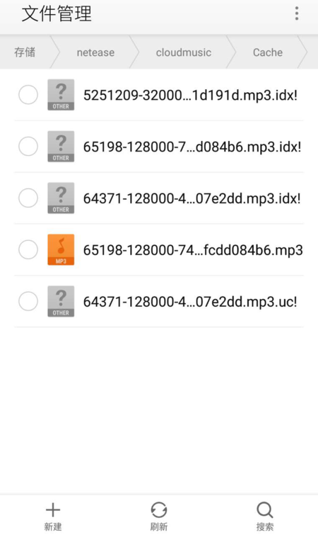
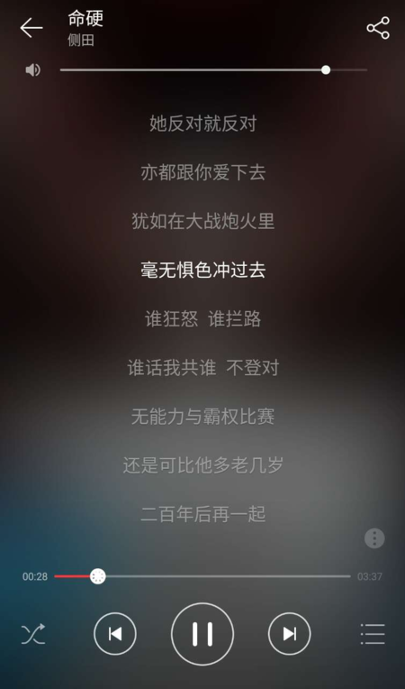

# **前言**

update2020： 当年身为一个白嫖党的倔强！ 哈哈。看着乐就行，现在不知道安卓端是否还能这么操作！

现在的音乐市场基本上推崇了付费听歌的趋势！首先本人很赞同这一点，无论是个人还是团体，在版权方面都应该得到尊重。不过，这种制度的推行，给习惯免费听歌下载的某部分人来说，造成了极大的不便！

1. 在一个音乐APP上听到一首不错的歌曲，想下载保存，无奈被告知需要首先成为会员才能进行下载！
2. 某些公司没有获得歌手的版权，无法在该APP上听（比如：网易云音乐，无法听那些名字变成灰色的歌！），这意味着你得在取得授权的APP上听，也就是你需要下载另外一个APP！
3. 我只是喜欢这一首偶尔听到的，旋律不错的歌！难道你还要我去完成上面的或者更多的操作吗？

# 开始教程

设备要求：Android手机一台，音乐APP一个！（网易云音乐）

网易云首页.png

## 1.找到一首需要付费下载的歌

侧田---命硬

侧田---命硬.png

点击下载后发现：

侧田---命硬.png

## 2.寻找cache目录

在文件管理中，找到netease/cloudmusic/Cache/Music

cache路径.png

## 3.重命名

然后你会发现这里这些数字组成的cache文件有一个.mp3的后缀，只不过后面还跟着一些东西！只需要把后面后面的 **.uc!**去掉。另外一个 **.idx** 是索引，不需要处理！因为你修改过后也是无法播放！

重命名.png

## 4.打开文件

然后会在该目录下得到一个.mp3结尾的文件，打开该文件！

Paste_Image.png

## 5.获取歌曲信息

一打开会发现，歌曲的确是刚才想下载的，但是歌曲信息是没有的，点击获取歌曲信息即可！

至于封面是否一样，这就关乎到服务器获取的问题!

感觉歌曲名，歌手名，歌词比较重要点！

还有一个细节就是，评论是没有的，喜欢按钮也是灰色的，参照开始！

getInformation.png

loading.png

cover.png

lyric.png

# **小结**

首先的一点是，通过这种方法的确是可以获得自己想要的单曲，但是有一个问题还是没有解决的是： 在找到cache目录的时候，那些都是数字的缓存文件，无法得知哪个是你刚才想要的！如果缓存文件多的话，要找到是你要的那个来修改的话，这就比较痛苦了！

有一个推荐的方法就是，通过文件管理的排序方式--按时间排序，可以提高修改成功率！请自行操作吧！

(完）

date: 2016年9月8日13:35:19