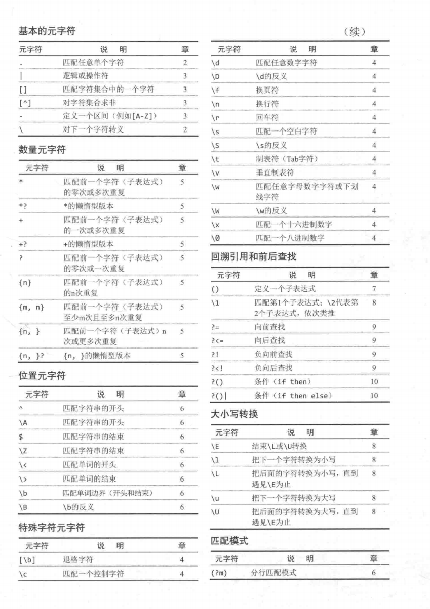

# 开局一张图，内容全靠编
> 为了方便查看相应的元字符含义，提到最上面来增加看到的机会

# 正则表达式
## 初见正则
现在回想起来，对于正则表达式的第一印象就是“乜賊嘢来噶？呃乜㖺啊？痴埋一齐鬼画符咁~！銩~🤓”_regex= /(\w+):\/\/([^/:]+)(:\d*)?([^# ]*)/_
当时因为不会把分段分块的看，语法方面也不是很懂，对于正则表达式的含义似懂非懂（就是不懂），看表达式都是一坨坨地看，晕死了。
> 参考书籍：《正则表达式（必知必会）》

## 概念和用途
正则表达式只是一种工具（**regular expression**），通过用文本字符串，设计出高度简练的规则，用于搜索、查找、匹配等场景下的问题。
**主要的用途： 1.进行搜索，2.进行替换**
## 例子
> regex1 = [a-zA-Z0-9_.]*
> regex2 = <[Hh]1>.*</[Hh]1>
> regex3 = \r\n\r\n
> regex4 = \d{3,3}-\d{3,3}-\d{4,4}

## 使用正则
掌握其语法并不是很困难，只要多看，遵循用进废退的原则；难点在于如何设计出符合当下场景的规则。
# 匹配单个字符
## 匹配纯文本
文本：
> Hello, my name is Sean. Please visit my website at www.xxx.com

正则：
_**my**_
规则解释：
这个my就是纯文本的正则，匹配文本中的my，文本中有两个my的匹配结果
结果：
> Hello, _**my **_name is Sean. Please visit _**my **_website at www.xxx.com

注意：

- 大部分情况下只会返回一个结果，上面虽然有两个my，但是默认返回的第一个，要想返回全部匹配结果，需要用数组或者其他形式来接收匹配结果
- 正则对字母大小写敏感 ，My或者MY都无法匹配结果
## 匹配任意字符
.字符可以匹配任何单个的字符、字母、数字和自己 . 字符本身
如果两个 .. 连续出现，将匹配任意两个字符
文本：
> sales.xls
> sales1.xls
> orders3.xls
> sales2.xls
> sales3.xls
> apac1.xls
> europe2. xls
> na1.xls
> na2.xls
> sa1.xls

正则：
_**sales.**_
结果：
> _**sales****.****xls   ### 注意这里 . 字符也是能被匹配的**_
> _**sales1**_.xls
> orders3.xls
> _**sales2**_.xls
> _**sales3**_.xls
> apac1.xls
> europe2. xls
> na1.xls
> na2.xls
> sa1.xls

## 匹配特殊字符
使用**\**（反斜杠）字符来对字符进行转义。 **\**是一个元字符（metacharacter），表示这个字符有特殊含义，而不是字符本身的含义。比如对 . 字符来说，它原本在正则的语法中的含义是“匹配任意单个字符”，但很不巧，我就是要匹配文本中的** .  **字符，此时需要进行转义**   \.   **通过这种方式，就可以告诉执行正则的家伙，我用了\进行转义，现在**.字符**的不再表示匹配文本中的单个字符，而是** . 字符本身**
文本：
> sales.xls
> sales1.xls
> orders3.xls
> sales2.xls
> sales3.xls
> apac1.xls
> europe2. xls
> na1.xls
> na2.xls
> sa1.xls

正则：
_**.a.\.xls**_
结果：
> sales.xls
> sales1.xls
> orders3.xls
> sales2.xls
> sales3.xls
> apac1.xls
> europe2. xls
> _**na1.xls**_
> _**na2.xls**_
> _**sa1.xls**_

同样地，如果需要匹配 \ 本身的话，对于\来说，原本在正则的语法下就是规定用来转义别的特殊字符，同样的也能转义 \ 自己本身 \\， 我转我自己！
# 匹配一组字符
## 匹配多个字符中的一个
使用** [ ] **定义一个字符集合，表示匹配该集合里面的任意一个成员。如 [abc]， 只要满足abc三个字符中的一个即可。
文本：
> sales.xls
> sales1.xls
> orders3.xls
> sales2.xls
> sales3.xls
> apac1.xls
> europe2. xls
> na1.xls
> na2.xls
> sa1.xls
> ca1.xls

正则：
_**[ns]a.\.xls**_
结果：
> sales.xls
> sales1.xls
> orders3.xls
> sales2.xls
> sales3.xls
> apac1.xls
> europe2. xls
> _**na1.xls**_
> _**na2.xls**_
> _**sa1.xls**_
> ca1.xls

解释：
只会匹配n或者s开头的，至于ca1.xls是匹配不到的
其他：
这种一般可以用于大小写的忽略场景之类的，[Aa]pple  大写或者小写开头的Apple，apple都可以
## 字符集合区间
使用类似（0-9，A-Z）表示集合的区间，0-9表示从0到9的整数0123456789，A-Z表示大写A到大写Z区间
文本：
> sales.xls
> sales1.xls
> orders3.xls
> sales2.xls
> sales3.xls
> apac1.xls
> europe2. xls
> sam.xls
> na1.xls
> na2.xls
> sa1.xls
> ca1.xls

正则：
_**[ns]a[0-9]\.xls**_
结果：
> sales.xls
> sales1.xls
> orders3.xls
> sales2.xls
> sales3.xls
> apac1.xls
> europe2. xls
> sam.xls
> _**na1.xls**_
> _**na2.xls**_
> _**sa1.xls**_
> ca1.xls

解释：
使用[0-9]代替了.字符，表示a后面只能接0-9的整数，而对于sam.xls，因为m是字母，所以无法匹配上。
_**[0-9] 等价于 [0123456789]**_
字符区间并不仅限于数字,以下这些都是合法的字符区间

- A-Z            匹配从A到Z的所有大写字母
- a-z             匹配从a到z的所有小写字母
- A-F            匹配从A到F的所有大写字母
- A-z            匹配从ASCII字符A到ASCII字符z的所有字母

注意点：

- 在定义一个字符区间的时候，一定要避免让这个区间的尾字符小于它的首字符（例如 [3-1] ）。这种区间是没有意义的，而且往往会让整个模式失效。
- **- **字符不是特殊字符，不需要转义，一般在区间内 [ ] 作为连接使用
- 多个字符区间可以在同一个字符集合中使用。
   - 如[A-Za-z0-9] 等价于[ABCDEFGHIJKLMNOPORSTUVWXYZabcdefghijklmnoparstuvwxyz0123456789]
## 取非匹配：^字符
取非，也就是取字符集合中相反的值，使用元字符^来表明你想对一个字符集和进行取非匹配
文本：
> sales.xls
> sales1.xls
> orders3.xls
> sales2.xls
> sales3.xls
> apac1.xls
> europe2. xls
> sam.xls
> na1.xls
> na2.xls
> sa1.xls
> ca1.xls

正则：
_**[ns]a[^0-9]\.xls**_
结果：
> sales.xls
> sales1.xls
> orders3.xls
> sales2.xls
> sales3.xls
> apac1.xls
> europe2. xls
> _**sam.xls**_
> na1.xls
> na2.xls
> sa1.xls
> ca1.xls

解释：
[0-9]是只匹配数字，[^0-9]匹配的是任何不是数字的字符。也只有sam.xls满足
# 元字符
## 对特殊字符转义
因为元字符在正则表达式中有特殊的含义，所以这些字符就无法用来代表它们本身。
文本：
> var myArray = new Array( );
> ...
> if (myArray[0] == 0 ){
> ...
> }

正则：
_**❌  myArray[0]**_
_**✅ myArray\[0\]**_
结果：
> var myArray = new Array( );
> ...
> if (_**myArray[0]**_ == 0 ){
> ...
> }

对于表达式 _**myArray[0] **_只会匹配出 _**myArray0，**_因为[0]表示一个数字0；而_**myArray\[0\]，**_使用了转义字符\进行转义，\[0\] 表示匹配字符[0]
其他：
_**myArray\[[0-9]\] **_表示匹配myArray[0-9]的字符形式，即系myArray[0],myArray[1],myArray[2]myArray[3]....
小tips：
写正则，养成成对编写，不然很容易漏掉。比如写 转义_**\[[0-9]\]**_的时候，应该顺手一起写_**\[ \],**_表示先转义两个[ ], 内容都在这两个里面。
## 匹配空白字符
| 元字符 | 说明 |
| --- | --- |
| [\\b] | 回退并删除一个字符（backspace键） |
| \\f | 换页符 |
| \\n | 换行符 |
| \\r | 回车符 |
| \\t | 制表符（Tab键） |
| \\v | 垂直制表符 |

\r\n是 Windows所使用的文本行结束标签。Unix和 Linux系统只使用一个换行符来结柬一个文本行；换句话说，在Unix/ Linux系统上匹配空白行只使用\n\n即可，不需要加上\r。同时适用于 Windows和Uniⅸ\Linux系统的正则表达式应该包含个可选的\r和一个必须被匹配的\n。

注意： **. 和 [ ] 是元字符**，但前提是你没有对它们进行转义。**f 和 n 也是元字符**，但前提是你对它们进行了转义。如果你没有对f和n进行转义，它们将被解释为普通字符，只能匹配它们本身。两者刚好相反。
# 特定字符类别
## 匹配数字（非数字）
  元字符                                说明

-        \d                任何一个整数数字字符，等价于 [0-9]
-        \D                任何一个非整数数字字符，等价于 [^0-9]

文本：
> var myArray = new Array( );
> ...
> if (myArray[0] == 0 ){
> ...
> }

正则：
_**myArray\[\d\]**_
结果：
> var myArray = new Array( );
> ...
> if (_**myArray[0]**_ == 0 ){
> ...
> }

解释：
\d匹配任意单个数字字符，所以_**myArray\[\d\]**_此时等价于_**myArray\[[0-9]\]**_
## 匹配字母数字
  元字符                                说明

-        \w                 任何一个字母数字字符（大小写均可）或下划线，等价于 [a-zA-Z0-9_]
-        \W                任何一个非字母数字字符或非下划线，等价于 [^a-zA-Z0-9_]

文本：
> 11213
> A1C2E3
> 48075
> AA237
> M1B4F2
> 90046
> H1H2H2

正则：
_**\w\d\w\d\w\d**_
结果：
> 11213
> _**A1C2E3**_
> 48075
> AA237
> _**M1B4F2**_
> 90046
> _**H1H2H2**_

_**\w\d\w\d\w\d **_匹配6个字符，第一个是\w，第二个字符是\d，表示只需要数字
## 匹配空白字符（非空白字符）
  元字符                                说明

-        \s                 任何一个空白字符，等价于 [\f\n\r\t\v]
-        \S                 任何一个飞空白字符，等价于 [^\f\n\r\t\v]
## 匹配十六进制，八进制
**十六进制**
在正则表达式中，十六进制数值要用**前缀 \x **标注，比如 \x0A对应这ASCII 字符10（换行符） 等价于\n
**八进制**
在正则表达式中，八进制数值要用**前缀 \0 **标注，比如 \011对应这ASCII 字符9（制表符） 等价于\t
## POSIX字符类
什么是POSIX字符？
JavaScript里面不支持POSIX字符类

| 字符类 | 说明 |
| --- | --- |
| [ :alnum: ] | 任何一个字母或数字 ( 等价于[a-zA-Z0-9] ) |
| [ :alpha: ] | 任何一个字母( 等价于[a-zA-Z] ) |
| [: digit :] | 任何一个数字(等价于[0-9]) |
| [: lower :] | 任何一个小写字母(等价于[a-z]) |
| [: upper :] | 任何一个大写字母(等价于[A-Z]) |
| [: print :] | 任何一个可打印字符 |
| [: graph :] | 和[:print:]一样,但不包括空格 |
| [: punct :] | 既不属于[:alnum:]也不属于[:cntr1:]的任何一个字符 |
| [ :blank: ] | 空格或制表符 (等价于  [\\t ] ) |
| [: space :] | 任何一个空白字符,包括空格  (等价于[^\\f\\n\\r\\t\\\\v ]) |
| [: xdigit :] | 任何一个十六进制数字(等价于 [a-fA-F0-9] ) |
| [: cntrl :] | ASCII控制字符 (ASCII 0到31,再加上ASCII127) |

注意：
这里使用的模式以 [[ 开头、以 ]] 结束(两对方括号).这是使用POSIX字符类所必须的.POSIX字符类必须括在[:和:]之间,我们使用的 POSIX字符类是[:xdigit:](不是:xdigit:).外层的[和]字符用来定义一个字符集合,内层的[和]字符是 POSIX字符类本身的组成部分.
# 重复匹配

匹配多个连续重复出现的字符或者字符集合
## 匹配多少个的问题
### 匹配重复一个或多个字符： +
使用+字符作为后缀的方式，就能给字符或者字符集合匹配多次重复的情况。
+表示匹配一个或多个字符（至少一个）
比如 a 匹配 a本身，a+将匹配一个或多个连续出现的a
文本：
> Send personal email to ben@forta.com. For questions about a book use supportaforta. com. Feel free to send unsolicited email to spam@forta.com (wouldn't it be nice if it were that simple, huh?)

正则：
**_\w+@\w+.\w+_**
**_[\w.]+@[\w.]+\.\w+      ###改进版本_**
结果：
> Send personal email to_** ben@forta.com**_. For questions about a book use _**support@forta. com**_. Feel free to send unsolicited email to _**spam@forta.com**_ (wouldn't it be nice if it were that simple, huh?)

### 匹配零个或多个字符：*
使用*字符表示匹配零个字符或者多个，这样可以匹配可有可无的字符情况；也就是出现零次或者多次
文本：
> Hello .ben@forta.com is my email address.

正则：
**_\w+[\w.]*@[\w.]+\.\w+_**
结果：
> Hello ._**ben@forta.com**_ is my email address.

解释：
开头的_**\w+**_负责匹配电子邮件地址里的第一个字符(一个字母数字字符,不包括_**.字符**_).接下来的_**[\W.]***_负责匹配电子邮件地址里第一个字符之后、@字符之前的所有字符,这个部分可以包含零个或多个字母数字字符和_**.字符**_
### 匹配零个或一个字符：？
使用？元字符来匹配零个或一个字符，表示出现零次或一次。
文本：
> The Url is http://www.forta.com/，to connect securely use https://www.forta.com instead.

正则：
**_https?://[\w./]?_**
结果：
> The Url is _**http://www.forta.com/**_，to connect securely use _**https://www.forta.com/**_ instead.

解释：
?在这里的含义是：我前面的字符s要么不出现，要么只出现一次，不能出现httpssss这种重复的。这样就可以匹配上http或者https的情况。
## 匹配的重复次数
前面的+，*，？都有局限性，不能定义重复出现的次数。

- +和*匹配的字符个数没有上限。我们无法为它们将匹配的字符个数设定一个最大值。
- +、*和？至少匹配零个或一个字符。我们无法为它们将匹配的字符个数另行设定一个最小值。
- 如果只使用+和*，我们无法把它们将匹配的字符个数设定为一个精确的数字。
### 在{ }内使用精确值设定匹配重复次数
设定重复的次数的语法，使用_**{ }字符**_来定义，把数值写在它们之间，如：_**s{6} **_ 字符s可以重复六次
### 在{ }内使用区间设定匹配重复次数
{ }语法还可以设置重复匹配次数区间，也就是为重复匹配次数设定一个最小值和一个最大值。如 _**s{2,4}**_ 字符s最少重复2次，最多重复4次。
### 匹配“至少重复多少次”
{ }中只给定一个最少值的时候，表明该字符至少重复给定的最少值。比如_** s{3, }**_  字符s至少重复3次，或者更多次
## 防止过度匹配
如果没能控制好前面几个元符号的使用，会导致匹配过度，也即是匹配到了一些我们不需要的字符数据
文本：
> This offer is not available to customers living in <B>AK</B> and <B>HI</B>

正则表达式
_**<[Bb}>.*</[Bb]>**_
结果
> This offer is not available to customers living in _**<B>AK</B> and <B>HI</B>**_

解释：
与我们的预期不一样，我们只希望能匹配标签<B></B>之间的内容（_**<B>AK</B>**_ and _**<B>HI</B>**_） and 这个并不在我们的预期内
为什么会这样？
因为*和+都是所谓的“贪婪型”元字符，它们在进行匹配时的行为模式是多多益善而不是适可而止的。它们会尽可能地从段文本的开头一直匹配到这段文本的末尾，而不是从这段文本的开头匹配到碰到第一个匹配时为止。

| 常用的贪婪型元字符和它们的懒惰型 |  |
| --- | --- |
| 贪婪型元字符 | 懒惰型元字符 |
| * | *? |
| + | +? |
| {n, } | {n, }? |

使用： _**<[Bb}>.*?</[Bb]> **_即可匹配到 _**<B>AK</B>**_ and _**<B>HI</B>**_
# 位置匹配
## 边界问题
问题例子：找出下面句子中的cat并替换成dog
> The cat scattered his food all over the room

如果使用正则_** cat  **_并替换则变成了不能被理解的句子
> The _**cat****  **_s_**cat**_tered his food all over the room
> The _**dog**_ s_**dog**_tered his food all over the room

使用边界限定符，也就是在正则表达式里用一些特殊的元字符来表明我们想让匹配操作在什么位置（或边界）发生
## 单词边界
使用限定符 \b 来指定单词的边界； \b用来匹配一个单词的开始或结尾
对于上面的例子，可以使用这样的正则：_**\bcat\b **_来表示找出句子中的cat单词
**关于\b**
\b到底匹配什么东西呢？
正则表达式引擎不懂英语（事实上，它不懂任何人类语言），也不知道什么是单词边界。简单地说，\b匹配的是一个这样的位置，这个位置位于一个能够用来构成单词的字符（字母、数字和下划线，也就是与\w相匹配的字符）和一个不能用来构成单词的字符（也就是与\w相匹配的字符）之间。
注意：
\b匹配且只匹配一个位置，不匹配任何字符。用\bcat\b匹配到的字符串的长度是3个字符（c、a、t），不是5个字符
使用\B来表明不匹配一个单词边界。
文本：
> Please enter the nine-digit id as it appears on your color - coded pass-key

正则：
**_\B-\B_**
结果：
> Please enter the nine-digit id as it appears on your color _**-**_ coded pass-key

分析
_**\B-\B**_将匹配一个前后都不是单词边界的连字符。nine-digit和pass-key中的连字符不能与之匹配，两边都是单词，但color - coded中的连字符可以与之匹配，两边是空格。
## 字符串边界
用来定义字符串边界的元字符有两个：

- 一个是用来定义字符串开头的 _**^ **_（位于字符串开头表示字符串开头，位于字符集合内或其他位置表示“求非”作用
- 另一个是用来定义字符串结尾的 _**$**_

文本
> This is bad, real bad
> <?xml version="1.0" encoding="UTF-8" ?>
> <wsdl:definitions target namespace="http://tips.cf"
> xmlns:impl="http://tips.cf" xmins:intf="http://tips.cf"
> xmins:apachesoap="http://xml.apacheorg/xml-soap"

正则表达式
**<\?xml.*\?>**
结果：
> This is bad, real bad
> _**<?xml version="1.0" encoding="UTF-8" ?>**_
> <wsdl:definitions target namespace="http://tips.cf"
> xmlns:impl="http://tips.cf" xmins:intf="http://tips.cf"
> xmins:apachesoap="http://xml.apacheorg/xml-soap"

这个正则虽然能找到我们要的<xml>便签内容，但是有个问题就是现在<xml>不在首行，如果执行这个xml肯定会报错，因为首行的内容不会通过；
所以如果要去确保首行是<?xml...开头，需要改进正则表达式：
使用字符串边界限定符： ^
**^\s*<\?xml.*\?>**
通过这个正则，就能确保首行是<?xml...
^匹配一个字符串的开头位置，所以^\s*将匹配一个字符串的开头位置和随后的零个或多个空白字符（这解决了<?xml>标签前允许有空格、制表符、换行符等空白字符的问题）。作为一个整体，模式_**^\s*<\?xm1.*?>**_不仅能正确地匹配一个位置正确的<?xml>标签，还能对合法的空白字符做出妥善处理。
同样的，对于另一个字符串限定符 $ ，也有类似的作用，表示以$前面的内容结尾
如 ： _**</[Hh][Tt][Mm][Ll]>\s*$ **_表示以</html>结尾，且后面不能有其他内容，忽略大小写。
## 分行匹配模式
启用分行匹配模式（ multiline mode）的_** (?m)记号**_能够改变其他元字符行为的元字符序列。
分行匹配模式将使得正则表达式引擎把行分隔符当作一个字符串分隔符来对待。在分行匹配模式下，^不仅匹配正常的字符串开头，还将匹配行分隔符（换行符）后
面的开始位置（这个位置是不可见的）；
类似地，$不仅匹配正常的字符串结尾，还将匹配行分隔符（换行符）后面的结束位置,
在使用时，_**(?m)**_ 必须出现在整个模式的最前面.
文本：
> 

正则：
**_(?m)^\s*//.*$_**
结果：
> 

解释：
**_^\s*//.*$_**将匹配一个字符串的开始，然后是任意多个空白字符，再后面是//（ JavaScript代码里的注释标签），再往后是任意文本，最后是一个字符串的结束。不过，这个模式只能找出第一条注释（并认为这条注释将一直延续到文件的末尾，因为*是一个"贪婪型"元字符）。
加上_**(?m)**_前缀之后，**_(?m)^\s*//.*$_**将把换行符视为一个字符串分隔符，这样就可
以把每一行注释都匹配出来了。
警告：有许多正则表达式实现不支持**_(?m)_**
# 正则的子表达式：( ) 括起来
## 什么是子表达式
之前的例子中，元字符 +,*,{2} 这些都只是会作用在它的前一个字符，如果某些字符是一个整体的话，会出现无法匹配的情况，如： hello world*   在这里hello world这个短语想作为一个整体，控制重复次数为0或多次，但是*只会作用于它的前一个字符d，匹配的结果可能会是worlddddd这样的，甚至hello都没有匹配上。
于是出现了子表达式的概念，就是为了让字符串作为一个整体独立元素来使用。
## 子表达式的使用方法
使用_**元字符( )**_把子表达式作为整体括起来，会被作为一个独立元素，如前面的hello world是一个整体的话，正则应该是：(hello world)*  这样去匹配的结果就是重复零次或多次的 hello world 整体，而不是前面出现的worlddd。
## 子表达式的嵌套
IP地址的列子：
一般来说匹配IP地址的正则可以为：_**(\d{1,3}\.){3}\d{1,3}**_
这里有个问题就是没有说明前三个的数字范围，即会出现700,900这些不合法的IP地址
把必须匹配的情况考虑周全并写出一个匹配结果符合预期的正则表达式很容易，但把不需要匹配的情况也考虑周全并确保它们都将被排除在匹配结果以外往往要困难得多
所以处理正则需要把规则限定好，也就是考周全
对于IP的约束

- 任何一个1位或2位数字
- 任何一个以1开头的3位数字
- 任何一个以2开头、第2位数字在0~4之间的3位数字
- 任何一个以25开头、第3位数字在0-5之间的3位数字

使用子表达式的嵌套根据约束来限定数字的大小范围
_**(((\d{1,2})|(1\d{2})|(2[0-4]\d)|(25[0-5]))\.){3}((\d{1,2})|(1\d{2})|(2|[0-4]\d)l(25[0-5]))**_
子表达式的作用是把同一个表达式的各个相关部分组合在一起。子表达式必须用（和）来定义。子表达式的常见用途包括：对重复次数元字符的作用对象做出精确的设定和控制、对|操作符的OR条件做出准确的定义等。如有必要，子表达式还允许嵌套使用。
# 回溯引用 \1 \2 \3
## 什么是回溯引用
前面说的子表达式的作用是把字符作为一个独立的元素，子表达式还有另外一个作用就是：定义回溯引用
匹配HTML的标题元素
文本：
> <BODY>
> <H1>Welcome to my Homepage</H1>
> Content is divided into two sections： 
> <H2>ColdFusion</H2>
> Information about Macromedia coldFusion
> <H2>Wireless</H2>
> Information about Bluetooth, 802.11，and more
> <H2>This is not valid HTML</H3>
> </BODY>

正则：
_**<[hH][1-6]>.*?</[hH][1-6]>**_
结果：
> <BODY>
> _**<H1>Welcome to my Homepage</H1>**_
> Content is divided into two sections： 
> _**<H2>ColdFusion</H2>**_
> Information about Macromedia coldFusion
> _**<H2>Wireless</H2>**_
> Information about Bluetooth, 802.11，and more
> _**<H2>This is not valid HTML</H3>**_
> </BODY>

解释：
显然最后一个<H2>和</H3>的组合是不合法的
使用回溯引用的方法解决前后匹配
修改正则：
_**<[hH]([1-6])>.*?</[hH]\1>**_
结果：
> <BODY>
> _**<H1>Welcome to my Homepage</H1>**_
> Content is divided into two sections： 
> _**<H2>ColdFusion</H2>**_
> Information about Macromedia coldFusion
> _**<H2>Wireless</H2>**_
> Information about Bluetooth, 802.11，and more
> <H2>This is not valid HTML</H3>
> </BODY>

解释：
总共找到了3个匹配:
1个一级标题(<H1>..</H1>)和2个二级标题(<H2>…H2>).
<[hH]([1-6])>匹配任何一级标题的开始标签,但我们这次**用(和)把[1-6]**括了起来,使它成为了一个**子表达式**.
这样一来我们就可以在用来匹配标题结束标签的</[hH]1>用**\1来引用这个子表**
**达式**了.
子表达式([1-6])匹配数字1~6,11只匹配与之相同的数字.这样一来,原始文本里的<H2 This is not valid HTML</H3>就不会被匹配到了.
回溯引用只能用来引用模式里的子表达式，用( )括起来的正则片段
回溯引用通常从1开始，\1,\2等，\1对应着第一个子表达式，\2对应第二个子表达式
回溯引用能被多次任意的引用，但由于是根据位置来获取子表达式的，一旦子表达式的位置变了，修改起来比较麻烦。
## 回溯引用的替换
需求：
电话号码格式排版为 (xxx)yyy-zzzz
文本：
> 313-555-1234
> 248-555-9999
> 810-555-9000

正则：
_**(\d{3})(-)(\d{3})(-)(\d{4})**_
替换：
_**($1)$3-$5**_
结果：
> (313)555-1234
> (248)555-9999
> (810)555-9000

**(\d{3})(-)(\d{3})(-)(\d{4})**用来匹配个电话号码,它被划分为5个子表达式(5个组成部分)，替换模式($1)$3-$5只用到了它们当中的3个,剩下的两个没有用到
## 大小写转换的例子
**元字符                说明**
\E                结束\L或\U转换
\l                 把下一个字符转换为小写
\u                把下一个字符转换为大写
\L                把\L到\E之间的字符全部转换为小写
\U                把\U到\E之间的字符全部转换为大写
解释：
\l和\u只能把下一个字符（或子表达式）转换为小写或大写。\L和\U将把它后面的所有字符转换为小写或大写，直到遇上\E为止
文本：
> <BODY>
> <H1>Welcome to my Homepage</H1>
> Content is divided into two sections： 
> <H2>ColdFusion</H2>
> Information about Macromedia coldFusion
> <H2>Wireless</H2>
> Information about Bluetooth, 802.11，and more
> <H2>This is not valid HTML</H3>
> </BODY>

正则：
_**(<[hH]1>)(.*?)(</[hH]1>)**_
替换：
**_$1\U$2\E$3_**
结果：
> <BODY>
> _**<H1>WELCOME TO MY HOEMPAGE****</H1>**_
> Content is divided into two sections： 
> <H2>ColdFusion</H2>
> Information about Macromedia coldFusion
> <H2>Wireless</H2>
> Information about Bluetooth, 802.11，and more
> <H2>This is not valid HTML</H3>
> </BODY>

解释：
模式**(<[Hh]1>)(.*?)(</[Hh]1>)，**把一级标题分成了3个子表达式:
开始标签、标题文字、结束标签。
第2个模式再把文本重新组合起来:$1包含着开始标签,\U$2\E把第2个子表达式(标题文字)转换为大写,$3包含着结束标签.
# 前后查找
问题来源：
文本
> <HEAD>
> <TITLE>Ben Fortas Homepage</TITLE>
> </HEAD>

正则表达式
<[tT][iI][tT][lL][eE]>.*</[tT][iI][tT][lL][eE]>
结果
> <HEAD>
> _**<TITLE>Ben Fortas Homepage</TITLE>**_
> </HEAD>

分析
正则满足我们的基本预期，但是能不能只获取<TITLE>标签内的内容呢？
当然可以使用前面所用的子表达式，先用子表达式进行划分再用替换的形式获内容，但这么做有点浪费时间和存在隐患
## 向前查找
向前查找指定了一个必须匹配但不在结果中返回的模式。向前查找实际就是一个子表达式，向前查找模式其实就是一个以_**元字符 ?=**_开头的子表达式，需要匹配的文本跟在=的后面
注意：
有些正则表达式文档使用术语“消费”（ consume）来表述“匹配和返回文本”的含义。在向前查找里，被匹配的文本不包含在最终返回的匹配结果里，这被称为“不消费”

文本
> http://www.forta.com/
> https://mail.forta.com/
> ftp://ftp.forta.com/

正则表达式
_**.+(?=:)**_
结果
> _**http**_://www.forta.com/
> _**https**_://mail.forta.com/
> _**ftp**_://ftp.forta.com/

解释：
在上面列出的URL地址里，协议名与主机名之间以一个：分隔。模式 .+ 匹配任意文本（第1个匹配是http子表达式 **(?=:) **匹配 **: **注意，被匹配到的** : **并没有出现在最终的匹配结果里；我们用？=向正则表达式引擎表明：只要找到：就行了，不要把它包括在最终的匹配结果里，用术语来说，就是“不消费”它。
相反的如果正则为 .+(:)
结果
> _**http:**_//www.forta.com/
> _**https:**_//mail.forta.com/
> _**ftp:**_//ftp.forta.com/

将会包括：字符
## 向后查找
向后查找的操作元字符：  ?<=
_**?<= 与 ?=**_的具体使用方法大同小异；必须在一个子表达式里，后面跟匹配的文本
文本
> ABC01: $23.45
> HGG42: $5.31
> CFMX1: $899.00
> XTC99: $69.96
> Total items found: 4

正则表达式
_**(?<=\$)[0-9.]+**_
结果
> ABC01: $_**23.45**_
> HGG42: $_**5.31**_
> CFMX1: $_**899.00**_
> XTC99: $_**69.96**_
> Total items found: 4

解释：
_**(?<=\$)**_只匹配$，但不消费它；最终的匹配结果里面只有价格数字
## 结合向前向后查找
来看下如何解决前面所提到的只提取<TITLE>标签里的内容，使用向前和向后查找的方法
文本
> <HEAD>
> <TITLE>Ben Fortas Homepage</TITLE>
> </HEAD>

正则表达式
_**（<?=[tT][iI][tT][lL][eE]>）.*（****<?=</[tT][iI][tT][lL][eE]>）**_
结果：
> <HEAD>
> <TITLE>_**Ben Fortas Homepage**_</TITLE>
> </HEAD>

## 对前后查找取非
向前査找和向后查找通常用来匹配文本，其目的是为了确定将被返回为匹配结果的文本的位置（通过指定匹配结果的前后必须是哪些文本）。这种用法被称为正向前查找（ positive lookahead）和正向后查找（ positive lookbehind）。术语"正"指的是寻找匹配的事实。
前后查找还有一种不太常见的用法叫作负前后查找（ negative lookaround）。负向前查找（ negative lookahead）将向前查找不与给定模式相匹配的文本，负向后查找（ negative lookbehind）将向后查找不与给定模式相匹配的文本。

**操作符                        说明**
(?=)                       正向前查找
(?!)                        负向前查找
(?<=)                    正向后查找
(?<!)                      负向后查找
文本
> I paid $30 for 100 apples
> 50 oranges, and 60 pears
> I saved $5 on this order

正则：
正向后查找：(?<=\$)\d+
负向后查找：_**\b(?<!\$)\d+\b**_
结果：
正向后：（显示的是价格）
> I paid $_**30**_ for 100 apples
> 50 oranges, and 60 pears
> I saved $**5** on this order

负向后：(显示的数量)
> I paid $30 for _**100**_ apples
> _**50**_ oranges, and _**60**_ pears
> I saved $5 on this order

解释：
在负向后里面使用了\b边界控制，因为如果不加边界，直接使用：_**(?<!\$)\d+ **_的话会出现：
_** **_$30 后面的 0 也满足正则匹配
> I paid $3**0** for _**100**_ apples
> _**50**_ oranges, and _**60**_ pears
> I saved $5 on this order

# 嵌入条件的正则
在正则表达式里面使用?来定义条件，而?前面接触的就好像有几种含义：

- ?匹配前一个字符或表达式,如果它存在的话
- ?=和?<=匹配前面或后面的文本,如果它存在的话.
## 回溯引用条件
语法：
用来定义这种条件的语法是_**(?( backreference)true- regex)**_，其中?表明这是一个条件，括号里的 backreference是一个回溯引用，true-regex是一个只在 backreference存在时才会被执行的子表达式。
文本
> <!-- Nay bar -->
> <TD>
> 
> 
> 
> 
> 
> </TD>

正则：
_**(<[Aa]\s+[^>]+>\s*)?<[Ii][Mm][Gg]\s+[^>]+>****(?(1)\s*</[Aa]>)**_
结果：
> <!-- Nay bar -->
> <TD>
> _****_
> _****_
> _****_
> _****_
> _****_
> </TD>

解释：
(<[Aa]\s+[^>]+\s*)?将匹配个<A>或<a>标签(以及<A>或<a>标签的任意属性)，这个标签可有可无(因为这个子表达式的最后有一个?)。
接下来<[Ii][Mm][Gg]\s+[^]+>匹配一个(大小写均可)及其任意属性
(?(1)\s*</[Aa]>)是一个回溯引用条件，?(1)的含义是：如果第一个回溯引用(具体到本例,就是<A>标签)存在,则使用\s*</[Aa]>继续进行匹配(换句话说，只有当前面的<A>标签匹配成功,才继续进行后面的匹配)。如果(1)存在，\s*</[Aa]>将匹配结束标签</A>之后出现的任意空白字符.

另外还能在回溯里面使用否则的含义：
否则表达式只在给定的回溯引用不存在(也就是条件没有得到满足)时才会被执行.用来定义这种条件的语法是_**(?( backeference)true- regex| false- regex)**_这个语法接受一个条件和两个将分别在这个条件得到满足和没有得到满足时执行的子表达式
文本：
> 123-4567890
> (123)456-7890
> (123) - 456·7890
> (123-456-7890
> 1234567890
> 1234567890

正则：
_**(\()?\****d{3}(?(1)\)|-)\d{3}-d{4}**_
_**结果：**_
> _**123-4567890**_
> _**(123)456-7890**_
> (123) - 456·7890
> (123-456-7890
> 1234567890
> 1234567890

解释：
**(\()?**也匹配一个可选的左括号,但我们这次把它用括号括起来得到了一个子表达式.随后的d3}匹配一位数字的区号.
_**(?(1))|-)**_是一个回溯引用条件,它将根据条件是否得到满足而去匹配 **) 或 - **
如果(1)存在(也就是找到了一个左括号), **\)**必须被匹配;否则,**-**必须被匹配。这样一来,只有配对出现的括号才会被匹配；如果没有使用括号或括号不配对，电话号码中的区号和其余数字之间的** -**分隔符必须被匹配

提示：
嵌入了条件的模式看上去往往非常复杂，而这往往意味着调试工作会变得非常困难。如果别无选择，先对整个模式的各组成部分分别进行调试，再把它们拼装到一起，这通常是一种比较好的办法
## 前后查找条件
前后査找条件只在一个向前查找或向后査找操作取得成功的情况下才允许一个表达式被使用。定义一个前后查找条件的语法与定义一个回溯引用条件的语法大同小异，只需把回溯引用（括号里的回溯引用编号）替换为一个完整的前后查找表达式就行了。

文本：
> 11111
> 22222
> 33333 -
> 44444-4444

正则：
_**\d{5}(?(?=-)-\d{4})**_
结果：
> _**11111**_
> _**22222**_
> 33333 -
> **_44444-4444_**

解释：
\d{5}匹配前5位数字。接下来是一个**(?(?=-)-d{4))**形式的向前查找条件。
这个条件使用了 ?=- 来匹配(但不消费)一个连字符，如果条件得到满足(那个连字符存在)，-\d{4} 将匹配那个连字符和随后的4位数字。这样一来，3333-将被排除在最终的匹配结果之外(它有一个连字符，所以满足给定条件，但那个连字符的后面没有必须出现在那里的4位数字)
# Java中的正则
Java语言中的正则表达式匹配功能主要是通过_**java.util.regex.Matcher**_类和以下这些方法实现的.

- find( )                  在一个字符串里寻找一个给定模式的匹配.
- looking( )             用一个给定的模式去尝试匹配一个字符串的开头.
- matches( )            用一个给定的模式去尝试匹配一个完整的字符串.
- replaceAll( )          进行替换操作,对所有的匹配都进行替换.
- replacefirst( )        进行替换操作,只对第一个匹配进行替换.

matcher类还提供了几个能够让程序员对特定操作做出更细致调控的方法.此外,_**java.util.regex.Patern**_类也提供了几个简单易用的包装器方法
compile( )                把一个正则表达式编译成一个模式
flags( )                     返回某给定模式的匹配标志.
matches( )               在功能上等价于刚才介绍的 matches()方法.
pattern( )                 把一个模式还原为一个正则表达式.
split( )                      把一个字符串拆分为子字符串.

# 附录元字符图

