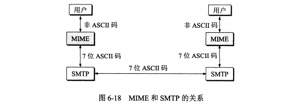
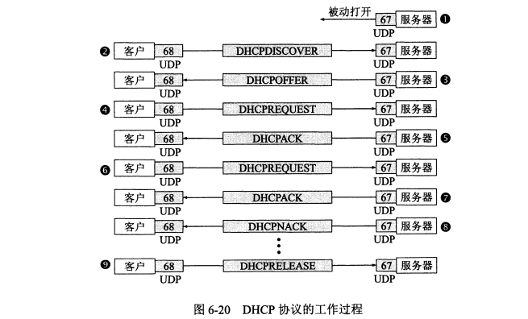

# 第6章 应用层

## 6.1 域名系统 DNS

### 6.1.1 DNS概述

域名系统 domain name system：用来便于人们记住IP地址

域名到IP地址的解析是由分布在互联网上的许多域名服务器程序（可简称为域名服务器）共同完成的。域名服务器程序在专设的结点上运行，而人们也常把运行域名服务器程序的机器称为域名服务器。

域名到IP地址的解析过程的要点如下：当某一个应用进程需要把主机名解析为IP地址时，该应用进程就调用解析程序（ resolver），并成为DNS的一个客户，把待解析的域名放在DNs请求报文中，以UDP用户数据报方式发给本地域名服务器（使用UDP是为了减少开销）。本地域名服务器在查找域名后，把对应的IP地址放在回答报文中返回。应用进程获得目的主机的IP地址后即可进行通信。

### 6.1.2 域名结构

任何一个连接在互联网上的主机或路由器，都有一个唯一的层次结构的名字，即域名（ domain name）。这里，“域”（ domain）是名字空间中一个可被管理的划分。域还可以划分为子域，而子域还可继续划分为子域的子域，这样就形成了顶级域、二级、三级等等。。。

### 6.1.3 域名服务器

每一个地区设置一个相应的权限域名服务器，用来保存该地区中的所有主机的域名到IP地址的映射。DNS服务器管理的范围叫区。

   

这种DNS域名服务器树状结构图可以更准确地反映出DNS的分布式结构。在图6-3中的每个域名服务器都能够进行部分域名到IP地址的解析。当某个DNS服务器不能进行域名到IP地址的转换时，它就设法找互联网上别的域名服务器进行解析

域名服务器的分类

- 根域名服务器：最重要的服务器
- 顶级域名服务器
- 权限域名服务器
- 本地域名服务器

DNS域名解析过程：

1.主机向本地域名服务器查询——递归查询

2.本地域名服务器向根域名服务器查询——迭代查询

## 6.2 文件传输协议

### 6.2.1 FTP协议

文件传输协议FTP file transfer protocol，提供交互式访问，允许客户指明文件的类型与格式，并允许文件具有存取权限

NFS网络文件系统：可以本地访问远程上的文件

### 6.2.2 FTP的原理

在进行文件传输时，FIP的客户和服务器之间要建立两个并行的TCP连接：“控制连接”和“数据连接”。控制连接在整个会话期间一直保持打开，FTP客户所发出的传送请

求，通过控制连接发送给服务器端的控制进程，但控制连接并不用来传送文件。实际用于传输文件的是“数据连接”。服务器端的控制进程在接收到FTP客户发送来的文件传输请求后就创建“数据传送进程”和“数据连接”，用来连接客户端和服务器端的数据传送进程。数据传送进程实际完成文件的传送，在传送完毕后关闭“数据传送连接”并结束运行。由于FTP使用了一个分离的控制连接，因此FTP的控制信息是带外（ out of band）传送的。

### 6.2.3 简单文件传输协议TFTP

TCP/IP协议族中有一个简单文件传送协议TFTP，轻巧易于实现。

TFTP的主要特点是

（1）每次传送的数据报文中有52字节的数据，但最后一次可不足512字节。

（2）数据报文按序编号，从1开始。

（3）支持ASCⅡ码或二进制传送。

（4）可对文件进行读或写。

（5）使用很简单的首部。

## 6.3 远程终端协议 TELNET

TELNET是一个简单的远程终端协议，TELNET又称为终端仿真协议

TELNET定义了数据和命令应该如何通过互联网，即所谓的网络虚拟终端NVT network virtual terminal。

## 6.4 万维网WWW

### 6.4.1 万维网概述

万维网WWW world wide web。万维网用连接的方法能非常方便地从互联网上的一个站点访问另一个站点。

万维网以客户服务器方式工作。上面所说的浏览器就是在用户主机上的万维网客户程序。万维网文档所驻留的主机则运行服务器程序，因此这台主机也称为万维网服务器。客户程序向服务器程序发出请求，服务器程序向客户程序送回客户所要的万维网文档。在一个客户程序主窗口上显示出的万维网文档称为页面（page）

万维网使用**统一资源定位符URL（ Uniform Resource Locator****）**来标志万维网上的各种文档，并使每一个文档在整个互联网的范围内具有唯一的标识符URL

万维网客户程序与万维网服务器程序之间的交互遵守严格的协议，这就是**超文本传送协议HTTP（HyperTextTransferProtocol）**。HTTP是一个应用层协议，它使用TCP连接进行可靠的传送

万维网使用超文本标记语言**HTML（ Hyper Text Markup Language）**，使得万维网页面的设计者可以很方便地用链接从本页面的某处链接到互联网上的任何一个万维网页面.

### 6.4.2 统一资源定位符 URL

1.URL的格式

统一资源定位符URL是用来表示从互联网上得到的资源位置和访问这些资源的方法

URL相当于文件在网络范围的扩展。

组成部分：<协议>://<主机>:<端口>/<路径>

2.使用HTTP的URL

格式：<HTTP>://<主机>:<端口>/<路径>

HTTP默认端口号是80

具体的访问：http://www.tsinghua.edu.cn/chn/yxsz/index.html

### 6.4.3 超文本传输协议 HTTP

1.HTTP的操作过程

HTTP协议本身是无连接的，无状态的。

无连接的：虽然HTTP使用了TCP连接，但是通信双方在交换HTTP报文之前不需要建立HTTP连接

无状态的：不管你访问多少次，返回的内容是相同的。这适合于大量的并发HTTP请求。

2.代理服务器

代理服务器是一种网络实体，称为万维网的高速缓存。

3.HTTP的报文格式

HTTP报文有两种：

- 请求报文——从客户想服务器发送请求
- 响应报文——服务器返回响应结果给客户端

组成部分：行、头、体，也即：请求（响应）行，请求（响应）头，请求（响应）体

常见的状态码

1xx表示通知信息，如请求收到了或正在进行处理

2xx表示成功，如接受或知道了。

3x表示重定向，如要完成请求还必须采取进一步的行动。

4xx表示客户的差错，如请求中有错误的语法或不能完成。

5xx表示服务器的差错，如服务器失效无法完成请求。

4.缓存用户信息——cookie

Cookie是这样工作的。当用户A浏览某个使用 Cookie的网站时，该网站的服务器就为A产生一个唯一的识别码，并以此作为索引在服务器的后端数据库中产生一个项目。接着在给A的HTTP响应报文中添加一个叫做Set-cookie的首部行。这里的“首部字段名”就是而后面的“值”就是赋予该用户的“识别码”。

例如这个首部行是这样的

Set-cookie：31d4896e407aad42

### 6.4.4 超文本标记语言 HTML

1.HTML

2.动态文档：指的是文档的内容在浏览器访问万维网时才由应用程序动态创建

CGIcommon gateway interface 通用网关接口是一种标准

3.活动万维网文档

### 6.4.5 万维网搜索引擎

垂直搜索引擎：针对某一特定领域，特定人群或特定需求提供搜索服务，如 购物、汽车、求职

元搜索引擎：把用户提交的检索请求发送到多个独立的搜索引擎上去搜索，并把搜索结果集中同一处理，主要集中在：智能化处理，个性化搜索，和用户检索界面的友好

## 6.5 电子邮件

### 6.5.1 email的概述

1982年ARPNET的电子邮件标准协议问世：简单邮件传送协议Simple Mail Transfer Protocol SMTP和互联网文本报文格式

1993年，提出了通用互联网邮件扩充-MIME multipurpose Internet mail extension

POP3：邮局协议

互联网上有许多邮件服务器可供用户选用（有些要收取少量的邮箱费用）。邮件服务器24小时不间断地工作，并且具有很大容量的邮件信箱。邮件服务器的功能是发送和接收邮件，同时还要向发件人报告邮件传送的结果（已交付、被拒绝、丢失等）。邮件服务器按照客户服务器方式工作。邮件服务器需要使用两种不同的协议。一种协议用于用户代理向邮件服务器发送邮件或在邮件服务器之间发送邮件，

如SMTP协议，而另一种协议用于用户代理从邮件服务器读取邮件，如邮局协议POP3。

### 6.5.2 简单邮件传输协议 SMTP simple mail transfer protocol

1.建立连接

发件人的邮件送到发送方邮件服务器的邮件缓存后，SMTP客户就每隔一定时间（例如30分钟）对邮件缓存扫描一次。如发现有邮件，就使用SMTP的熟知端口号码25与接收方邮件服务器的SMTP服务器建立TCP连接。在连接建立后，接收方SMTP服务器要发出“20 Service ready”（服务就绪）。然后SMTP客户向SMTP服务器发送HELO命令，附上发送方的主机名。SMIP服务器若有能力接收邮件，则回答：“250OK”，表示已准备好接收。若MTP服务器不可用，则回答“42 I Service not available”（服务不可用）。

2.邮件传送

邮件的传送从MAL命令开始。MAIL命令后面有发件人的地址。如：MAIL FROMxiexiren@tsinghua. org,cn>。若SMTP服务器已准备好接收邮件，则回答“250OK”。否则，返回一个代码，指出原因。如：451（处理时出），452（存储空间不够），500（命令无法识别）等。

3.释放连接

邮件发送完毕后，SMTP客户应发送QUIT命令。SMTP服务器返回的信息是“221（服务关闭）”，表示SMTP同意释放TCP连接。邮件传送的全部过程即结束

### 6.5.3 电子邮件的信息格式

FROM 发件人

TO 收件人

CC 副本抄送 carbon copy

subject 主题

content 内容

### 6.5.4 邮件读取协议 POP3 和IMAP

现在常用的邮件读取协议有两个，即邮局协议第3个版本POP3和网际报文存取协议IMAP（ nternet Message Access Protocol）。

邮局协议POP是一个非常简单、但功能有限的邮件读取协议。

已成为互联网的正式标准。大多数的ISP都支持POP3。

POP3协议的一个特点就是只要用户从POP3服务器读取了邮件，POP3服务器就把该邮件删除。

网际报文存取协议IMAP（ nternet Message Access Protocol）。

IMAP最大的好处就是用户可以在不同的地方使用不同的计算机（例如，使用办公室的计算机、或家中的计算机，或在外地使用笔记本电脑）随时上网阅读和处理自己在邮件服务中。

不要把邮件读取协议POP3或IMAP与邮件传送协议SMTP弄混。发件人的用户代理向发送方邮件服务器发送邮件，以及发送方邮件服务器向接收方邮件服务器发送邮件，都是使用SMTP协议。而POP3或MAP则是用户代理从接收方邮件服务器上读取邮件所使用的协议。

### 6.5.5 基于万维网的电子邮件

现在这个问题解决了。在20世纪90年代中期， Hotmail推出了基于万维网的电子邮件Webmail）。今天，几乎所有的著名网站以及大学或公司，都提供了万维网电子邮件。常用的万维网电子邮件有谷歌的 gmail，微软的 Hotmail，雅虎的 Yahoo！Mail。我国的网易（163或126）和新浪（sina）等互联网技术公司也都提供万维网邮件服务

### 6.5.6 通用互联网邮件扩展 MIME

SMTP存在某些不足之处，就提出了通用互联网邮件扩充MIME。MIME并没有改动或取代SMTP.MIME的意图是继续使用原来的邮件格式，但增加了邮件主体的结构，并定义了传送非ASCⅡ码的编码规则。也就是说，MIME邮件可在现有的电子邮件程序和协议下传送。图6-18表示MIME和SMTP的关系。

MIME主要包括以下三部分内容

（1）5个新的邮件首部字段，它们可包含在原来的邮件首部中。这些字段提供了有关邮件主体的信息

（2）定义了许多邮件内容的格式，对多媒体电子邮件的表示方法进行了标准化。

（3）定义了传送编码，可对任何内容格式进行转换，而不会被邮件系统改变

为适应于任意数据类型和表示，每个MME报文包含告知收件人数据类型和使用编码的信息。MME把增加的信息加入到原来的邮件首部中。

下面是MIME增加的5个新的邮件首部的名称及其意义（有的可以是选项）

（1）MME- Version：标志MME的版本。现在的版本号是1.0.若无此行，则为英文文本

（2） Content- Description：这是可读字符串，说明此邮件主体是否是图像、音频或视频。

（3） Content-Id：邮件的唯一标识符。

（4） Content- Transfer-Encoding：在传送时邮件的主体是如何编码的

（5） Content-Type：说明邮件主体的数据类型和子类型。

## 6.6 动态主机配置协议 DHCP

为了把协议软件做成通用的和便于移植的，协议软件的编写者不会把所有的细节都固定在源代码中。相反，他们把协议软件参数化。

在协议软件中给参数赋值叫做：协议配置

DHCP dynamic host configuration protocol 提供了一种机制，叫做即插即用连网 plug-and-play networking，可以让计算机加入新的网络获取IP地址不需要手工配置

每一个网络至少有一个DHCP中继代理 relay agent），它配置了DHCP服务器的IP地址信息。

DHCP工作过程

## 6.7 简单网络管理协议 SNMP

SNMP simple network management protocol

网络管理包括对硬件、软件和人力的使用、综合与协调，以便对网络资源进行监视、测试、配置、分析、评价和控制，这样就能以合理的价格满足网络的一些需求，如实时运行性能、服务质量等。网络管理常简称为网管。

## 6.8 小结

