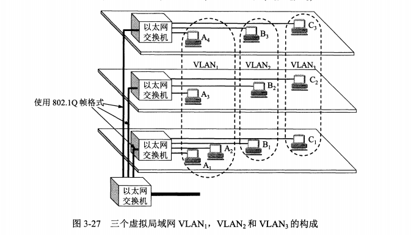

# 第3章 数据链路层

数据链路层属于计算机网络的底层，主要使用点对点信道，广播信道。

## 3.1  使用点对点信道

### 3.1.1 数据链路和帧

链路：从一个结点到相邻结点的一段物理线路（有线，无线）

数据链路：把实现通信协议的硬件或软件加到链路上，就构成了数据链路。如加一个网络适配器

帧：数据链路层把网络层交下来的数据构成帧，以及把接收到的帧中的数据取出并上交给网络层

### 3.1.2 封装成帧，透明传输，差错检测

1. **封装成帧**

封装成帧：在一段数据的前后分别添加首部和尾部，构成一个帧；帧的长度等于数据部分长度加上帧首部和帧尾部的长度，首尾部的作用就是进行帧定界

MTU maximum transfer unit，最大传输单元

1. **透明传输**

出现的问题：文本中含有结束字符，数据链路层错误地找到帧的边界，丢失数据。

解决办法：在SOH，EOH的首尾部使用转义字符ESC，即字符填充或字节填充

1. **差错检测**

在传输的过程中，比特可能会产生差错：0变1，1变0，即比特差错；传输错误的比特所占传输比特总数的比率称为：误码率 （BER bit error rate）

解决方法：使用循环冗余检验 CRC。 能够实现无比特差错的传输情况，但是这不是可靠传输；仍旧会出现：帧丢失，帧重复，帧失序，这三种情况属于“出现传输差错”，但不是比特差错。

## 3.2 点对点协议 PPP

### 3.2.1 Point-to-Point Protocol 的特点

PPP协议就是用户计算机和ISP进行通信时所用的数据链路层协议

**PPP协议满足以下要求：**

- 简单：进行CRC检验即可，正确就收下，反之丢弃
- 封装成帧：加帧定界符
- 透明性
- 支持多种网络层协议：如支持IP、IPX等
- 多种类型链路：串行，并行；同步，异步；低速，高速等
- 差错检验
- 检测链接状态
- 最大传送单元
- 网络层地址协商：
- 数据压缩协商：有压缩算法

**PPP的组成**

1. 将IP数据报转到串行链路的方法
2. 用来建立，配置和测试数据链路连接的链路控制协议LCP link control protocol
3. 网络控制协议NCP

### 3.2.2 PPP协议的帧格式

1. 各字段的意义

1. 字节填充

如果信息中出现了比特0x7E的组合，需要进行字节填充

1. 零比特填充

PPP在使用SONET/SDH链路时，使用的时同步传输，而不是异步，此时需要进行零比特填充方法来实现透明传输

### 3.2.3 PPP协议的工作状态

LCP：链路控制协议

## 3.3 使用广播信道

### 3.3.1 局域网的数据链路层

局域网使用的就是广播信道

共享信道的问题：如何使众多用户能够合理而方便地共享通信媒体资源；

方法：

1.静态划分信道，即时分复用，频分复用，波分复用，码分复用等；代价高，不适合局域网

2.动态媒介接入控制，又称为多点接入

- 随机接入：会出现同一时刻碰撞的情况，须有解决碰撞的网络协议
- 受控接入：令牌环局域网和集中控制的多点线路轮询

以太网的一些额外东西：

- 两个标准: DIX Ethernet V2 与 IEEE 的802.3标准
- 适配器：即网络接口卡（network interface card）

### 3.3.2 CSMA/CD协议

常把局域网上的计算机称为：主机，工作站，站点，站。

CSMA/CD协议：载波监听多点接入/碰撞检测 Carrier Sense Multiple Access with Collision Detection（什么鬼？？？这名字。）

为了通信方便，以太网采取了两种方法：

\1. 采用灵活的无连接的工作方式，即不必先建立连接就可以直接发送数据。（如TCP 的不可靠传输，会重新发送）

2.使用曼彻斯特编码的信号发送数据

**特点**

- 多点接入：总线型网络
- 载波监听：就是检测信道，不管在发送前，还是在发送中，每个站都必须不停地检测信道。
- 碰撞检测：边发送边监听。一旦发生了碰撞，适配器立即停止发送，等待一段时间后再次发送

## 3.4 使用广播信道的以太网

### 3.4.1 使用集线器的星型拓扑

拓扑结构示意图

集线器特点：

1.使用集线器的以太网逻辑上仍是一个总线网，各站共享逻辑上的总线，使用CSMA/CD协议。 又称：星型总线或盒中总线

2.有多个接口

3.集线器工作在物理层，进行简单地转发比特，不进行碰撞测试

4.自适应串音抵消

### 3.4.2 以太网Ethernet 的信道利用率

什么是以太网：[以太网Ethernet-Wikipedia](https://en.wikipedia.org/wiki/Ethernet)

**以太网**（英语：Ethernet）是一种[计算机](https://zh.wikipedia.org/wiki/计算机)[局域网](https://zh.wikipedia.org/wiki/局域网)技术。[IEEE](https://zh.wikipedia.org/wiki/IEEE)组织的IEEE 802.3标准制定了以太网的技术标准

### 3.4.3 以太网Ethernet 的MAC层

1. **MAC层的硬件地址**

MAC地址又称为物理地址，硬件地址；

1. **MAC帧的格式**

如前面所说，以太网的两个标准：DIX Ethernet V2标准和IEEE的802.3标准

## 3.5 扩展的以太网

### 3.5.1 在物理层扩展以太网

光纤调制解调器的作用：进行电信号和光信号的转换

### 3.5.2 在数据链路层扩展以太网

使用网桥进行在数据链路层的扩展，网桥工作在数据链路层；

什么是网桥：[Bridging (桥接器）- Wikipedia](https://en.wikipedia.org/wiki/Bridging_(networking))

**网桥**工作在数据链路层，将两个LAN连起来，根据MAC地址来转发帧，可以看作一个“低层的路由器”（路由器工作在网络层，根据网络地址如IP地址进行转发）

**
**

网桥的主要工作：根据MAC帧目的地址对收到的帧进行转发和过滤。

1. **网桥的内部结构**

网桥根据转发表来转发帧，转发表也叫转发数据库或者路由目录。

使用网桥的好处：

- 过滤通信量，增加吞吐量
- 扩大物理范围

使用网桥的不足：

- 由于有转发和过滤，会增加时延
- 在MAC子层没有流量控制功能
- 只适合于通信量不大的局域网，否则会因为传播过多的广播信息而产生网络拥塞，即广播风暴

1. **透明网桥**

透明是指：以太网上的站点并不知道所发送的帧将经过哪几个网桥，以太网上的站点看不见以太网上的网桥，透明网桥不用人工配置转发表就能工作，即插即用

1. **源路由网桥**

由发送帧的源站负责路由选择的网桥就问世了，这就是源路由网桥。站点必须知道网桥的标识以及连接到哪一个站点。

1. **多接口网桥——以太网交换机**

虚拟局域网

## 3.6 高速以太网

### 3.6.1 100BASE-T 以太网

### 3.6.2 吉比特以太网

### 3.6.3 10吉比特和100吉比特以太网

## 3.7 小结

