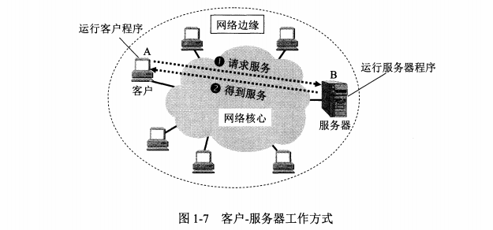
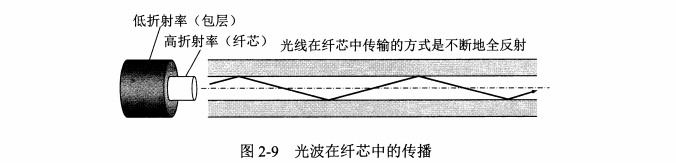

我的前言：

基本上是老老实实地“叕”重新看完了，记录得比较详细，主要是涉及的概念太多了（看了忘，忘了看的恶性循环），充其量是为了让自己看的时候能更加全面回顾。老毛病了：会纠结概念上的东西。

参考书本：《计算机网络（第6版）》— 谢希仁

# 第1章 概述

## 1.1 计算机网络在信息时代的作用

21世纪时代特点：数字化，网络化，信息化；以网络为核心的信息时代。

**三网：**

- 电信网络：提供打电话，发电报，发传真；
- 有线电视网络：提供电视节目
- 计算机网络：提供数据文件传输，图片/视频

## 1.2 因特网概述/互联网概述

### 1.2.1 网络的网络——互联网

网络（network）由若干结点（node）和连接这些点的链路（link）组成。

### 1.2.2 互联网发展的三个阶段

**第一阶段：单个网络的ARPANET。**

ARPANET是1969年美国国防部创建的分组交换网。70年代中，ARPA开始研究多种网络互联的技术——即互联网的雏形。1983年，TCP/IP协议成为了ARPANET上的标准协议，所有使用TCP/IP协议的计算机都能利用互联网互相通信。1990年，ARPA实验室关闭。

关于internet与Internet的区别？

internet,泛指多个计算机网络互连而成的网络

Internet，全球的众多网络互连的，专有名词，且采用TCP/IP协议作为通信的规则，前身是ARPANET

**第二阶段：三级结构的互联网**

1985年，美国国家科学基金会NSF（National Science Fundation）弄出了一个国家科学基金网：分为主干网，地区网和校园网/企业网的三级计算机网络-NSFNET

1991年，NSF和其他政府机构认识到需要扩大因特网的使用范围，交由私人公司运营

1993年，主机超过100万；1994年，主干网的速率提高到45Mb/s

**第三阶段：多层次ISP结构的互联网**

1993年开始，NSFNET逐渐被商用互联网主干网替代，政府不再负责互联网的运营；于是有了一个新名词：互联网服务提供商ISP（Internet Service Provider）——例如：中国电信，中国联通，中国移动就是ISP

**ISP的介绍**

ISP通过在互联网管理机构申请到IP地址和通信线路（大的ISP由自己的通信线路，小的ISP租用大ISP的，比如电信有自己的，长城租用电信的）以及路由器等网络设备。“上网”就是用ISP提供的IP接入到互联网

**ISP的分类**

主干ISP：速率非常高；服务面积最大，可覆盖国家范围；专门部门和公司维护

地区ISP：通过一个或多个ISP连接，数据传输速率低于主干ISP。服务范围也比较小

本地ISP：直接给端用户提供服务，本地ISP可以是提供网络服务的公司（比如广州长城），可以是非营利的机构（比如大学校园网）

**互联网交换点IXP（Internet eXchange Point）**

IXP的主要作用就是允许两个网络直接相连并交换分组。而不需要通过第三个网络来转发分组。

20世纪90年代，欧洲原子核研究组织CERN开发的万维网WWW-World Wide Web被广泛应用到互联网上。

### 1.2.3 互联网的标准化工作

1992年，互联网协会成立（Internet Society， ISOC），目的是全面管理互联网以及在世界范围内促进其发展和使用；其中有个技术组织叫互联网体系结构委员会IAB（Internet Architecture Board），专门负责管理互联网有关协议的开发。IAB下设有两个部门：

1. 互联网工程部IETF Internet Engineering Task Force

主要针对协议的开发和标准，以及解决一些特定领域的短期和中期工程问题。

1. 互联网研究部IRTF Internet Research Task Focrce

进行理论方面的研究和探索

所有的互联网标准都是以RFC的形式在互联网上发表的。RFC-Request For Comments

成为真正的标准需要通过四个阶段

1）互联网草案 Internet Draft——还不是RFC

2）建议标准 Proposed Standard——还不是RFC

3）草案标准 Draft Standard

4）互联网标准 Internet Standard

## 1.3 互联网的组成

边缘部分：所有连接在互联网上的主机组成，用户直接使用

核心部分：大量网络和连接这些网络的路由器组成，为边缘部分提供服务

### 1.3.1 互联网的边缘部分

边缘部分，即主机，端系统。

通信：主机A的某个进程和主机B的另一个进程进行通信

端系统之间的通信方式：客户端-服务器（C/S，client/server）方式；对等方式（P2P，peer to peer）

1. **C/S方式**

客户端和服务器都是指通信中所涉及的两个应用进程，所描述的是进程之间服务和被服务的关系；客户端时服务请求方；服务器是服务提供方。

1. **P2P方式**

对等连接是两个主机在通信时并不区分哪一个时服务请求方还是服务提供方；只要两个主机都运行了对等连接软件，它们就可以进行平等的，对等连接通信。

### 1.3.2 互联网的核心部分

核心部分的主要作用是为边缘部分提供连接，起特殊作用的是路由器（router），路由器是一种特殊的专用计算机；是实现分组交换（packet switching）的关键，任务是转发收到的分组

1. **电路交换**

电路交换：建立连接（占用通信资源）——通话（一直占用）——释放连接（归还通信资源）

从通信资源的角度来说，交换就是按照某种方式动态地分配传输线路的资源；

电路交换的特点：在通话的过程中，通话的两个用户始终占用端到端的通信资源，导致线路的传输效率往往很低

1. **分组交换**

分组交换采用存储转发的方式。在发送报文前，先把较长的报文划分成一个个更小的等长数据段。分组是在互联网传输的数据单元。

位于网络边缘部分的主机和位于网络核心部分的路由器都是计算机，但作用不一样；主机是为用户进行信息处理的，并与其他主机通过网络交换；路由器是用来转发分组的，即进行分组交换。

1. 报文交换——已经不怎么用了

需要获取报文，制成纸带，操作员以每份报文为单位，撕下纸带，用发报机根据报文目的地地址发送，耗时长。

- 三种交换的比较

## 1.5 计算机网络的分类

### 1.5.2 不同类别的网络分类

1. 按网络的作用范围

广域网WAN, Wide Area Nwtwork

城域网MAN, Metropolitan Area Network

局域网LAM, Local Area Network，校园网，宿舍几个人用交换机的那种也是局域网

个人区域网PAN, Personal Area Network，蓝牙。

1. 按网络的使用者

公用网 （公众网，CHINANET）

专用网 （政府，军队，银行）

1. 按接入的网络

接入网AN，又称本地接入网或居民接入网

## 1.6 计算机网络的性能

### 1.6.1 计算机网络的性能指标

1. 速率

比特（bit）是计算机中数据量的单位，也是信息论中使用的信息量的单位（1/0）

网络技术中的速率指的是连接在计算机网络上的主机在数字信道上传送数据的速率，也叫数据率/比特率；单位是b/s（bit/s，比特每秒，也可写成 bps，bit per second）

1. 带宽

通常来说，一条通信链路的带宽越宽，所能传输的最高数据率也越高。

两种含义：

- 带宽本来是指某个信号具有的频带宽度，单位为赫，用于传统的通信线路上传送的电话信号，比如标准带宽3.1kHz
- 在计算机网路中，带宽表示网络的通信线路传送数据的能力，表示在单位时间内从网络中的某一点到另一点所能通过的“最高数据率” 带宽的单位是 bit/s，比特每秒

1. 吞吐量

吞吐量表示单位时间内通过某个网络的数据量。吞吐量受带宽或网络的额定速率限制。

1. 时延

时延（delay，latency）是指数据从网络的一段传送到另一端所需的时间，也叫做延迟。

总时延=发送时延+传播时延+处理时延+排队时延

- 发送时延：主机或路由器发送数据帧所需要的时间，公式：发送时延=数据帧长度(b) / 发送速率(b/s)
- 传播时延：电磁波在信道中传播一定的距离需要花费的时间，公式：传播时延=信道长度（m）/电磁波在信道上的传播速率（m/s）
- 处理时延：主机或路由器收到分组报文需要一定时间进行处理，例如提取数据部分，进行差错检验等等
- 排队时延：分组在网络上传输时，可能需要经过多个路由器转发，进入路由器后未必能马上进行处理，需要进行排队等待转发。

1. 时延带宽积

时延带宽积=传播时延 x 带宽

1. 往返时间RTT

RTT round-trip time：从发送方发送数据开始，到发送方收到来自接收方的确认信息经历的时间

1. 利用率

信道或网络利用率过高会产生非常大的时延

### 1.6.2 计算机网络的非性能特征

1. 费用
2. 质量
3. 标准化
4. 可靠性
5. 可拓展性和可升级性
6. 易于管理和维护

## 1.7 计算机网络体系结构

### 1.7.1 计算机网络体系结构的形成

起初ARPANET提出了分层的方法，到1974年，IBM宣布了系统网络体系结构SNA（system network architecture），也用了分层的思想；1977年，国际标准化组织ISO提出了一个适用于世界范围内的计算机互联网比标准框架：开放系统互连基本参考模型 OSI/RM （Open System Interconnection Reference Model）简称OSI。1983年，形成了正式文件ISO7498, 即著名的七层协议的体系结构。后来改体系失败了，过于理想化，缺乏实际经验。

### 1.7.2 协议与划分层次

要做到有条不紊的传输交换数据，需要遵守约定好的规则，而这些规则一般被称为网络协议，简称协议。

协议主要由三部分构成：语法，语义，同步

分层的好处：

1. 各层之间相互独立，并不需要知道下一层是如何实现的。
2. 灵活性好，当某一层需要改变时，只需要保持接口不变，则该层的变化不会影响到别层
3. 结构上可分割开
4. 易于实现和维护
5. 能促进标准化工作

各层需要完成的功能相似的如下：

- 差错控制
- 流量控制
- 分段和重装
- 复用和分用
- 连接建立和释放

体系结构是抽象的，而实现则是具体的，是真正在运行的计算机硬件和软件

### 1.7.3 具有五层协议的体系结构

### 1.7.5 TCP/IP 的体系结构

# 第2章 物理层

## 2.1 物理层的基本概念

物理层首要考虑的是：怎么样才能在连接各种计算机的传输媒介上传输数据，而不是具体的数据。说人话就是：先解决打通传数据的路，再考虑数据的正确性。

物理层的特性：（与传输媒介的接口有关的特性）

1. 机械特性：接线器的形状和尺寸，引脚数和排列等。 常见的连接线都有严格的标准化规定
2. 电器特性：电压范围之类的
3. 功能特性：某条线上出现的电平电压的意义
4. 过程特性：对于不同功能的各种可能事件的出现顺序

## 2.2 数据通信的基础知识

### 2.2.1 数据通信系统的模型

通信的目的是传送消息，如语音，文字，图像都是消息；数据是运送消息的实体，通常是有意义的符号序列，这种信息的表示可用计算机处理或产生，信号signal则是数据的电气/电磁表现，分为：模拟信号和数字信号

- 模拟信号：或连续信号，代表消息的参数的取值是连续的
- 数字信号：或离散信号，代表消息的参数的取值是离散的，只有两种状态0/1

### 2.2.2 信道的相关概念

信道一般都是用来表示向某一个方向传送消息的媒介。从通信的双方信息交互的方式来看，有三种基本方式

- 单向通信，即只能有一个方向的通信，而没有反方向的交互。无线广播
- 双向交替通信，即半双工通信，双方都能发送消息，但不能同时发，比如对讲机
- 双向同时通信，即全双工通信，通信的双方能同时发送和接收信息，电话

来自信源的信号常称为基带信号，为了解决不能传输低频分量或直流分量，需要对基带信号进行调制（modulation）

- 基带调制：对基带信号的波形进行变换，使它能够与信道特性相适应。由于是从数字信号变成另一种数字信号，这个过程也叫编码coding

- 带通调制：需要使用载波进行调制，把基带信号的频率范围搬移到较高的频段，并转换成模拟信号；调制后的信号叫带通信号

### 2.2.3 信道的极限容量

任何实际的信道都不是理想的，在传输信号时会产生各种失真。

香农公式：

此公式表明：信道的带宽或信道中的信噪比越大，信息的极限传输速率就越高。意义在于：只要信息传输速率低于信道的极限信息传输速率，就可以找到某种办法来实现无差错的传输，但是香农并没有告诉我们怎么去实现。

## 2.3 物理层的传输媒介

传输媒介分为：导引型传输媒介和非导引型传输媒介

导引型：用线传输的；非导引型：电磁波无线形式的

### 2.3.1 导引型传输媒介

1. 双绞线

模拟传输和数字传输都可以使用双绞线，通信距离为几到十几公里；

1. 同轴电缆

1. 光缆

### 2.3.2 非导引型传输媒介

无线传输可使用的频段很广。

短波通信主要靠电离层的反射

无线电微波通信

红外通信

激光通信

## 2.4 信道复用技术

### 2.4.1 频分复用，时分复用，统计时分复用

复用的概念：不需要每个单独信号进行通信，可以使用一个复用器/分用器就行，减少经济消耗。

频分复用：在通信工程中自始至终都占用这个频带，用户在同样的时间占用不同的带宽资源

时分复用：将时间划分为一段段等长的时分复用帧，即TDM帧，等时信号；用户在不同的时间占用同样的频带宽度，更适合于数字信号的传输

时分复用的问题：

统计时分复用：是时分复用的改进，提高信道的利用率

### 2.4.2 波分复用

波分复用即光的频分复用，在一条光纤上复用多路的光载波信号

### 2.4.3 码分复用

码分复用CDM code division multiplexing；也叫码分多址CDMA。用户可以在同样的时间使用同样的频带进行通信

## 2.5 数字传输系统

## 2.6 宽带接入技术（了解）

### 2.6.1 ADSL技术

非对称数字用户线ADSL（Asymmetric Digital Subscriber Line）是用数字技术对现有的模拟电话用户线进行改造

### 2.6.2 光纤同轴混合网

### 2.6.3 FTTx技术

## 2.7 小结

一堆自己不知道的东西，概念太多了，也没有必要完全记住，这层的东西感觉根本用不上，都是知道概念即可。

王道的资料截图

