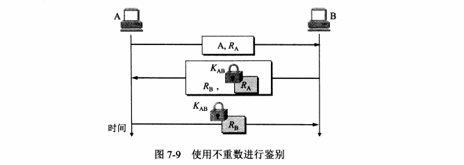
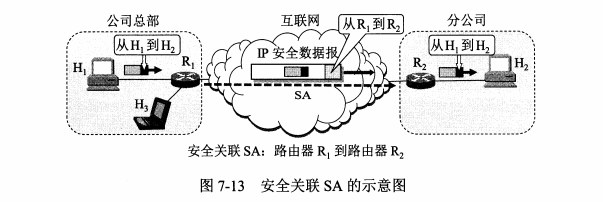

# 第7章 网络安全

## 7.1 安全问题

### 7.1.1 安全性威胁

两大威胁：主动攻击和被动攻击

若从互联网上的成百上千个网站集中攻击一个网站，则称为分布式拒绝服务DDoS（ Distributed denial of service）。有时也把这种攻击称为网络带宽攻击或连通性攻击。

### 7.1.2 安全的计算机网络

一个安全的网络需要具有：

- 保密性
- 端点甄别
- 信息的完整性
- 运行的安全性

访问控制（ access contro）对计算机系统的安全性非常重要。必须对访问网络的权限加以控制，并规定每个用户的访问权限。由于网络是个非常复杂的系统，其访问控制机制比操作系统的访问控制机制更复杂（尽管网络的访问控制机制是建立在操作系统的访问控制机制之上的），尤其在安全要求更高的多级安全（ multilevel security）情况下更是如此。

### 7.1.3 数据加密模型

一般的数据加密模型如图7-2所示。用户A向B发送明文X，但通过加密算法E运算后，就得出密文Y。

## 7.2 两类密码体制

### 7.2.1 对称密钥密码体制

所谓对称密钥密码体制，即加密和解密都是使用相同的密码体制。（就是加密和解密都用同一个密钥，如上图的K，无论在加密还是解密都用K）

数据加密标注DES属于对称密钥密码体制，保密性仅取决于对密钥的保密，而算法是公开的，即意味着如果别人获取到了你的密钥，由于加密解密都是同一个密钥，则会被获取到加密的信息。

### 7.2.2 公钥密码体制

在公钥密码体制中，加密密钥PK（ public key，即公钥）是向公众公开的，而解密密钥SK（ secret key，即私钥或秘钥）则是需要保密的。加密算法E和解密算法D也都是公开

公开密钥与对称密钥在使用通信信道方面有很大的不同。在使用对称密钥时，由于双方使用同样的密钥，因此在通信信道上可以进行一对一的双向保密通信，每一方既可用此密钥加密明文，并发送给对方，也可接收密文，用同一密钥对密文解密。这种保密通信仅限于持有此密钥的双方（如再有第三方就不保密了）。但在使用公开密钥时，在通信信道上可以是多对一的单向保密通信。

例如在图7-3中，可以有很多人同时持有B的公钥，并各自用此公钥对自己的报文加密后发送给B。只有B才能够用其私钥对收到的多个密文一一进行解密。但使用这对密钥进行反方向的保密通信则是不行的。在现实生活中，这种多对一的单向保密通信是很常用的。例如，在网购时，很多顾客都向同一个网站发送各自的信用卡信息，就属于这种情况

## 7.3 数字签名

数字签名必须保证能够实现以下三点功能：

（1）接收者能够核实发送者对报文的签名。也就是说，接收者能够确信该报文的确是发送者发送的。其他人无法伪造对报文的签名。这叫做报文鉴别

（2）接收者确信所收到的数据和发送者发送的完全一样而没有被篡改过。这叫做报文的完整性

（3）发送者事后不能抵赖对报文的签名。这叫做不可否认。

为了进行签名，A用其私钥SKA对报文X进行D运算（见图74）。D运算本来叫做解密运算。可是，还没有加密怎么就进行解密呢？这并没有关系。因为D运算只是得到了某种不可读的密文。在图7-4中我们写为“D运算”而不是“解密运算”，就是为了避免产生这种误解。A把经过D运算得到的密文传送给B.B为了核实签名，用A的公钥进行E运算，还原出明文X。请注意，任何人用A的公钥PKA进行E运算后都可以得出A发送的明文。可见图7-4所示的通信方式并非为了保密，而是为了进行签名和核实签名，即确认此明文的确是A发送的。

## 7.4 鉴别

该小节来自第七版

在网络的应用中，鉴别（ authentication）是网络安全中一个很重要的问题。鉴别和加密是不相同的概念。鉴别是要验证通信的对方的确是自己所要通信的对象，而不是其他的冒充者，并且所传送的报文是完整的，没有被他人篡改过

### 7.4.1 报文鉴别

**1.密码散列函数**

散列函数具有以下两个特点

（1）散列函数的输入长度可以很长，但其输出长度则是固定的，并且较短。散列函数的输出叫做散列值，或更简单些，称为散列

（2）不同的散列值肯定对应于不同的输入，但不同的输入却可能得出相同的散列值。即，散列函数的输入和输出并非一一对应的，而是多对一的。

密码散列函数实质上是一个单向函数

**2.散列函数 MD5和SHA-1**

**MD5函数**

MD message digest 报文摘要

下面仍以MD5为例来介绍报文摘要。这主要是考虑到目前新的散列函数（如SHA）都是从MD5发展而来的。对于有兴趣研究散列函数的读者，MD5是个很好的出发点。MD5算法的大致过程如下

（1）先把任意长的报文按模2计算其余数（64位），追加在报文的后面。

（2）在报文和余数之间填充1~512位，使得填充后的总长度是512的整数倍。填充的首位是1，后面都是0

（3）把追加和填充后的报文分割为一个个512位的数据块，每个512位的报文数据再分成4个128位的数据块依次送到不同的散列函数进行4轮计算。每一轮又都按32位的小数据块进行复杂的运算。一直到最后计算出MD5报文摘要代码（128位）

**SHA-1**

SHA是由美国标准与技术协会NST提出的一个散列算法系列。SHA和MD5相似，但码长为160位（比MD5的128位多了25%）。SHA也是用512位长的数据块经过复杂运算得出的。SHA比MD5更安全，但计算起来却比MD5要慢些。1995年发布的新版本SHA-1【RFC3174在安全性方面有了很大的改进，但后来SHA-1也被证明其实际安全性并未达到设计要求，并且也曾被王小云教授的研究团队攻破。虽然现在SHA-1仍在使用，但很快就会被另外的两个版本SHA-2和SHA-3【WSHA3】所替代。例如，微软选择弃用SHA-1的计划，并将于2017年1月1日起停止支持SHA-1证书，而以前签发的SHA-1证书也必须更换为SHA-2证书。谷歌也宣布将在 Chrome浏览器中逐渐降低SHA-1证书的安全指示。

**3.报文鉴别码**

从图7-7可以看出，在A从报文X导出散列H后，就对散列H用密钥K加密。这样得出的结果叫做报文鉴别码MAC（ Message Authentication Code）。请注意：局域网中使用的媒体接入控制MAC也是使用这三个字母，因此在看到MAC时应注意上下文

### 7.4.2 实体鉴别

实体鉴别和报文鉴别不同。报文鉴别是对每一个收到的报文都要鉴别报文的发送者而实体鉴别是在系统接入的全部持续时间内对和自己通信的对方实体只需验证一次。

最简单的实体鉴别过程如图7-8所示。A向远端的B发送带有自己身份A（例如，A的姓名）和口令的报文，并且使用双方约定好的共享对称密钥KAB进行加密。B收到此报文

后，用共享对称密钥KAB进行解密，从而鉴别了实体A的身份。

为了对付重放攻击，可以使用不重数（ nonce）。不重数就是一个不重复使用的大随机数，即“一次一数”。在鉴别过程中不重数可以使B能够把重复的鉴别请求和新的鉴别请求

还是存在中间人攻击的情况

## 7.5 密钥分配

密钥分配（或密钥分发）是密钥管理中最大的问题。密钥必须通过最安全的通路进行分配。例如，可以派非常可靠的信使携带密钥分配给互相通信的各用户。这种方法称为网外分配方式。但随着用户的增多和网络流量的增大，密钥更换频繁（密钥必须定期更换才能做到可靠），派信使的办法已不再适用，而应采用网内分配方式，即对密钥自动分配。

### 7.5.1 对称密钥的分配

目前常用的密钥分配方式是设立密钥分配中心KDC（ Key Distribution Center）。KDC是大家都信任的机构，其任务就是给需要进行秘密通信的用户临时分配一个会话密钥（仅使用一次）。在图7-11中假定用户A和B都是KDC的登记用户。A和B在KDC登记时就已经在KDC的服务器上安装了各自和KDC进行通信的主密钥 master key）KA和KB。

目前最出名的密钥分配协议是 Kerberos V52，是美国麻省理工学院MT开发的。 Kerberos既是鉴别协议，同时也是KDC，它已经变得很普及，现在是互联网建议标准。 Kerberos使用比DES更加安全的高级加密标准AES进行加密。 Kerberos V4的大致工作过程

## 7.6 互联网使用的安全协议

### 7.6.1 网络层安全协议

1.IPsec协议族概述

IPsec协议族中的协议可划分为以下三个部分

（1）IP安全数据报格式的两个协议：鉴别首部AH（ Authentication header）协议和封装安全有效载荷ESP（ Encapsulation Security Payload）协议

（2）有关加密算法的三个协议（在此不讨论）。

（3）互联网密钥交换IKE（ nternet Key Exchange）协议。

两种工作方式

第一种工作方式是运输方式 transport mode）。运输方式是在整个运输层报文段的前后分别添加若干控制信息，再加上IP首部，构成IP安全数据报

第二种工作方式是隧道方式 tunnel mode）。隧道方式是在原始的IP数据报的前后分别添加若干控制信息，再加上新的P首部，构成一个IP安全数据报。

论使用哪种方式，最后得出的IP安全数据报的P首部都是不加密的。只有使用不加密的P首部，互联网中的各个路由器才能识别P首部中的有关信息，

2.安全关联

在发送IP安全数据报之前，在源实体和目的实体之间必须创建一条网络层的逻辑连接，即安全关联SA（ Security Association）。这样，传统的互联网中无连接的网络层就变为了具有逻辑连接的一个层。安全关联是从源点到终点的单向连接，它能够提供安全服务。如要进行双向安全通信，则两个方向都需要建立安全关联。

3.IP安全数据报格式

4.IPsec其他构件

发送IP安全数据报的实体可能要用到很多条安全关联SA。那么这些SA存放在什么地方呢？这就要提及 IPsec的一个重要构件，叫做安全关联数据库SAD（ Security Association Database）。当主机要发送IP安全数据报时，就要在SAD中查找相应的SA，以便获得必要的信息，来对该IP安全数据报实施安全保护。同样，当主机要接收IP安全数据报时，也要在SAD中查找相应的SA，以便获得信息来检查该分组的安全性。

### 7.6.2 运输层安全协议

运输层使用的两个安全协议：

- 安全套接字层SSL security socket layer
- 运输层安全 transport layer security

SSL提供的安全服务可归纳为以下三种

（1）SsL服务器鉴别，允许用户证实服务器的身份。支持SSL的客户端通过验证来自服务器的证书，来鉴别服务器的真实身份并获得服务器的公钥。

（2）SSL客户鉴别，SSL的可选安全服务，允许服务器证实客户的身份

（3）加密的SSL会话，对客户和服务器间发送的所有报文进行加密，并检测报文是否被篡改

SSL默认端口是443

### 7.6.3 应用层安全协议

关于电子邮件的安全协议：PGP（ Pretty Good Privacy）它是一个完整的电子邮件安全软件包，包括加密、鉴别、电子签名和压缩等技术。

## 7.7 系统安全：防火墙与入侵检测

防火墙（ firewall）作为一种访问控制技术，通过严格控制进出网络边界的分组，禁止任何不必要的通信，从而减少潜在入侵的发生，尽可能降低这类安全威胁所带来的安全风险。

防火墙技术一般分为以下两类。

（1）分组过滤路由器是一种具有分组过滤功能的路由器，它根据过滤规则对进出内部网络的分组执行转发或者丢弃（即过滤）。过滤规则是基于分组的网络层或运输层首部的信息，例如：源/目的P地址、源/目的端口、协议类型（TCP或UDP），等等。我们知道，TCP的端口号指出了在TCP上面的应用层服务。例如，端口号23是 TELNET，端口号119是新闻网 USENET，等等。

（2）应用网关也称为代理服务器（ proxy server），它在应用层通信中扮演报文中继的角色。一种网络应用需要一个应用网关，在应用网关中，可以实现基于应用层数据的过滤和高层用户鉴别

### 7.7.2 入侵检测系统

防火墙试图在入侵行为发生之前阻止所有可疑的通信。但事实是不可能阻止所有的入侵行为，有必要采取措施在入侵已经开始，但还没有造成危害或在造成更大危害前，及时检测到入侵，以便尽快阻止入侵，把危害降低到最小。入侵检测系统IDS正是这样一种技术。IDS对进入网络的分组执行深度分组检查，当观察到可疑分组时，向网络管理员发出告警或执行阻断操作。IDS能用于检测多种网络攻击，包括网络映射、端口扫描、DoS攻击、蠕虫和病毒、系统漏洞攻击等。

# 第10章 IPv6 （IP version six）

## 10.1 IPv6的基本内容

### 10.1.1 IPv6解决资源耗尽问题

IPv6 出现的原因：IPv4 快用完了。

### 10.1.2 IPv6的基本首部

IPv6所引进的主要变化如下：

（1）更大的地址空间。Pv6把地址从Pv4的32位增大到4倍，即增大到128位，使地址空间增大了2倍。这样大的地址空间在可预见的将来是不会用完的。

（2）扩展的地址层次结构。IPv6由于地址空间很大，因此可以划分为更多的层次

（3）灵活的首部格式。IPv6数据报的首部和IPv4的并不兼容。IPv6定义了许多可选的扩展首部，不仅可提供比IPv4更多的功能，而且还可提高路由器的处理效率，这是因为路由器对扩展首部不进行处理（除逐跳扩展首部外）。

（4）改进的选项。IPv6允许数据报包含有选项的控制信息，因而可以包含一些新的选项。但IPv6的首部长度是固定的，其选项放在有效载荷中。我们知道，IPv4所规定的选项是固定不变的，其选项放在首部的可变部分。

（5）允许协议继续扩充。这一点很重要，因为技术总是在不断地发展（如网络硬件的更新）而新的应用也还会出现。但我们知道，IPv4的功能是固定不变的。

（6）支持即插即用（即自动配置）。因此IPv6不需要使用DHCP。

（7）支持资源的预分配。IPv6支持实时视像等要求保证一定的带宽和时延的应用

（8）IPv6首部改为8字节对齐（即首部长度必须是8字节的整数倍）。原来的IPv4首部是4字节对齐。

### 10.1.3 IPv6的地址

一般来讲，一个IPV6数据报的目的地址可以是以下三种基本类型地址之一

（1）单播（ unicast）单播就是传统的点对点通信。

（2）多播（ multicast）多播是一点对多点的通信，数据报发送到一组计算机中的每个。IPv6没有采用广播的术语，而是将广播看作多播的一个特例。

（3）任播（ anycast）这是IPv6增加的一种类型。任播的终点是一组计算机，但数据报只交付其中的一个，通常是距离最近的一个。

巨大的地址范围还必须使维护互联网的人易于阅读和操纵这些地址。IPV4所用的点分十进制记法现在也不够方便了。例如，一个用点分十进制记法的128位的地址为

104.230.140.100.255.255.255.255.0.0.17.128.150.10.255.255

为了使地址再稍简洁些，IPV6使用冒号十六进制记法（ colon hexadecimal notation，简写为 colon hex），它把每个16位的值用十六进制值表示，各值之间用冒号分隔。例如，如果前面所给的点分十进制数记法的值改为冒号十六进制记法，就变成了：

68E6:8C64：FFFF:FFFF：0:1180:960A:FFFF

### 10.1.4 从IPv4 到 IPv6的过渡

1.双协议栈

2.隧道技术

### 10.1.5 ICMPv6

和IPv4一样，IPV6也不保证数据报的可靠交付，因为互联网中的路由器可能会丢弃数据报。因此IPv6也需要使用ICMP来反馈一些差错信息。新的版本称为 ICMPv6，它比

ICMPYe4要复杂得多。地址解析协议ARP和网际组管理协议IGMP的功能都已被合并到 ICMPv6中（图4-51）。

