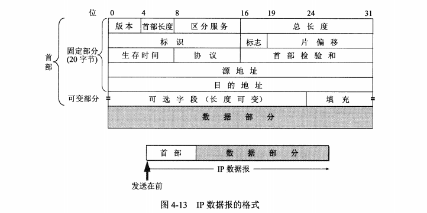
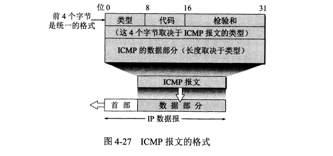
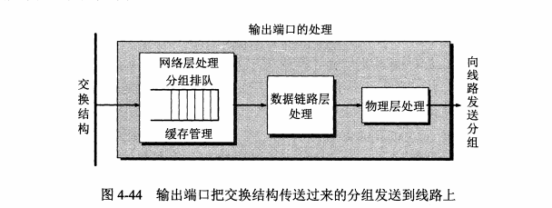

# 第4章 网络层

重中之重：网际协议——IP协议

## 4.1 网络层提供的两种服务

网络层向上提供简单灵活的，无连接的，尽最大努力交付的数据报服务；不提供服务质量的保证

虚电路服务和数据报服务

## 4.2 网际协议IP

IP协议是TCP/IP体系中最重要的协议之一，与其一起使用的配套协议有三个：

- 地址解析协议 ARP Address Resolution Protocol
- 网际控制报文协议 ICMP Internet Control Message Protocol
- 网际组管理协议 Internet Group Management Protocol

### 4.2.1 虚拟互连网络

虚拟：即逻辑上互连；具体来说就是各种物理网络的异构性客观存在，使用IP协议就可以使这些性能各异的网络在网络层上看起来好像一个统一的网络

将网络相互连接需要用到中间设备

- 物理层使用的中间设备叫转发器 repeater
- 数据链路层使用的中间设备叫网桥/桥接器 bridge
- 网络层使用的中间设备叫路由器 router （历史原因：网络层的路由器也被叫做网关）
- 在网络层以上使用的中间设备叫 网关 gateway，用网关连接两个不兼容的系统需要在高层进行协议的转换

举例：源主机H1发送一个IP数据报给目的主机H2的过程，首先会去查找自己的路由表，看是否在本网络上，有则直接交付，否则需要转发给另一个路由器进行间接交付

### 4.2.2 分类的IP地址 （一生之痛）

1. **IP地址及其表示方法**

什么是IP地址：IP地址就是给互联网上的每一个主机或路由器的每一个接口分配一个在全世界范围内唯一的32位的标识符

IP地址由互联网名字和数字分配机构ICANN分配 internet corporation for assigned names and numbers

**IP地址的编址方法的历史**

- 分类的IP地址
- 子网的划分
- 构成超网

IP地址分类：即将IP地址划分为若干个固定类，每一类地址都有两个固定长度的字段组成；

第一个字段是网络号（net-id），表示主机或路由器所连接到的网络，网络号是唯一的

第二个字段是主机号（host-id），表示该主机或路由器，在网络号范围内，主机号也是唯一的

这种两级的IP地址可以划分为：IP地址 ::= { <网络号>，<主机号> }

十进制表示IP提高可读性：

1. 常用的三种类别的IP地址

IP地址的特点：

- 每一个IP地址都有网络号和主机号组成。 
- IP地址由一个主机+链路的接口。当一个主机同时连接到两个网络上时，该主机就必须同时具有两个相应的IP地址，网络号必须不同，称为多归属主机 multihomed host
- 用转发器或桥接连接起来的若干个局域网仍为一个网络
- IP地址都是平等的

### 4.2.3 IP地址与硬件地址

物理地址是数据链路层和物理层使用的地址，而IP地址是网络层及以上使用的地址，是一种逻辑地址。

IP地址放在IP数据报的首部，而硬件地址则放在MAC帧的首部。

示例：

### 4.2.4 地址解析协议 ARP

已知主机或路由器的IP地址，找出其对应的硬件地址，需要使用地址解析协议ARP

ARP的要点

每一个主机都有一个高速缓存 ARP cache，里面有本局域网上的各主机和路由器的IP地址到硬件地址的映射表

ARP工作原理

请求广播，响应单向。

典型情况

（1）发送方是主机（如H1），要把IP数据报发送到同一个网络上的另一台主机（如H2）。这时H1发送ARP请求分组（在网1上广播），找到目的主机H2的硬件地址

（2）发送方是主机（如H1），要把I数据报发送到另一个网络上的一台主机（如H3或H4）。这时H1发送ARP请求分组（在网1上广播），找到网1上的一个路由器R1的硬件地址。剩下的工作由路由器R1来完成.R1要做的事情是下面的（3）或（4）。

（3）发送方是路由器（如R1），要把IP数据报转发到与R1连接在同一个网络（网2）上的主机（如H23）。这时R1发送ARP请求分组（在网2上广播），找到目的主机H3的硬件地址

（4）发送方是路由器（如R1），要把IP数据报转发到网3上的一台主机（如H4）。H4与R1不是连接在同一个网络上。这时R1发送ARP请求分组（在网2上广播），找到连接在2上的一个路由器R2的硬件地址。剩下的工作由这个路由器R2来完成

### 4.2.5 IP数据报的格式

IP数据报的格式，具体的各字段解析 P127页

### 4.2.6 IP层转发分组的流程

以路由器R2的路由表为例。由于R2同时连接在网络2和网络3上，因此只要目的主机在网络2或网络3上，都可通过接口0或1由路由器R2直接交付，当然还要利用地址解析协议ARP才能找到这些主机相应的硬件地址）。若目的主机在网络1中，则下一跳路由器应为R1，其IP地址为200.07.路由器R2和R1由于同时连接在网络2上，因此从路由器R2把分组转发到路由器R1是很容易的。同理，若目的主机在网络4中，则路由器R2应把分组转发给IP地址为30001的路由器R3.我们应当注意到，图中的每一个路由器都有两个不同的IP地址。

对每一条路由最主要的是以下两个信息：（目的网络，下一跳地址）

默认路由：可以减少路由表所占用的空间和搜索路由表所用的时间

## 4.3 划分子网和构造超网

### 4.3.1 划分子网

划分子网的基本思路如下

（1）一个拥有许多物理网络的单位，可将所属的物理网络划分为若干个子网（ subnet）。划分子网纯属一个单位内部的事情。本单位以外的网络看不见这个网络是由多少个子网组成，因为这个单位对外仍然表现为一个网络。

（2）划分子网的方法是从网络的主机号借用若干位作为子网号（ subnet-id），当然主机号也就相应减少了同样的位数。于是两级IP地址在本单位内部就变为三级IP地址：网络号、子网号和主机号。也可以用以下记法来表示 IP地址：={<网络号>，<子网号>，<主机号>}

（3）凡是从其他网络发送给本单位某台主机的IP数据报，仍然是根据IP数据报的目的网络号找到连接在本单位网络上的路由器。但此路由器在收到IP数据报后，再按目的网络号和子网号找到目的子网，把IP数据报交付目的主机

下面用例子说明划分子网的概念。图418表示某单位拥有一个B类IP地址，网络地址是1451300（网络号是14513）。凡目的地址为1453xx的数据报都被送到这个网络上的

路由器R1。

子网掩码

现在剩下的问题就是：假定有一个数据报（其目的地址是145.13.3.10）已经到达了路由器R1.那么这个路由器如何把它转发到子网145.13.30呢？——使用子网掩码

使用子网掩码的好处：不管网络有没有划分子网，只要把子网掩码和IP地址进行逐位 与 运算，就能得到网络地址

同样的IP地址用不同的子网掩码可以得到相同的网络地址。

### 4.3.2 使用子网时分组的转发

路由表三项内容：目的网络地址、子网掩码、下一跳地址

路由器转发算法：

在划分子网的情况下，路由器转发分组的算法如下：

（1）从收到的数据报的首部提取目的IP地址D

（2）先判断是否为直接交付。对路由器直接相连的网络逐个进行检查：用各网络的子网掩码和D逐位相“与”（AND操作），看结果是否和相应的网络地址匹配。若匹配，则把分组进行直接交付（当然还需要把D转换成物理地址，把数据报封装成帧发送出去），转发任务结束。否则就是间接交付，执行（3）

（3）若路由表中有目的地址为D的特定主机路由，则把数据报传送给路由表中所指明的下一跳路由器；否则，执行（4）。

（4）对路由表中的每一行（目的网络地址，子网掩码，下一跳地址），用其中的子网掩码和D逐位相“与”（AND操作），其结果为N。若N与该行的目的网络地址匹配，则把数据报传送给该行指明的下一跳路由器；否则，执行（5）

（5）若路由表中有一个默认路由，则把数据报传送给路由表中所指明的默认路由器；否则，执行（6）。

（6）报告转发分组出错。

### 4.3.3 无分类编制CIDR （构成超网）classless inter-domain routing

1.网络前缀

CIDR的特点：

- 消除了A,B,C类的地址，和子网划分的概念  IP地址 ::= {<网络前缀>，<主机号>}， 使用斜线法记录，然后写上所占位数
- CIDR把网络前缀都相同的连续的IP组成一个CIDR地址快

斜线法：128.14.35.7/20=10000000000011100010001100000111     斜线后面的数字就是地址掩码中1的个数

举例：

2.最长前缀匹配

在使用CIDR时，由于采用了网络前缀这种记法，IP地址由网络前缀和主机号这两个部分组成，因此在路由表中的项目也要有相应的改变。这时，每个项目由“网络前缓”和下一跳地址”组成。但是在查找路由表时可能会得到不止一个匹配结果。这样就带来一个问题：我们应当从这些匹配结果中选择哪一条路由呢？

答案是：应当从匹配结果中选择具有最长网络前缀的路由。这叫做最长前缀匹配！（ ongest-prefizκ matching），这是因为网络前缀越长，其地址块就越小，因而路由就越具体（ more specific）。最长前缀匹配又称为最长匹配或最佳匹配。为了说明最长前缀匹配的概念，我们仍以前面的例子来讨论。

3.使用二叉线索查找路由表

为了进行更加有效的查找，通常是把无分类编址的路由表存放在一种层次的数据结构中，然后自上而下地按层次进行查找。这里最常用的就是二叉线索 binary trie，它是一种特殊结构的树。IP地址中从左到右的比特值决定了从根节点逐层向下层延伸的路径，而二叉线索中的各个路径就代表路由表中存放的各个地址。

## 4.4 网际控制报文协议 ICMP internet control message protocol

ICMP允许主机或路由器报告差错情况和提供有关异常情况的报告，ICMP不是高层协议，它的报文是装在IP数据报中的。

### 4.4.1 ICMP报文的种类

ICMP报文的种类有两种：ICMP差错报告报文和ICMP询问报文

ICMP报文的前4个字节时统一的格式，共有三个字段：即类型，代码和校验和

（1）终点不可达当路由器或主机不能交付数据报时就向源点发送终点不可达报文。

（2）时间超过当路由器收到生存时间为零的数据报时，除丢弃该数据报外，还要向源点发送时间超过报文。当终点在预先规定的时间内不能收到一个数据报的全部数据报片时，就把已收到的数据报片都丢弃，并向源点发送时间超过报文

（3）参数问题当路由器或目的主机收到的数据报的首部中有的字段的值不正确时，就丢弃该数据报，并向源点发送参数问题报文。

（4）改变路由（重定向）路由器把改变路由报文发送给主机，让主机知道下次应将数据报发送给另外的路由器（可通过更好的路由）。

常用的ICMP询问报文有两种，即：

（1）回送请求和回答ICMP回送请求报文是由主机或路由器向一个特定的目的主机发出的询问。收到此报文的主机必须给源主机或路由器发送ICMP回送回答报文。这种询问报文用来测试目的站是否可达以及了解其有关状态

（2）时间戳请求和回答ICMP时间戳请求报文是请某台主机或路由器回答当前的日期和时间。在ICMP时间戳回答报文中有一个32位的字段，其中写入的整数代表从1900年1月1日起到当前时刻一共有多少秒。时间戳请求与回答可用于时钟同步和时间测量。

### 4.4.2 ICMP的应用

ICMP的一个重要应用就是分组网间探测PING（ Packet InterNet Groper），用来测试两台主机之间的连通性。PNG使用了ICMP回送请求与回送回答报文。PING是应用层直接使用网络层ICMP的一个例子。它没有通过运输层的TCP或UDP

## 4.5 因特网的路由选择协议

### 4.5.1 路由选择协议的基本概念

1.路由算法

路由选择协议的核心就是路由算法，即需要何种算法来获得路由表中的各项目。一个理想的路由算法应具有如下的一些特点【BELL86】：

（1）算法必须是正确的和完整的。这里，“正确”的含义是：沿着各路由表所指引的路由，分组一定能够最终到达目的网络和目的主机

（2）算法在计算上应简单。路由选择的计算不应使网络通信量增加太多的额外开销

（3）算法应能适应通信量和网络拓扑的变化，这就是说，要有自适应性。当网络中的通信量发生变化时，算法能自适应地改变路由以均衡各链路的负载。当某个或某些结点、链路发生故障不能工作，或者修理好了再投入运行时，算法也能及时地改变路由。有时称这种自适应性为“稳健性”（ robustness）

（4）算法应具有稳定性。在网络通信量和网络拓扑相对稳定的情况下，路由算法应收敛于一个可以接受的解，而不应使得出的路由不停地变化

（5）算法应是公平的。路由选择算法应对所有用户（除对少数优先级高的用户）都是平等的。例如，若仅仅使某一对用户的端到端时延为最小，但却不考虑其他的广大用户，这就明显地不符合公平性的要求

（6）算法应是最佳的。路由选择算法应当能够找出最好的路由，使得分组平均时延最小而网络的吞吐量最大。虽然我们希望得到“最佳”的算法，但这并不总是最重要的。对于某一种特定要求下得出的较为合理的选择而已

2.分层次的路由选择协议

互联网把路由选择协议划分为两大类：

- 内部网关协议IGP Internet gateway protocol  如 RIP 和 OSPF等
- 外部网关协议EGP external gateway protocol 如BGP

### 4.5.2 内部网关协议 RIP

1.工作原理

RIP routing information protocol ，即路由信息协议，基于距离向量的路由选择协议

距离也叫作跳数，每经过一个路由器，跳数就加1. 最多只能包含15个路由器一条路径上

特点：

- 仅和相邻路由器交换信息
- 交换的信息是当前本路由器所知道的全部信息，就自己的路由表
- 按固定的时间间隔交换路由表信息

2.距离向量算法

- [TO-DO] 具体的算法步骤用到的时候再细看

3.RIP协议的报文格式

4.RIP的缺点：当网络故障了，需要经过比较长的时间才能将此信息传送到所有的路由器

### 4.5.3 内部网关协议 OSPF

1.OSPF协议的基本特点

OSPF open shortest path first，即开放最短路径优先。使用了Dijkstra提出的最短路径算法SPF。注意：OSPF只是协议名称，并不表示其他的路由协议不是最短路径优先。

OSPF的特征是使用了分布式的链路状态协议，而不是像RIP的距离向量协议。区别有：

- 向本系统中的所有路由器发送消息
- 发送的信息就是与本路由器相邻的所有路由器的链路状态
- 当链路发生变化时，路由器才会更新所有的路由信息

2.OSPF的报文格式

OSPF不用UDP而是直接用IP数据报

### 4.5.4 外部网关协议 BGP

BGP 边界网关协议，BGP只能是力求寻找一条能够到达目的网络且比较好的路由，而并非要寻找到一条最佳路由。采用了路径向量路由选择协议

至少需要一个路由器作为该自治系统的发言人

BGP的报文格式

### 4.5.5  路由器的构成

1.路由器的结构

输入输出端口结构

2.交换结构

## 4.6 IP多播

### 4.6.1 IP多播的概念

IP多播是一种服务，为了节约网络资源。

### 4.6.2 在局域网上进行硬件多播

多播IP地址与以太网硬件地址的映射并不唯一，需要在IP层利用软件进行过滤

### 4.6.3 网际组管理协议IGMP和多播路由选择协议

IGMP 网际组管理协议

- 【TO-DO】未细看

多播路由选择协议

- 【TO-DO】未细看

## 4.7 虚拟专用网VPN和网络地址转换NAT

### 4.7.1 虚拟专用网VPN

VPN：利用公用的互联网作为本机构各专用网之间的通信载体

### 4.7.2 网络地址转换NAT 

NAT net address translation

## 4.8 小结

