# 第5章 运输层

## 5.1 运输层协议概述

### 5.1.1 进程之间的通信

运输层向上面的应用层提供通信服务。

IP协议能够把源主机A发送出的分组，按照首部中的目的地址，送交到目的主机B，那么，为什么还需要运输层呢？

从IP层来说，通信的两端是两台主机。IP数据报的首部明确地标志了这两台主机的IP地址。但“两台主机之间的通信”这种说法还不够清楚。这是因为，**真正进行通信的实体是在主机中的进程**，是这台主机中的一个进程和另一台主机中的一个进程在交换数据（即通信）。因此严格地讲，两台主机进行通信就是两台主机中的应用进程互相通信。IP协议虽然能把分组送到目的主机，但是这个分组还停留在主机的网络层而没有交付主机中的应用进程。从运输层的角度看，通信的真正端点并不是主机而是主机中的进程。也就是说，**端到端的通信是应用进程之间的通信**。

运输层有一个很重要的功能—复用（ multiplexing）和分用（ demultiplexing）。这里的“复用”是指在发送方不同的应用进程都可以使用同一个运输层协议传送数据（当然需要加上适当的首部），而“分用”是指接收方的运输层在剥去报文的首部后能够把这些数据正确交付目的应用进程。

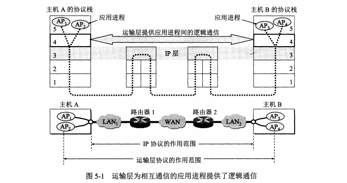

运输层需要有两种不同的运输协议，即面向连接的TCP和无连接的UDP，TCP：全双工的可靠信道，UDP：不可靠信道

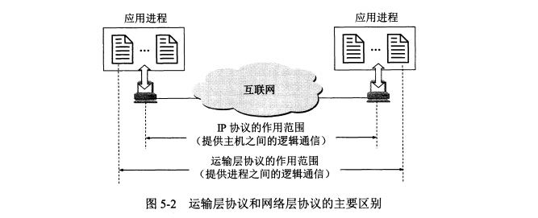

### 5.1.2 运输层两个重要的协议——TCP、UDP

TCP/IP运输层的两个主要协议都是互联网的正式标准，即

（1）用户数据报协议UDP（ User Datagram Protoco）

（2）传输控制协议TCP（ Transmission Control protocol）

按照OSI的术语，两个对等运输实体在通信时传送的数据单位叫做运输协议数据单元TPDU（ Transport Protocol Data Unit）。

但在TCP/IP体系中，则根据所使用的协议是TCP或UDP，分别称之为TCP报文段（ segment）或UDP用户数据报

**UDP在传送数据之前不需要先建立连接**。远地主机的运输层在收到UDP报文后，不需要给出任何确认。虽然**UDP不提供可靠交付**，但在某些情况下UDP却是一种最有效的工作方式

**TCP则提供面向连接的服务。在传送数据之前必须先建立连接，**数据传送结束后要释放连接。TCP不提供广播或多播服务。由于**TCP要提供可靠的、面向连接的运输服务**，因此不可避免地增加了许多的开销，如确认、流量控制、计时器以及连接管理等。这不仅使协议数据单元的首部增大很多，还要占用许多的处理机资源。

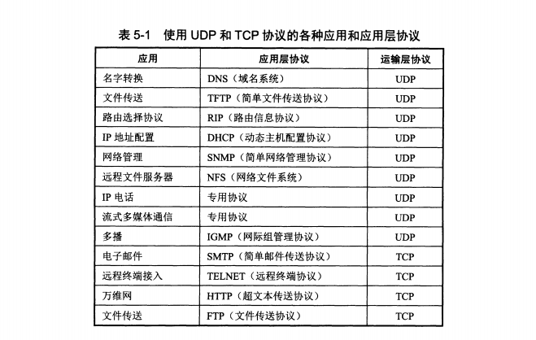

### 5.1.3 运输层的端口

端口出现的原因：不同的操作系统使用了不同格式的进程标识符，进程的创建和销毁是动态的，无法识别的对方机器上的进程。

在运输层使用协议端口号 protocol port number，即端口。

端口分类：

（1）服务器端使用的端口号

这里又分为两类，最重要的一类叫做熟知端口号（welnown portnumber或系统端口号，数值为0-1023.）

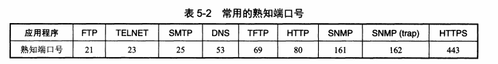

另一类叫做登记端口号，数值为1024-49151.这类端口号是为没有熟知端口号的应用程序使用的。

（2）客户端使用的端口号数值为49152-65535.由于这类端口号仅在客户进程运行时才动态选择，因此又叫做短暂端口号。这类端口号留给客户进程选择暂时使用。当服务器进程收到客户进程的报文时，就知道了客户进程所使用的端口号，因而可以把数据发送给客户进程。通信结束后，刚才已使用过的客户端口号就不复存在，这个端口号就可以供其他客户进程使用。

## 5.2 用户数据报协议 UDP

### 5.2.1 UDP概述

UDP特点：

- UDP是无连接的，即发送前不提前建立连接
- UDP使用尽最大努力交付，即不保证可靠交付
- UDP是面向报文的，即发送方的UDP对应用程序交下来的报文，在添加首部后就交付给Ip层。即应用层给交给UDP多长的报文，UDP就照发。

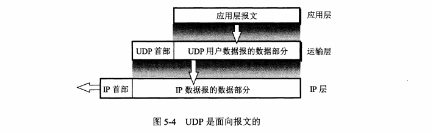

- UDP是没有拥塞控制的
- UDP支持一对一，一对多，多对一，多对多的交互通信
- UDP收不开销小，只有8个字节（TCP的首部有20个字节）

### 5.2.2 UDP的首部格式

用户数据报UDP有两个字段：数据字段和首部字段。首部字段很简单，只有8个字节，由四个字段组成，每个字段的长度都是两个字节。

各字段意义如下

（1）源端口：源端口号。在需要对方回信时选用。不需要时可用全0。

（2）目的端口：目的端口号。这在终点交付报文时必须使用。

（3）长度：UDP 用户数据报的长度，其最小值是8（仅有首部）。

（4）检验和： 检测UDP用户数据报在传输中是否有错。有错就丢弃

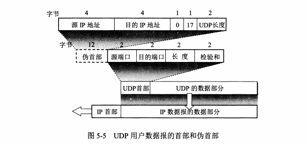

当运输层从IP层收到UDP数据报时，就根据首部中的目的端口，把UDP数据报通过相应的端口，上交最后的终点—应用进程。

## 5.3 传输控制协议TCP（重点）

### 5.3.1 TCP的主要特点

1. TCP是面向连接的运输层协议，即传输数据前需要建立连接
2. TCP只支持一对一连接
3. TCP提供可靠交付，即传输的数据无差错，不丢失，不重复，并且按序到达
4. TCP提供全双工通信
5. 面向字节流，TCP会把应用层交下来的数据看成是无结构的字节流，并不知道其字节流的含义

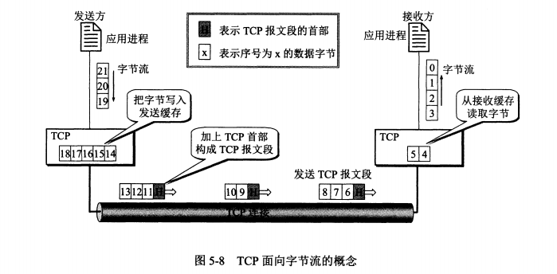

### 5.3.2 TCP的连接——Socket套接字

TCP把连接作为最基本的抽象。TCP连接的端点叫做套接字socket 或者插口。

socket = （IP：port），套接字 = （IP地址：端口prot）

每一条TCP连接唯一地被通信两端的两个端点（即两个套接字）所确定。即：

TCP 连接  : :=（socket1, socket2）={（IP1：port1），（IP2：port2）}

## 5.4 可靠传输的工作原理

### 5.4.1 停止等待协议

停止等待就是每发完一个分组就停止发送，等待对方的确认，收到确认后再发送下一个分组。

1.无差错情况(a)

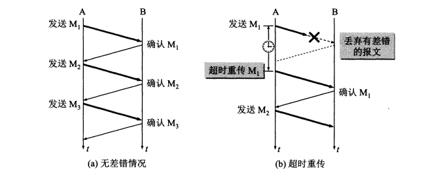

2.出现差错(b) 超时重传

A只要超过了一段时间仍然没有收到确认，就认为刚才发送的分组丢失了因而重传前面发送过的分组。这就叫做超时重传。

要实现超时重传，就要在每发送完一个分组时设置一个超时计时器。如果在超时计时器到期之前收到了对方的确认，就撤销已设置的超时计时器。（a）中，A为每一个已发送的分组都设置了一个超时计时。但A只要在超时计时器到期之前收到了相应的确认，就撤销该超时计时器。

3.确认丢失和确认迟到

图5-10（a）说明的是另一种情况。B所发送的对M1的确认丢失了。A在设定的超时重传时间内没有收到确认，并无法知道是自己发送的分组出错、丢失，或者是B发送的确认丢失了。因此A在超时计时器到期后就要重传M1.现在应注意B的动作。假定B又收到了重传的分组M1.这时应采取两个行动。

第一，丢弃这个重复的分组M1，不向上层交付。

第二，向A发送确认。不能认为已经发送过确认就不再发送，因为A之所以重传M1就表示A 没有收到对M1的确认

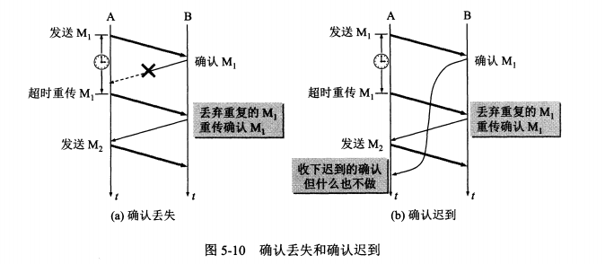

图5-10（b）也是一种可能出现的情况。传输过程中没有出现差错，但B对分组M1的确认迟到了。A会收到重复的确认。对重复的确认的处理很简单：收下后就丢弃。B仍然会收到重复的M1，并且同样要丢弃重复的M1，并重传确认分组。

通常A最终总是可以收到对所有发出的分组的确认。如果A不断重传分组但总是收不到确认，就说明通信线路太差，不能进行通信。

使用上述的确认和重传机制，我们就可以在不可靠的传输网络上实现可靠的通信。

像上述的这种可靠传输协议常称为**自动重传请求ARQ（ Automatic Repeat reQuest）**。意思是重传的请求是自动进行的。接收方不需要请求发送方重传某个出错的分组。

4.信道利用率

停止协议的优点是简单，但是信道利用率太低了。

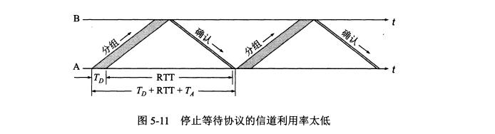

对于流水线传输，需要用到连续ARQ协议和滑动窗口协议

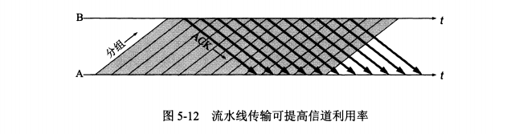

### 5.4.2 连续ARQ协议

图5-13（a）表示发送方维持的发送窗口，它的意义是：位于发送窗口内的5个分组都可连续发送出去，而不需要等待对方的确认。这样，信道利用率就提高了。

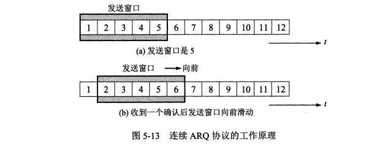

连续ARQ协议规定，发送方每收到一个确认，就把发送窗口向前滑动一个分组的位置。图5-13（b）表示发送方收到了对第1个分组的确认，于是把发送窗口向前移动一个分组的位置。如果原来已经发送了前5个分组，那么现在就可以发送窗口内的第6个分组了。

接收方一般都是采用累积确认的方式。这就是说，接收方不必对收到的分组逐个发送确认，而是在收到几个分组后，对按序到达的最后一个分组发送确认，这就表示：到这个分组为止的所有分组都已正确收到了。

累积确认有优点也有缺点。优点是：容易实现，即使确认丢失也不必重传。但缺点是不能向发送方反映出接收方已经正确收到的所有分组的信息。

## 5.5 TCP报文段的首部格式

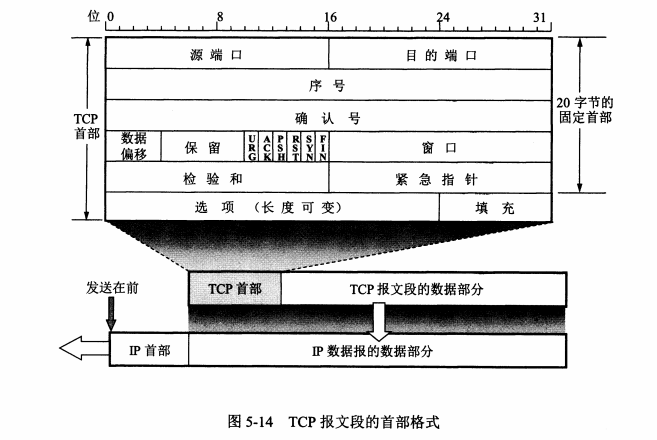

## 5.6 可靠传输的工作实现

### 5.6.1 以字节为单位的滑动窗口

TCP的滑动窗口是以字节为单位的。

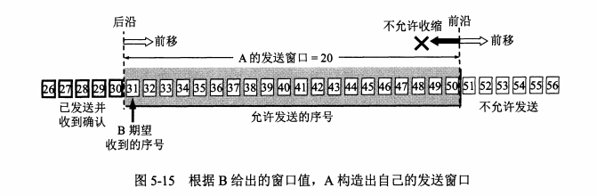

滑动窗口内的，凡是已经发送过的数据，但是未收到确认之前都必须暂时保留，以便在超时重传时使用。

已发送且确认的，不需要保留；还未发送的数据，接收方暂时没有处理，所以还是需要保留在缓存空间里。

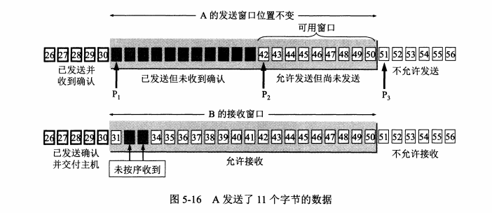

B只能对按序收到的数据中的最高序号给出确认，因此B发送的确认报文段中的确认号仍然是31，而不是32,33

A收到了31的确认信号，发送窗口向前滑动

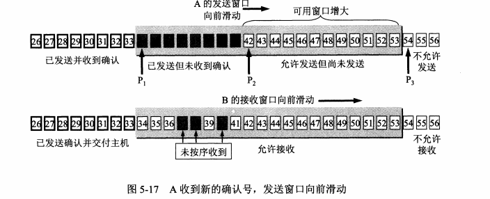

当A的发送窗口满了，就会等待一段时间，如果还没有收到B的接受确认，则重传这部分的数据，直到收到B的确认

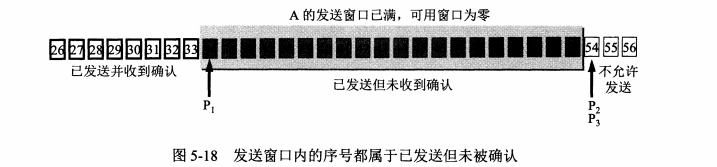

**TCP的缓存和窗口的关系**

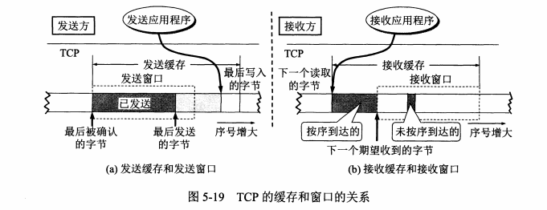

图5-19（a）所示的发送方的情况

发送缓存用来暂时存放：

（1）发送应用程序传送给发送方TCP准备发送的数据

（2）TCP已发送出但尚未收到确认的数据。

发送窗口通常只是发送缓存的一部分。已被确认的数据应当从发送缓存中删除，因此发送缓存和发送窗口的后沿是重合的。发送应用程序最后写入发送缓存的字节减去最后被确认的字节，就是还保留在发送缓存中的被写入的字节数。发送应用程序必须控制写入缓存的速率，不能太快，否则发送缓存就会没有存放数据的空间。

图5-19（b）所示的接收方的情况。

接收缓存用来暂时存放：

（1）按序到达的、但尚未被接收应用程序读取的数据；

（2）未按序到达的数据如果收到的分组被检测出有差错，则要丢弃。如果接收应用程序来不及读取收到的数据，接收缓存最终就会被填满，使接收窗口减小到零。反之，如果接收应用程序能够及时从接收缓存中读取收到的数据，接收窗口就可以增大，但最大不能超过接收缓存的大小。图5-19（b）中还指出了下一个期望收到的字节号。这个字节号也就是接收方给发送方的报文段的首部中的确认号。

### 5.6.2 超时重传时间的选择

TCP采用了一种自适应算法，它记录一个报文段发出的时间，以及收到相应的确认的时间。这两个时间之差就是**报文段的往返时间RTT**。

TCP保留了RTT的一个加权平均往返时间RTTs（这又称为平滑的往返时间，S表示 Smoothed因为进行的是加权平均，因此得出的结果更加平滑）。

### 5.6.3 选择确认SACK

选择确认 Select ACK： 收到的报文段无差错，只是顺序不同，可以先把这些收到的不连续的数据段返回确认，告诉发送方不要重复发送这些已经收到的数据了。

第一个字节块，从L1=1501到R1=3001 返回确认。注意右边界要+1.

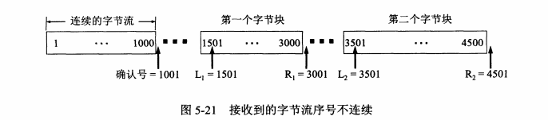

## 5.7 TCP的流量控制

### 5.7.1 利用滑动窗口实现流量控制

**TCP的窗口单位是字节，不是报文**

流量控制：即发送方不要发太快，要让接收方来得及处理。

发送发的窗口大小不能超过接收方的接收窗口

我们应注意到，接收方的主机B进行了三次流量控制。第一次把窗口减小到rwnd=300，第二次又减到rwnd=100，最后减到rwnd=0，即不允许发送方再发送数据了。这种使发送方暂停发送的状态将持续到主机B重新发出一个新的窗口值为止。我们还应注意到，B向A发送的三个报文段都设置了ACK=1，只有在ACK=1时确认号字段才有意义

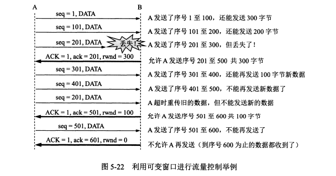

### 5.7.2 传输效率

前面已经讲过，应用进程把数据传送到TCP的发送缓存后，剩下的发送任务就由TCP来控制了。可以用不同的机制来控制TCP报文段的发送时机。

例如，第一种机制是TCP维持一个变量，它等于最大报文段长度MSS。只要缓存中存放的数据达到MSS字节时，就组装成一个TCP报文段发送出去。

第二种机制是由发送方的应用进程指明要求发送报文段即TCP支持的推送φpush操作。

第三种机制是发送方的一个计时器期限到了，这时就把当前已有的缓存数据装入报文段（但长度不能超过MSS）发送出去。

在TCP的实现中广泛使用 Nagle算法。算法如下：若发送应用进程把要发送的数据逐个字节地送到TCP的发送缓存，则发送方就把第一个数据字节先发送出去，把后面到达的数据字节都缓存起来。当发送方收到对第一个数据字符的确认后，再把发送缓存中的所有数据组装成一个报文段发送出去，同时继续对随后到达的数据进行缓存。只有在收到对前一个报文段的确认后才继续发送下一个报文段。当数据到达较快而网络速率较慢时，用这样的方法可明显地减少所用的网络带宽。 Nagle算法还规定，当到达的数据已达到发送窗口大小的半或已达到报文段的最大长度时，就立即发送一个报文段。这样做，就可以有效地提高网络的吞吐量。

**另一个问题叫做糊涂窗口综合征（ silly window syndrome）**，有时也会使TCP的性能变坏。设想一种情况：TCP接收方的缓存已满，而交互式的应用进程一次只从接收缓存中读取1个字节（这样就使接收缓存空间仅腾出1个字节），然后向发送方发送确认，并把窗口设置为1个字节（但发送的数据报是40字节长）。接着，发送方又发来1个字节的数据（请注意，发送方发送的IP数据报是41字节长）。接收方发回确认，仍然将窗口设置为1个字节。这样进行下去，使网络的效率很低。

要解决这个问题，可以让接收方等待一段时间，使得或者接收缓存已有足够空间容纳个最长的报文段，或者等到接收缓存已有一半空闲的空间。只要出现这两种情况之一，接收方就发出确认报文，并向发送方通知当前的窗口大小。此外，发送方也不要发送太小的报文段，而是把数据积累成足够大的报文段，或达到接收方缓存的空间的一半大小上述两种方法可配合使用。使得在发送方不发送很小的报文段的同时，接收方也不要在缓存刚刚有了一点小的空间就急忙把这个很小的窗口大小信息通知给发送方

## 5.8 TCP的拥塞控制

### 5.8.1 拥塞控制的原理

拥塞：对网络中某一资源的需求超过了该资源所能提供的可用部分，网络的性能就会变差。

拥塞控制与流量控制的关系密切，它们之间也存在着一些差别

所谓拥塞控制就是防止过多的数据注入到网络中，这样可以使网络中的路由器或链路不致过载。拥塞控制所要做的都有一个前提，就是网络能够承受现有的网络负荷。拥塞控制是一个全局性的过程，涉及到所有的主机、所有的路由器，以及与降低网络传输性能有关的所有因素。

拥塞控制的作用

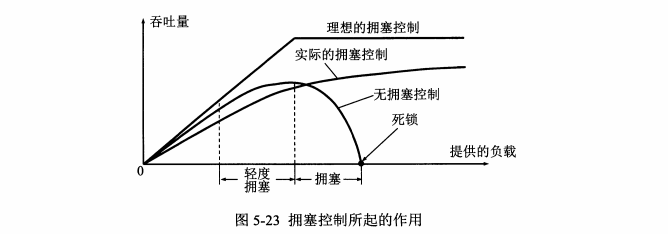

### 5.8.2 拥塞控制的方法

TCP进行拥塞控制的算法有四种，

即慢开始（sow-star）、拥塞避免（ congestionoidance））、快重传 ast retransmit）和快恢复（ fast recovery）

1.慢开始和拥塞避免

拥塞控制也叫做基于窗口的拥塞控制。为此，发送方维持一个叫做拥塞窗口cwnd（ congestion window）的状态变量。拥塞窗口的大小取决于网络的拥塞程度，并且动态地在变化。发送方让自己的发送窗口等于拥塞窗口

发送方控制拥塞窗口的原则是：只要网络没有出现拥塞，拥塞窗口就可以再增大些，以便把更多的分组发送出去，这样就可以提高网络的利用率。但只要网络出现拥塞或有可能出现拥塞，就必须把拥塞窗口减小一些，以减少注入到网络中的分组数，以便缓解网络出现的拥塞。

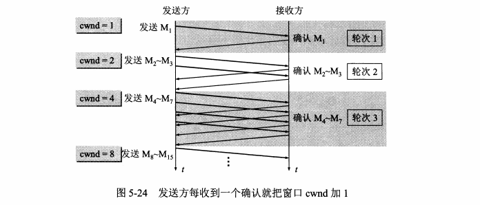

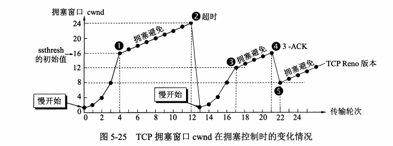

为了防止拥塞窗口cwnd增长过大引起网络拥塞，还需要设置一个慢开始门限 ssthresh状态变量（如何设置 ssthresh，后面还要讲）。

慢开始门限 ssthresh的用法如下：

当cwnd< ssthresh时，使用上述的慢开始算法。

当cwnd> ssthresh时，停止使用慢开始算法而改用拥塞避免算法，

当cwnd= ssthresh时，既可使用慢开始算法，也可使用拥塞避免算法。

拥塞避免算法的思路是让拥塞窗口cwnd缓慢地增大，即每经过一个往返时间RTT就把发送方的拥塞窗口cwnd加1，而不是像慢开始阶段那样加倍增长。因此在拥塞避免阶段就有“加法增大”AI（ Additive Increase）的特点。这表明在拥塞避免阶段，拥塞窗口cwnd按线性规律缓慢增长，比慢开始算法的拥塞窗口增长速率缓慢得多

2.快重传和快恢复

采用快重传算法可以让发送方尽早知道发生了个别报文段的丢失。快重传算法首先要求接收方不要等待自己发送数据时才进行捎带确认，而是要立即发送确认，即使收到了失序的报文段也要立即发出对已收到的报文段的重复确认。

如图5-26所示，接收方收到了M1和M2后都分别及时发出了确认。现假定接收方没有收到M3但却收到了M4本来接收方可以什么都不做。但按照快重传算法，接收方必须立即发送对M2的重复确认，以便让发送方及早知道接收方没有收到报文段M3.发送方接着发送M和M6.接收方收到后也仍要再次分别发出对M2的重复确认。

这样，发送方共收到了接收方的4个对M2的确认，其中后3个都是重复确认。快重传算法规定，发送方只要一连收到3个重复确认，就知道接收方确实没有收到报文段M3，因而应当立即进行重传（即“快重传”），这样就不会出现超时，发送方也不就会误认为出现了网络拥塞。使用快重传可以使整个网络的吞吐量提高约20%

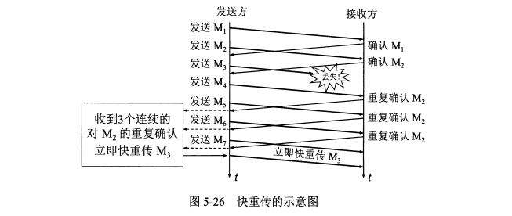

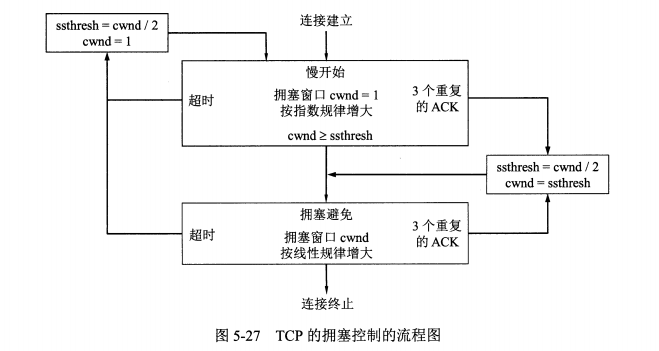

## 5.9 TCP的连接管理（握手）

连接的阶段：建立连接，数据传送，释放连接

### 5.9.1 TCP的连接建立

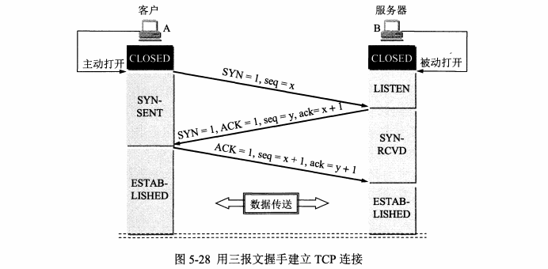

开始，B的TCP服务器进程先创建传输控制块TCB，准备接受客户进程的连接请求。然后服务器进程就处于 LISTEN（收听）状态，等待客户的连接请求。如有，即作出

响应

A的TCP客户进程也是首先创建传输控制模块TCB。然后，在打算建立TCP连接时向B发出连接请求报文段，这时首部中的同步位SYN=1，同时选择一个初始序号seq

X.TCP规定，SYN报文段（即SYN=1的报文段）不能携带数据，但要消耗掉一个序号这时，TCP客户进程进入 SYN-SENT（同步已发送）状态

B收到连接请求报文段后，如同意建立连接，则向A发送确认。在确认报文段中应把SYN位和ACK位都置1，确认号是ack=x+1，同时也为自己选择一个初始序号seq=y

请注意，这个报文段也不能携带数据，但同样要消耗掉一个序号。这时TCP服务器进程进入 SYN-RCVD（同步收到）状态

TCP客户进程收到B的确认后，还要向B给出确认。确认报文段的ACK置1，确认号ack=y+1，而自己的序号seq=x+1.TCP的标准规定，ACK报文段可以携带数据。但如

果不携带数据则不消耗序号，在这种情况下，下一个数据报文段的序号仍是seq=x+1.这时，TCP连接已经建立，A进入 ESTABLISHED（已建立连接）状态。

当B收到A的确认后，也进入 ESTABLISHED状态。上面给出的连接建立过程叫做三报文握手。请注意，在图5-28中B发送给A的报文段，也可拆成两个报文段。可以先发送一个确认报文段（ACK=1，ack=x+1），然后再发送一个同步报文段（SYN=1，seq=y）。这样的过程就变成了四报文握手，但效果是样的。

为什么A最后还要发送一次确认呢？

这主要是为了防止已失效的连接请求报文段突然又传送到了B，因而产生错误

### 5.9.2 TCP的连接释放

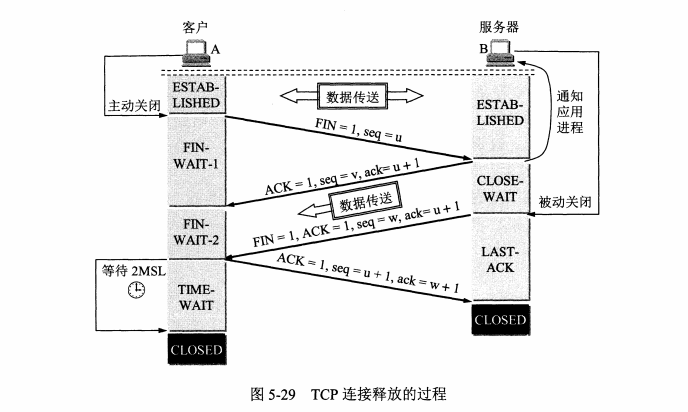

TCP连接释放过程比较复杂，我们仍结合双方状态的改变来阐明连接释放的过程。

数据传输结束后，通信的双方都可释放连接。现在A和B都处于 ESTABLISHED状态（图5-29）。A的应用进程先向其TCP发出连接释放报文段，并停止再发送数据，主动关闭TCP连接。A把连接释放报文段首部的终止控制位FIN置1，其序号seq=u，它等于前面已传送过的数据的最后一个字节的序号加1.这时A进入 FIN-WAIT-1（终止等待1）状态，等待B的确认。请注意，TCP规定，FIN报文段即使不携带数据，它也消耗掉一个序号

B收到连接释放报文段后即发出确认，确认号是ack=u+1，而这个报文段自己的序号是ⅴ，等于B前面已传送过的数据的最后一个字节的序号加1.然后B就进入 CLOSE

WAIT（关闭等待）状态。TCP服务器进程这时应通知高层应用进程，因而从A到B这个方向的连接就释放了，这时的TCP连接处于半关闭 (half-close）状态，即A已经没有数据要发送了，但B若发送数据，A仍要接收。也就是说，从B到A这个方向的连接并未关闭，这个状态会持续一段时间

A收到来自B的确认后，就进入 FIN-WAIT2（终止等待2）状态，等待B发出的连接释放报文段。

若B已经没有要向A发送的数据，其应用进程就通知TCP释放连接。这时B发出的连接释放报文段必须使FN=1.现假定B的序号为w（在半关闭状态B可能又发送了一些数据）。B还必须重复上次已发送过的确认号ack=u+1.这时B就进入 LAST-ACK（最后确认）状态，等待A的确认

A在收到B的连接释放报文段后，必须对此发出确认。在确认报文段中把ACK置1，确认号ack=w+1，而自己的序号是seq=u+1（根据TCP标准，前面发送过的FN报文

段要消耗一个序号）。然后进入到 TIME-WAIT（时间等待）状态。请注意，现在TCP连接还没有释放掉。必须经过时间等待计时器（ TIME-WAIT timer）设置的时间2MSL后，A才进入到 CLOSED状态。时间MSL叫做最长报文段寿命 Maximum Segment Lifetime），RFC793建议设为2分钟。但这完全是从工程上来考虑的，对于现在的网络，MSL=2分钟可能太长了一些。因此TCP允许不同的实现可根据具体情况使用更小的MSL值。因此，从A进入到 TIME- WAIT状态后，要经过4分钟才能进入到 CLOSED状态，才能开始建立下一个新的连接。当A撤销相应的传输控制块TCB后，就结束了这次的TCP连接。

### 5.9.3 TCP的有限状态机

为了更清晰地看出TCP连接的各种状态之间的关系，图5-30给出了TCP的有限状态机。图中每一个方框即TCP可能具有的状态。每个方框中的大写英文字符串是TCP标准所

使用的TCP连接状态名。状态之间的箭头表示可能发生的状态变迁。箭头旁边的字，表明引起这种变迁的原因，或表明发生状态变迁后又出现什么动作。请注意图中有三种不同的箭头。粗实线箭头表示对客户进程的正常变迁。粗虚线箭头表示对服务器进程的正常变迁。另种细线箭头表示异常变迁。

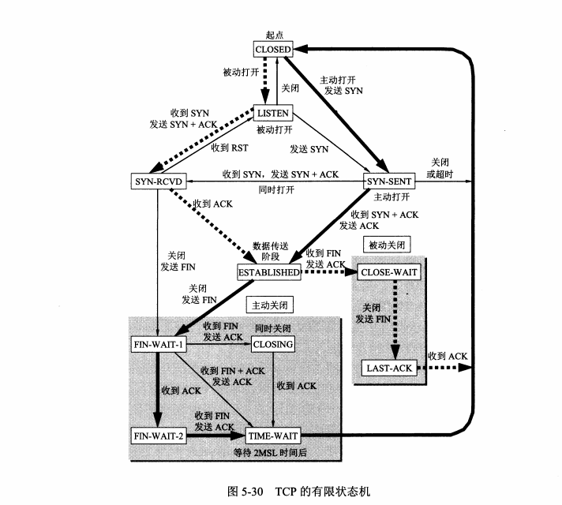

## 5.10 小结

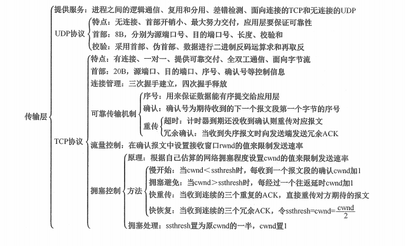