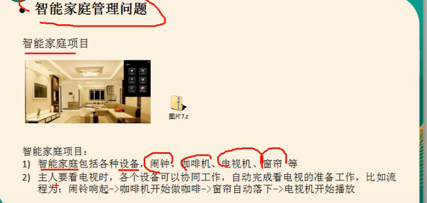
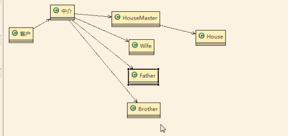
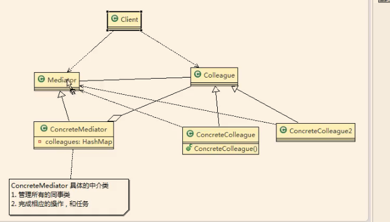
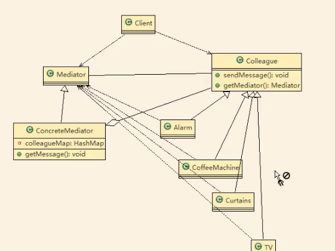
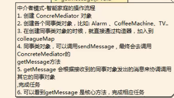

案例背景

传统的方式的问题分析

11）当各电器对象有多种状态改变时，相互之间的调用关系会比较复杂

2）各个电器对象彼此联系，你中有我，我中有你，不利于松耦合

13）各个电器对象之间所传递的消息（参数），容易混乱

4）当系统增加一个新的电器对象时，或者执行流程改变时，代码的可维护性、扩展性

都不理想→考虑中介者模武

中介者模式基本介绍

基本介绍

1）中介者模式（ Mediator Pattern），用一个中介对象来封装一系列的对象交互中介者使各个对象不需要显式地相互引用，从而便其耦合松散，而且可以独立

2）中介者模式属于行为型模式，使代码易于维护

3）比如MVC模式，C（ Controller控制器）是M（ Model模型）和v（vew视图）的中介者，在前后端交互时起到了中间人的作用

案例Uml图

//code 妈的，代码超级垃圾，看不懂。

中介者模式的注意事项和细节

中介者模式的注意事项和细节

1）多个类相互稠合，会形成网状结均，使用中介者模式将网状结构分离为星型结构，

进行解耦

2）减少类间依赖，降低了耦合，符合迪米特原则

3）中介者承担了较多的责任，一旦中介者出现了问题，整个系统就会受到影响

4）如果设计不当，中介者对象本身变得过于复杂，这点在实际使用时，要特别注意