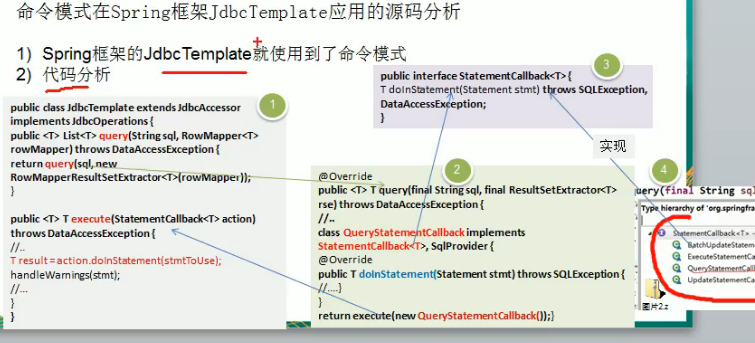

//案例背景

1)我们买了一套智能家电,有照明灯、风扇、冰箱、洗衣机,我们只要在手机上安装app就可以控制对达兰家电工作.

2)这些智能家电来自不同的厂家,我们不想针对每一种家电都安装一个App,分别控制,我们希望只要一个app就可以控制全部智能家电.

3)要实现控制所有智能家电的需要,则每个智能家电厂家都要提供一个统一的接囗给ap调用,这时就可以考虑便用命令模式

4)命令模式可将"动作的请孓省"从"动作的执行者"对象中解耦出来.

5)在我们的例子中,动作的请求者是手机ap,动作的执行者是每个厂商的一个家电产品

命令模式基本介绍

基本介绍

1)命令模式( Command Pattern):在软件设计中,我们经常需要向某些对象发送请求,但是并不知道请求的接收者是谁,也不知道被请求的操作是哪个,

我们只需在程序运行时指定具体的请求接收者即可,此时,可以使用命令模式来进行设计

将军下进攻命令，并不知道具体哪个士兵去进攻

2)命名模式使得请求发送者与请求接收者消除彼此之间的耦合,让对象之间的调用夭系更加灵活,实现解耦.

3)在命名模式中,会将一个请求封装为一个对象,以便使用不同参数来表示不同的请求(即命名),同时命令模式也支持可撤销的操作

4)通俗易懂的理解:将军发布命令,士兵去执行.其中有几个角色:

将军(命令发布者)、士兵(命令的具体执行者)、命令(连接将军和士兵)

角色

Invoker是调用者(将军),Receⅳve是被调用者(士兵),

My Command是命令,实现了 Com mand接口,持有接收对象

//简单的UML草图

no command 是空命令

//code

spring的jdbc template使用到了命令模式

小结；

命令模式的注意事项和细节

命令模式的注意事项和细节

1)将发起请求的对象与执行请求的对象解耦.发起请求的对象是调用者,调用者只要

调用命令对象的 execute(方法就可以让接收者工作,而不必知道具体的接收者对

象是谁、是如何实现的,命令对象会负责让接收者执行请求的动作,也就是说

请求发起者"和"请求执行者"之间的解耦是通过命令对象实现的,命令对象起到

了纽带桥梁的作用.

2)容易设计一个命令队列.只要把命令对象放到列队,就可以多线程的执行命令

3)容易实现对请求的撤销和重做

4)命令模式不足:可能导致某些系统有过多的具体命令类,增加了系统的复杂度,这

点在在使用的时候要注意

5)空命令也是一种设计模式,它为我们省去了判空的操作.在上面的实例中,如果没

有用空命令,我们每按下一个按键都要判空,这给我们编码带来一定的麻烦

6)命令模式经典的应用场景:界面的一个按钮都是一条命令、模拟CMD(DS命令)

订单的撤销/恢复、触发-反馈机制