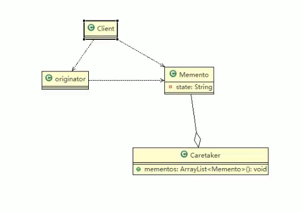
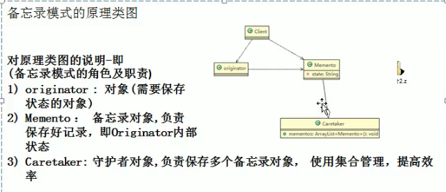
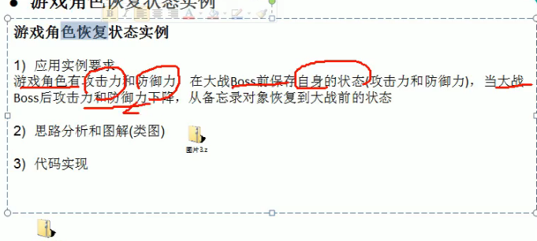

备忘录模式基本介绍

基本介绍

1）备忘录模式（ Memento Pattern）在不破坏封装性的前提下，捕获一个对象的内

部状态，并在该对象之外保存这个状态。这样以后就可将该对象恢复到原先保

存的状态

2）可以这里理解备忘录模式：现实生活中的备忘录是用来记录某些要去做的事情，

或者是记录已经达成的共同意见的事情，以防忘记了。而在软件层面，备忘录

模式有着相同的含义，备忘录对象主要用来记录一个对象的某种状态，或者某

些数据，当要做回退时，可以从备忘录对象里获取原来的数据进行恢复操作

3）备忘录模式属于行为型模式

//简单的UML图

Memento 会保存originator的状态

///code

//游戏存档， 可以使用备忘录模式

小结：

备忘录模式的注意事项和细节

1）给用户提供了一种可以恢复状态的机制，可以使用户能够比较方便地回到某个历史的状态

2）实现了信息的封装，使得用户不需要关心状态的保存细节

3）如果类的成员变量过多，势必会占用比较大的资源，而且每一次保存都会消耗一定的内存，这个需要注意

4）适用的应用场景：1、后悔药。2、打游戏时的存档。3、 Windows里的ctri+z。4、|E中的后退。4、数据库的事务管理

5）为了节约内存，备忘录模式可以和原型模式配合使用