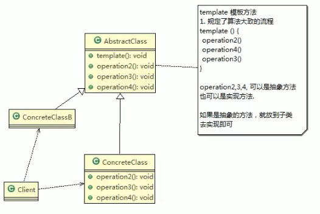

///北京案例

编写制作豆浆的程序,说明如

1)制作豆浆的流程[添加配为漫上放到夏浆机打碎

2)通过添加不同的

不味的豆浆

3)选材

这几个步骤对于制作斜

豆浆都是一样的

4)请使用模板方法模式主成(说明:因为模板方法模式,比较简单,很容易就

想到这个方案,因此就直接使用,不再使用传统的方案来引出模板方法模式)

模板方法

基本介绍

1)模板方法模式( Template Method Pattern),又叫模板模式( Template Pattern),z

在一个抽象类公开定义了执行它的方法的模板.它的子类可以按需要重写方法

实现,但调用将以抽象类中定义的方式进行

2)简单说,模板方法模式定义一个操作中的算法的骨架,而将一些步骤延迟到子

类中,使得于类可以不改变一个算法的结构,就可以重定义该算法的某些特定

步骤

3)这种类型的设计模式属于行为型模式.

//角色

对原理类图的说明即(模板方法模式的角色及职责)

\1) Abstractclass抽象类,类中实现了模板方法,定义了算法的骨架,具体子

类需要去实现其它的抽象方法 operation2,3,4

Concretecla实现抽象方法 operation234,以完成算法中子类的步骤

//code

钩子方法？

模板方法模式的钩子方法

1)在模板方法模式的父类中,我们可以定义一个方法它默认不做任何事，子类可视情沉要不要覆盖它, 该方法称“钩子”

spring ioc容器初始化的时候用到了模板方法模式

小结：

●模板方法模式的注意事项和细节

模板方法模式的注意事项和细节

1)基本思想是:算法只存在于一个地方,也就是在父类中,容易修改.需要修改算

法

要修改父类的模板方法或者已经实现的某些步骤,子类就会继承这些修改

2)实现了最大化代码复用.父类的模板方法和已实现的某些步骤会被子类继承而直接

使用

3)既统一了算法也提供了很大的灵活悝.父类的模板方法确保了算法的结构保持不

是供部分

勺实现

)该模式的不足之处:每一个不同的实现都需要一个子类实现,导致类的个数增加

使得系统更加庞大

5)一般模板方法都加上 final关键字,防止子类重写模板方法

6)模板方法模式使用场景:当要完成在某个过程,该过程要执行一系列步骤,这

系列的步骤基本相同,但其个别步骤在实现时可能不同,通常考虑用模板方法模

式来处理