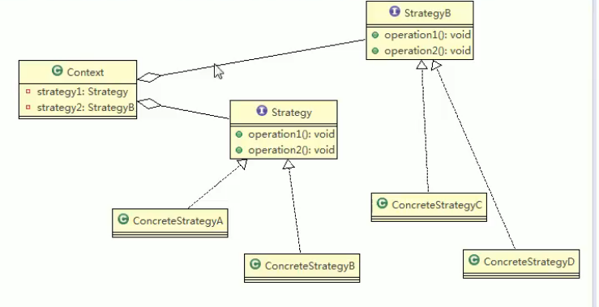
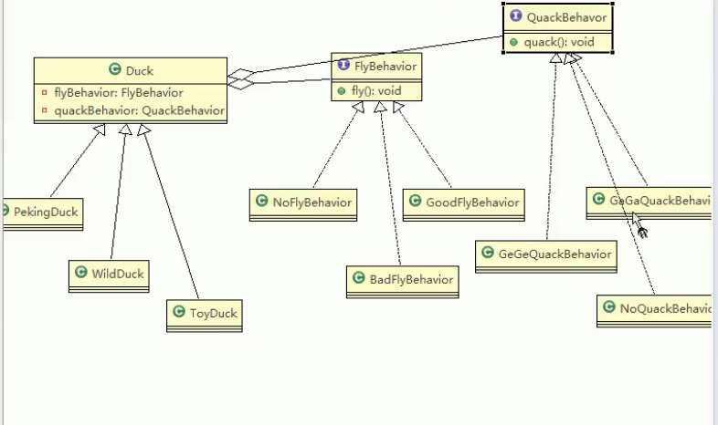
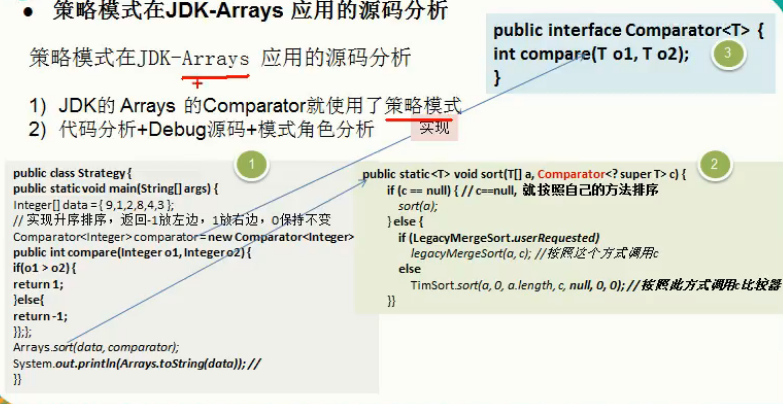

案例背景

编写鸭子项目，具体要求如下

1）有各种鸭子（比如野鸭、北京鸭、水鸭等，鸭子有各种行为，比如叫、飞行等）

显示鸭子的信息

传统的方式实现的问题分析和解决方案

1）其它鸭子，都继承了Duck类，所以fy让所有子类都会飞了，这是不正确的

2）上面说的1的问题，其实是继承带来的问题：对类的局部改动，尤其超类的局部改

动，会影响其他部分。会有溢出效应

3）为了改进1问题，我们可以通过覆盖f方法来解决=>覆盖解决

4）问题又来了，如果我们有一个玩具鸭子 Toy Duck，这样就需要 Toy Duck去覆盖Duck

的所有实现的方法=>解决思路策略模式

基本介绍

1）策略模式（ Strategy Pattern）中，定义算法族，分别封装起来，让他们之间可以

互相替换，此模式让算法的变化独立于使用算法的客户

2）这算法体现了几个设计原则，第一、把变化的代码从不变的代码中分离出来

第二、针对接口编程而不是具体类（定义了策略接口）；第三、多用组合/聚合，

少用继承（客户通过组合方式使用策略）。

UmL类图

鸭子问题的解决方案类图

arrays用到了策略模式

策略模式的注意事项和细节

1）策略模式的关键是：分析项目中变化部分与不变部分

2）策略模式的核心思想是：多用组合/聚合少用继承；用行为类组合，而不是行为的继承。更有弹性

3）体现了“对修改关闭，对扩展开放”原则，客户端增加行为不用修改原有代码，只要添加一种策略（或者行为）即可，避免了使用多重转移语句（。 else if.else）

4）提供了可以替换继承关系的办法：策略模式将算法封装在独立的 Strategy类中使得你可以独立于其 Context改变它，使它易于切换、易于理解、易于扩展

5）需要注意的是：每添加一个策略就要增加一个类，当策略过多是会导致类数目庞大