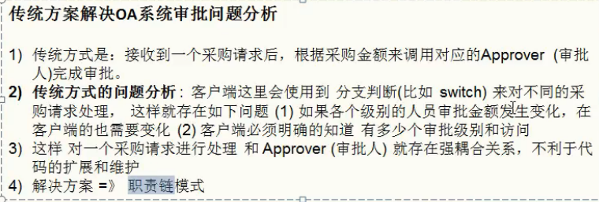
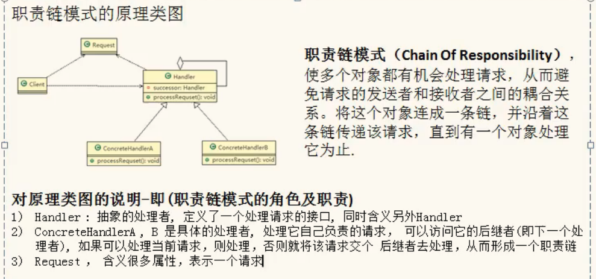
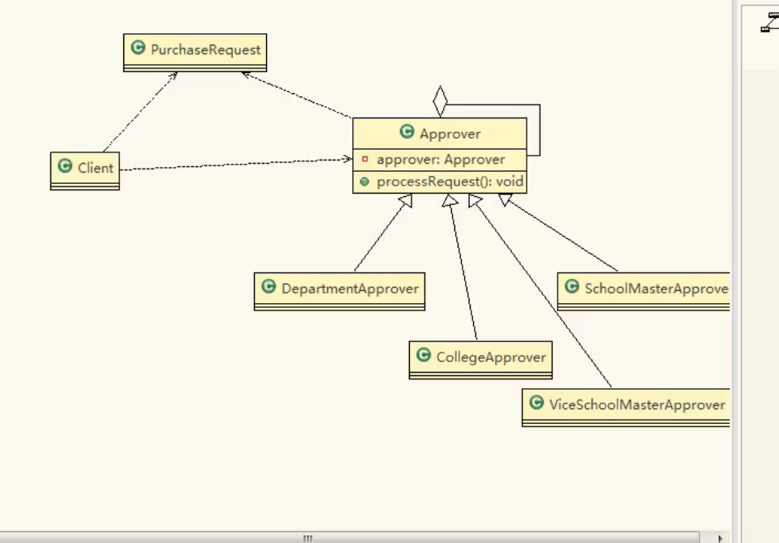
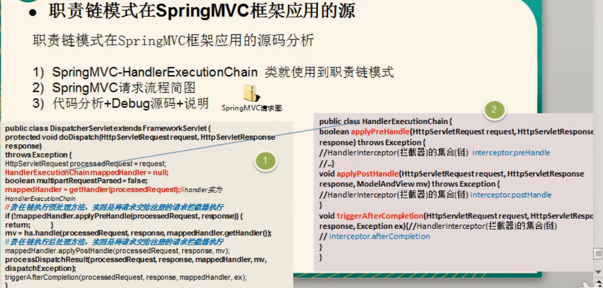

// 案例背景

OA系统采购审批需求

学校QA系统的采购审批项目：需求是

1）采购员采购教学器材

2）如果金额小于等于5000，由教学主任审批

3）如果金额小于等于10000由院长审批

4）如果金额小于等于30000由副校长审批

5）如果金额超过30000以上，有校长审批

职责链模式基本介绍

基本介绍T

1）职责链模式（ Chain of Responsibility Pattern）

又叫责任链模式，为请求创建了一个接收者

对象的链（简单示意图）。这种模式对请求的

发送者和接收者进行解耦。

2）职责链模式通常每个接收者都包含对另一个接

收者的引用。如果一个对象不能处理该请求

那么它会把相同的请求传给下一个接收者，依

此类推。

3）这种类型的设计模式属于行为型模式

在spring mvc框架中有用到过

职责链模式的注意摹项和细节

1）将请求和处理分开，实现解耦，提高系统的灵活性

2）简化了对象，使对象不需要知道链的结构

3）性能会受到影响，特别是在链比较长的时候，因此需控制链中最大节点数量，一般

通过在 Handler中设置一个最大节点数量，在 setNet（方法中判断是否已经超过阀值，

超过则不允许该链建立，避免出现超长链无意识地破坏系统性能

4）调试不方便。采用了类似递归的方式，调试时逻辑可能比较复杂

5）最佳应用场景：有多个对象可以处理同一个请求时，比如：多级请求、请假/加薪

等审批流程、 Java Web中 Tomcat对 Encoding的处理、拦截器