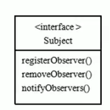
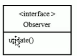
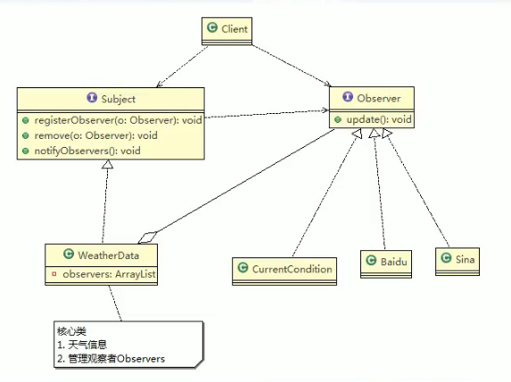
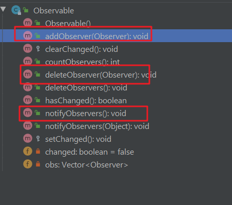

观察者模式很重要，有种类似于订阅的感觉。

//案例背景： 天气与预报

\>问题分析

1）其他第三方接入气象站获取数据的问题

12）无法在运行时动态的添加第三方（新浪网站）

3）违反ocp原则=>研察者模式

∥在 WEather data中，当增加一个第三方，都闹要创建一个对应的第三方的公告板

对泉，并加入到 atachange，不利于维护，也不是动态加入

public void data ChangeO

currentConditions update（getTemperature o, getPressure（， getHumidityo）

原理

·观察者模式（ Observer）原理

观察者模式原理

\>观察者模式类似近牛奶业务

奶站/气象局局：Subject

2）用户第三方网站：Observer

\> Subject：登记注册、移除和通知

1） registerobserver注册

moveobserver

3） notifyobservers（通知所有的注册的用户，根据不同需求，可以是更新数据，让用

户来取，也可能是实施推送，看具体需求定

观察者模式：对象之间多对一依赖的一种设计方案，被依赖的对象为 Subject，，

依赖的对象为 observer, Subjec通知 observer变化比如这里的奶站是Subject，是1的一方。用户时 Observer，是多的一方

、

//code

观察者模式的好处

1）观察者模式设计后，会以集合的方式来管理用（ Observer），包括注册，移除和通知。

2）这样，我们增加观察者（这里可以理解成一个新的公告板），就不需要去修改核心类 WeatherData不会修改代码，遵守了。cp原则。

jdk中的Observer用到了该模式

