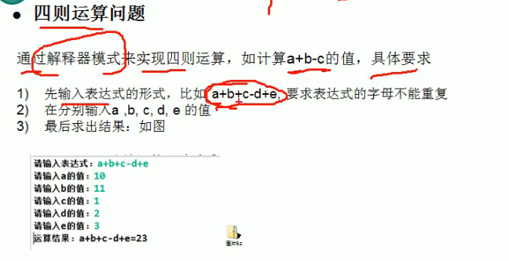
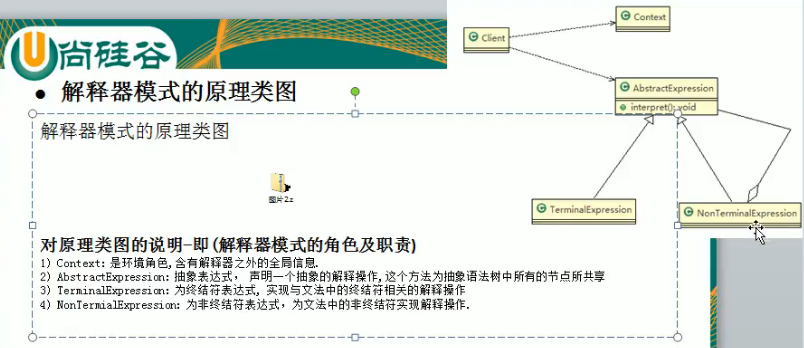
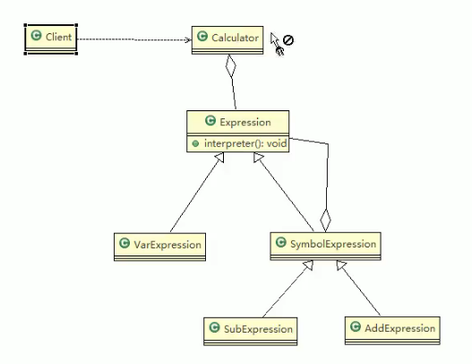

//四则运算，解释器模式 //

**没看完感觉案例复杂好难懂， 需要另外自己看一个容易理解的案例去理解这个模式的原理**

●解释器模式基本介绍

基本介绍

1）在编译原理中，一个算术表达式通过词法分析器形成词法单元，而后这些词法单元再通过语法分析器构建语法分析树，最终形成一颗抽象的语法分析树。这里的词法分析器和语法分析器都可以看做是解释器

2）解释器模式（ interpreter Pattern）：是指给定一个语言（表达式），定义它的文法的一种表示，并定义一个解释器，使用该解释器来解释语言中的句子（表达式）

3）应用场景

应用可以将一个需要解释执行的语言中的句子表示为一个抽象语法树些重复出现的问题可以用一种简单的语言来表达个简单语法需要解释的场景

4）这样的例子还有，比如编译器、运算表达式计算、正则表达式、机器人等

//简单的UML 图

类图没看懂。。。o(╥﹏╥)o

计算场景下

//code

在spel spring exprexxtion laguage使用到了该模式

小结：

解释器模式的注意事项和细节

1）当有一个语言需要解释执行，可将该语言中的句子表示为一个抽象语法树，就可以考虑使用解释器模式，让程序具有良好的扩展性

2）应用场景：编译器、运算表达式计算、正则表达式、机器人等

3）使用解释器可能带来的问题：解释器模式会引起类膨胀、解释器模式采用递归调用方法，将会导致调试非常复杂、效率可能降低