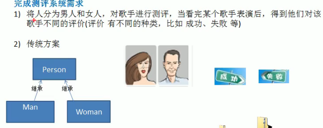
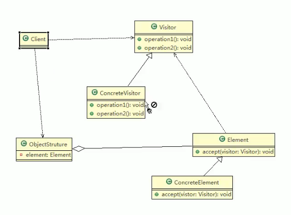
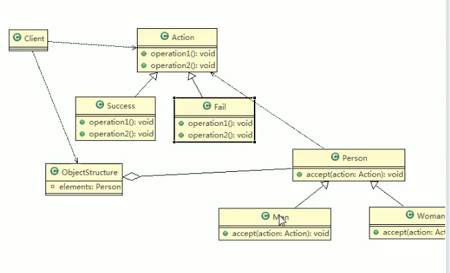

// 案例背景

点歌？

访问者模式基本介绍

访问者模式基本介绍

1)访问者模式( Visitor pattern),封装一些作用于某种数据结构的各元素的操作它可以在不改变数据结构的前提下定义作用于这些元素的新的操作

2)主要将数据结构与数据操作分离,解决数据结构和操作耦合性问题

3)访问者模式的基本工作原理是:在被访问的类里面加一个对外提供接待访问者的接口

4)访问者模式主要应用场景是:需要对一个对象结构中的对象进行很多不同操作(这些操作彼此没有关联),同时需要避免让这些操作"污染"这些对象的类,可以

选用访问者模式解决

简单的UML

1） Visitor是抽象访问者，为该对象结构中的 ConcreteElement的每一个类声明一个vait操作

3） bject structure能枚举它的元素，司以提供一个言层的接囗，用来允许访问者访间元素

4） Element定义一个 accept方法，接收一个访问者对象

5） ConcreteElenent为具体元素，实现了 accept方法

双分派

4）应用案例的小结

上面提到了双分派，所谓双分派是指不管类怎么变化，我们都能找到期望的方法运行

双分派意味着得到执行的操作取决于请求的种类和两个接收者的类型

以上述实例为例，假设我们要添加一个 NotAt的状态类，考察Man类和 Woman类的

反应，由于使用了双分派，只需增加一个 Action子类即可在客户端调用即可，

不需要改动任何其他类的代码

//code

·访问者模式的注意事项和细节

访问者模式的注意事项和细节

优点

1）访问者模式符合单一职责原则、让程序具有优秀的扩展性、灵活性非常高

2）访问者模式可以对功能进行统一，可以做报表、U、拦截器与过滤器，适用于数据

结构相对稳定的系统

缺点

1）具体元素对访问者公布细节，也就是说访问者关注了其他类的内部细节，这是迪米

特法则所不建议的，这样造成了具体元素变更比较困难

2）违背了依赖倒转原则。访问者依赖的是具体元素，而不是抽象元素

3）因此，如果一个系统有比较稳定的数据结构，又有经常变化的功能需求，那么访问

者模式就是比较合适的