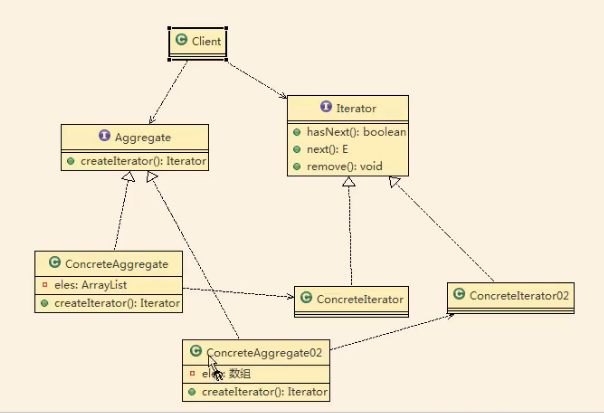
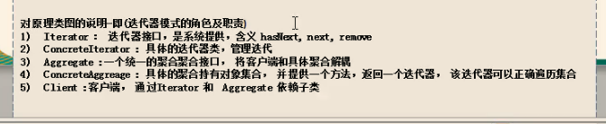
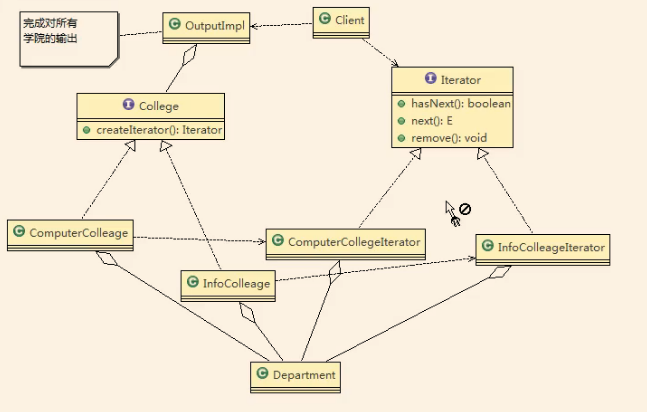

基本介绍

1）迭代器模式（ Iterator Pattern）是常用的设计模式，属于行为型模式

2）如果我们的集合元素是用不同的方式实现的，有数组，还有java的集合类，或者还有其他方式，当客户端要遍历这些集合元素的时候就要使用多种遍历方式，而且还会暴露元素的内部结构，可以考虑使用迭代器模式解决。

3）迭代器模式，提供一种遍历集合元素的统一接口，用一致的方法遍历集合元素不需要知道集合对象的底层表示，即：不暴露其内部的结构。

//uml简单图

//案例uml图

//code

jdk中ArrayList中用到了迭代器模式 显而易见了

小结：

迭代器模式的注意事项和细节

1）提供一个统一的方法遍历对象，客户不用再考虑聚合的类型，使用一种方法就可以遍历对象了

2）隐藏聚合的内部结构，客户端要遍历聚合的时候只能取到迭代器，而不会知道聚合的具体组成。

3）提供了一种设计思想，就是一个类应该只有一个引起变化的原因（叫做单一责任原则）。在聚合类中，我们把迭代器分开，就是要把管理对象集合和遍历对象集

合的责任分开，这样一来集合改变的话，只影响到聚合对象。而如果遍历方式改变的话，只影响到了迭代器

4）当要展示一组相似对象，或者過历一组相同对象时使用，适合使用迭代器模式

缺点

每个聚合对象都要一个迭代器，会生成多个迭代器不好管理