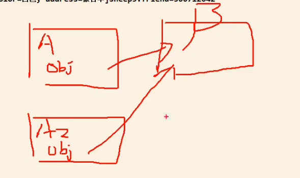

//克隆羊案例

传统的方式解决克隆羊的问题

//code

优点是比较好理解，操作简单

缺点：创建新的对象的时候，总是需要重新获取原始对象的属性，如果对象属性多的话，效率很低。不是动态获取对象运行的状态

解决：Object类提供了一个clone的方法，该方法可以将一个java对象复制一份，但是需要实现Cloneable接口，表示该类能够复制。

基本概念

1.原型模式 Prototype模式）是指：用原型实例指定创建对象的种类，并且通过拷贝这些原型，创建新的对象

2.原型模式是一种创建型设计模式，允许一个对象再创建另外一个可定制的对象，无需知道如何创建的细节

3.工作原理是通过将一个原型对象传给那个要发动创建的对象，这个要发动创建的对象通过请求原型对象拷贝它们自己来实施创建，即对象clone( )。

spring框架用到了原型模式 ： bean的创建 ，<bean id  = "" class ="" scope ="prototype" />

原型模式里如果有对象属性会怎么处理呢？

//浅拷贝

不会复制对象属性，只是用引用指向同一个对象属性 hashcode是一样的

1）对于数据类型是基本数据类型的成员变量，拷贝会直接进行值传递，也就是将该属性复制一份给新的对象

2）对于数据类型是引用数据类型的成员变量，比如说成员变量是某个数组、某个类的对象等，那么浅拷贝会将该成员变量的引用值（内

存地址）复制一份给新的对象。因为实际上两个对象的该成员变量都指向同一个实例。在这种情况下，在一个对象中修改该成员变量会影响到另一个对象的该成员变量值

3）前面我们克隆羊就是浅拷贝

4）浅拷贝是使用默认的clone（）方法来实现 sheep =（Sheep） super.clone( )

//深拷贝

1）复制对象的所有基本数据类型的成员变量值

2）为所有引用数据类型的成员变量申请存储空间，并复制每个引用数据类型成员变量所引用的对象，直到该对象可达的所有对象。也就是说，对象进行深拷贝要对

整个对象进行拷贝

3）深拷贝实现方式1：重写clone方法来实现深拷贝

4）深拷贝实现方式2：通过对象序列化实现深拷贝 ,推荐使用

小结：

原型模式的注意事项和细节

1）创建新的对象比较复杂时，可以利用原型模式简化对象的创建过程，同时也能够提高效率

2）不用重新初始化对象，而是动杰地获得对象运行时的状态）如果原始对象发生变化（增加或者减少属性），其它克隆对象的也会发生相应的编号，

无需修改代码

4）在实现深克隆的时候可能需要比较复杂的代码

5）缺点：需要为每一个类配备一个克隆方法，这对全新的类来说不是很难，但对已有的类进行改造时，需要修改其源代码，违背了ocp原则