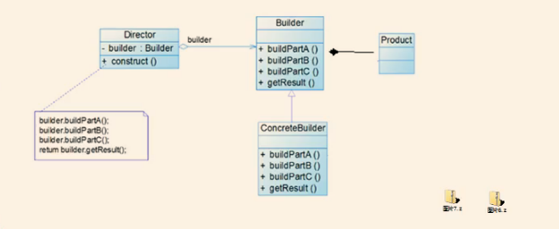

//案例背景 盖房子

传统方式：

.//code

优缺点：

1）优点是比较好理解，简单易操作

2）设计的程序结构，过于简单，没有设计缓存层对象，程序的扩展和维护不好。也就是说这种以计方案，把产品声：房子）和创建产品的过程即：建房子流程）封装在一起，耦合性增强

3）解决方案：将产品和产品建造过程解耦=>建造者模式。

建造者模式

可以将复杂对象的创造过程抽象出来，使这个抽象过程的不同实现方式可以构造出不同表现

通过一步一步创建一个复杂的对象，不需要知道具体的构建细节

建造者模式的角色

Product 具体的一个产品对象

Builder 抽象建造者 接口/抽象类

ConcreateBuilder 具体建造者：实现接口，构建和装配各种配件

Director 指挥者：使用Builder接口的对象去创建一个复杂的对象，作用：隔离客户与对象的生产过程；负责控制产品对象的生产过程

// 建造者的使用在jdk中

**StringBuilder使用了建造者模式**

String Builder的原码碎片

小结

建造者模式的注意事项和细节

1）客户端（使用程序不必知道产品内部组成的细节，将产品本身产品的创建过程解耦，便得相同的创建过程可以创建不同的产品对象

2）每一个具体建造者都相对独立，而与其他的且体建造者无关，因此可以很方便地替换具体建造者或增加新的具体建造者，用户使用不同的具体建造者即可得到不同的产品对象

3）可以更加精细地控制产品的创建过程。将复杂产品的创建步骤分解在不同的方法中，使得创建过程更加清晰，也更方便使用程序来控制创建过程

4）增加新的具体建造者无须修改原有类库的代码，指挥者类针对抽象建造者类编程系统扩展方便，符合“开闭原则

5建造者模式所创建的产品一般具有较多的共同点，其组成部分相似，如果产品之间的差异性很大，不适合使用建造者模式，因此其使用范围受到一定的限制

6如果产品的内部变化复杂，可能会导致需要定义很多具体建造者类来实现这种变化，导致系统变得很庞大，因此在这种情况下，要考虑是否选择建造者模式

7抽象工厂模式vs建造者模式

抽象工厂模式实现对产品家族的创建，一个产品家族是这样的一系列产品：具有不同分类维度的产品组合，采用抽象工厂模式不需要关心构建过程，只关心什么产品

由什么工厂生产即可。而建造者模式则是要求按照指定的蓝图建造产品，它的主要目的是通过组装零配件而产生一个新产品