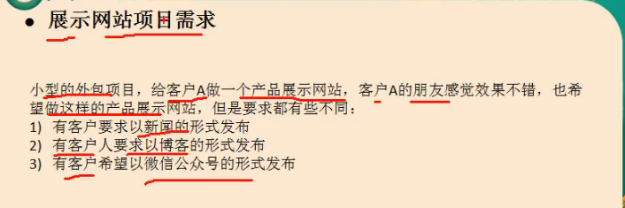
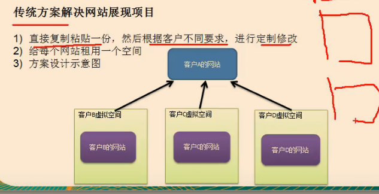
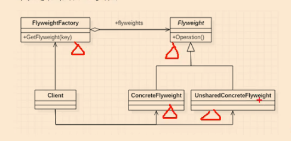
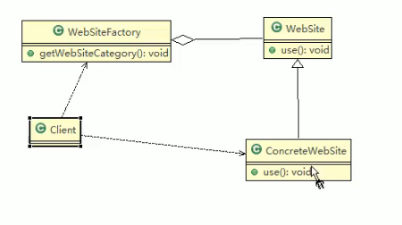

享元模式 flyweight pattern 也叫蝇量模式

享：共享，元：对象

//案例背景



传统的解决方案：



分析：

●传统方案解决网站展现项目-问题分析

传统方案解决网站展现项目-问题分析

1）需要的相似度很高，而且都不是高访问量网站，如果分成多个虚圳空间来

处理，相当于一个相同网站的实例对象很多，造成服务器的资源浪费

2）解决思路：整合到一个网站中，共享其相关的代码和数据，对于硬盘、内存、CPU

数据库空间等服务器资源都可以达成共享，诚少服务器资源

3）对于代码来说，由于是一份实例，维护和扩展都更加容易

4）上面的解决思路就可以使用享元模式来解决


String的底层就是享元模式

数据连接池也是一种享元模式

基本介绍

1）享元模式（ Flyweight Pattern）也叫蝇量谟式：运用共技术有效地支持大量细粒度的对象

2）常用于系统底层开发，解决系统的性能问题。像数据库连接池，里面都是创建好的连接对象，在这连接对象中有我们需要的则直接拿来用，避

免重新创建，如果没有我们需要的，则创建一个

3）享元模式能够解决重复对象的内存浪费的问题，当系统中有大量相似对象，需要缓冲池时。不需总是创建新对象，可以从缓冲池里拿。这样可以

降低系统内存，同时提高效率

4）享元模式经典的应用场景就是池技术了， String常量池、数据库连接池、缓冲池等等都是享元模式的应用，享元模式是池技术的重要实现方式


//模式角色




上图的flyweight是产品的抽象类，同时定义外部状态和内部状态的接口实现

UnsharedConcreteFlyweight不会出现在FlyweightFactory中

对原理图的说明-即（模式的角色及职责）

F】 wEight是抽象的享元角色，他是产品的抽象类，同时定义出对象的外部状态和内部状态（后面介绍）的接口或实现

2） Concrete ly Weight是具体的享元角色，是具体的产品类，实现抽象角色定义相关业务

3） Un SharedancreteFlyWeight是不可共享的角色

会出现在享元

4） FlyWeight Factory享元工厂类，用于构建一个池窨器（集合），同时提供从池中获取对象方法


内部状态和外部状态

比如围棋、五子棋、跳棋，它们都有大量的棋子对象，围棋和五子褀只有黑白两色，跳棋颜色多

点，所以棋子颜色就是棋子的内部状态；而各个棋子之间的差别就是位置的不同，当我们落子后，

落子颜色是定的，但位置是变化的，所以棋子坐标就是棋子的外部状态

1）享元模式提出了两个要求：细粒度和共享对象。这里就涉及到内部状态和外部状态了，即将对象的信慧分为两个部分：内部状态和外部状态

2）内部状态指对象共享出来的信息，存储在享元对象内部且不会随环境的改变而改变

3）外部状态指对象得以依赖的一个标记，是随环境改变而改变的、不可共享的状态。

4）举个例子：围棋理论土有361个空位可以放棋子，每盘棋都有可能有两三百个棋子对象产生，因为内存空间有限，一台服务器很难支持更多的玩家玩围棋游戏，如果用

享元模式来处理棋子，那么棋子对象就可以减少到只有两个实例，这样就很好的解决了对象的开销问题


//uml类图



//code


//在jdk中的Integer里面能用到享元模式

```java
    public static Integer valueOf(int i) {
        if (i >= IntegerCache.low && i <= IntegerCache.high)
            return IntegerCache.cache[i + (-IntegerCache.low)];
        return new Integer(i);
    }
```

小结：

享元模式的注意事项和细节

1）在享元模式这样理解，“享”就表示共享，“元”表示对象

2）系统中有大量对象，这些对象消耗大量内存，并且对象的状态大部分可以外部化时，

我们就可以考虑选用享元模式

3）用唯一标识码判断，如果在内存中有，则返回这个唯一标识码所标识的对象，用

HashMap/ hashTable存储

4）享元模式大大减少了对象的创建，降低了程序内存的占用，提高效率

5）享元模式提高了系统的复杂度。需要分离出内部状态和外部状态，而外部状态具有

固化特性，不应该随着内部状态的改变而改变，这是我们使用享元模式需要注意的

地方

6）使用享元模式时，注意划分内部状态和外部状态，并且需要有一个工厂类加以控制

7）享元模式经典的应用场景是需要缓冲池的场景，比如 String常量池、数据库连接池