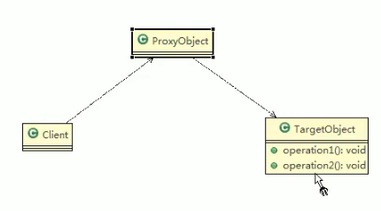
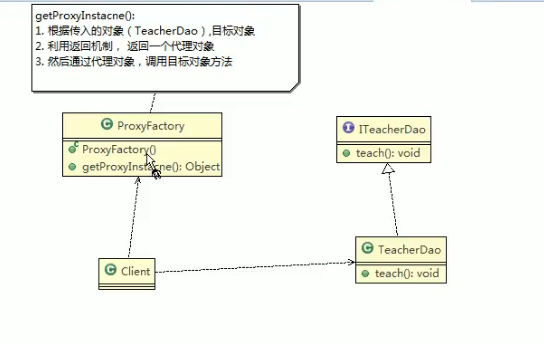
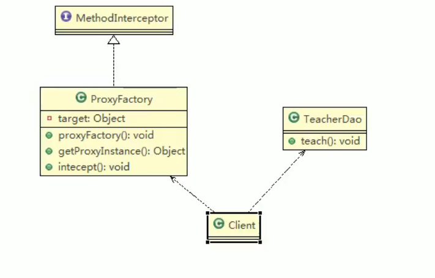

//代理模式特别重要！


代理模式的基本介绍

1）代理模式：为对象提供一个替身，以控个对象的访间。即通过代理对问目标对象这样做的好处是：可以在目标对家实现的基础上增强额外的功能操作即扩展目标对象的功能。

2）被代理的对象可以是远程对象、创建开销大的对象或需要安全控制的对象

3）代理模式有不同的形式，主要有三种静态代理、动态代理（jdk代理，接口代理）和cglib代理（不需要实现接口）


简单的UML

TargetObject，目标对象，也叫被代理对象



# 静态代理

静态代码模式的基本介绍

静态代理在使用时需要定义接口或者父类被代理对象（即目标对象）与代理对象一起实现相同的接口或者是继承相同父类


应用实例

具体要求

1）定义一个接口：eacherDao

2）目标对象 eacherdao实现接口 eacherdao

3）使用静态代理方式就需要在代理对象 Teacher DAOProxy中也实现 eacherDAo

4）调用的时候通过调用代理对象的方法来调用目标对象

5）特别提醒：代理对象与目标对象要实现相同的接口，然后通过调用相同的方法来调用目标对象的方法。


//简答的uml图


//code


静态代理优缺点

1）优点：在不修改目标对象的功能前提下，能通过代理对众对目标功能扩展

2）缺点：因为代理对象需要与目标对象实现一样的接口所以会有很多代理类

3）一旦接囗增加方法目标对象与代理对象都要维护


# 动态代理

动态代理

动态代理模式的基本介绍

1）代理对象不需要实现接口，但是目标对象要实现接口，否则不能用动态代理

2）代理对象的生成，是利用JDK的API，动态的在内存中构建代理对象

3）动态代理也叫做：JDK代理、接口代理

JDK中生成代理对象的API

1）代理类所在包 ：java.lang.reflect.Proxy

2）JDK实现代理只需要使用 newProxyInstance方法，但是该方法需要接收三个参数完整的写法是

```
public static Object newProxyInstance(ClassLoader loader,Class<?>[] interfaces,InvocationHandler h)
```


简单的UML




# cglib代理

最重要的区别：目标对象不需要实现接口，或继承父类

cgib代理模式的基本介绍

1）静态代理和DK代理模式都要求目标对象是实现一个接口但是有时候目标对象只是一个单独的对家，并没有实现任何的接口，这个时候可使用目标对象子类来实现

代理这就是Cgib代理

2）cgib代理也叫作子类代理，它是在内存中构建一个子类对象从而实现对目标对象功能扩展，有些书也将cgb代理归属到动态代理

3）Cg|b是一个强大的高性能的代码生成包，它可以在运行期扩展jav类与实现java接口。它广泛的被许多AOP的框架使用例如 Spring AOP，实现方法拦截

4）在AOP编程中如何选择代理模式

1.目标对象需要实现接口，用JDK代理

2.目标对象不需要实现接口，用Cgib代理

5）需要导入cglib 包 。Cgib包的底层是通过使用字节码处理框架ASM来转换字节码并生成新的类


注意点：

2）在内存中动态构建子类，注意代理的类不能为fnal，否则报错java.lang.IllegalArgumentException

3）目标对象的方法如果为 final/static，那么就不会被拦截即不会执行目标对象额外的业务方法


//简单的UML图

目标对象并没有实现接口 ，， 在intercept中实现对目标对象的调用



//code


//返回一个代理对象:是 target对象的代理对象

public object getProxyInstance ()(

/11.创建一个工具类

Enhancerenhancer new Enhancer (;

//2.设置父类

enhancer. setSuperclass(target getclass o);

//3.设置回调函数I

enhancer. setCallback(this);

//4.创建子类对象,即代理对象

return enhancer. create


重写cglib包中的xxxx类的intercept方法


# 代理模式( Proxy)的变体

几种常见的代理模式介绍一几种变体

1)防火墙代理

网通过代理穿透防火墙,实现对公网的访问

2)缓存代理

比如:当请求图片文件等资源时,先到缓存代理取,如果取到资源则ok如果取不到资源再到公网或者数据库取,然后缓存

3)远程代理 

远程对象的本地代表,通过它可以把远程对象当本地对象来调用.远程代理通过网络和真正的远程对象沟通信息

4)同步代理:主要使用在多线程编程中,完成多线程间同步工作