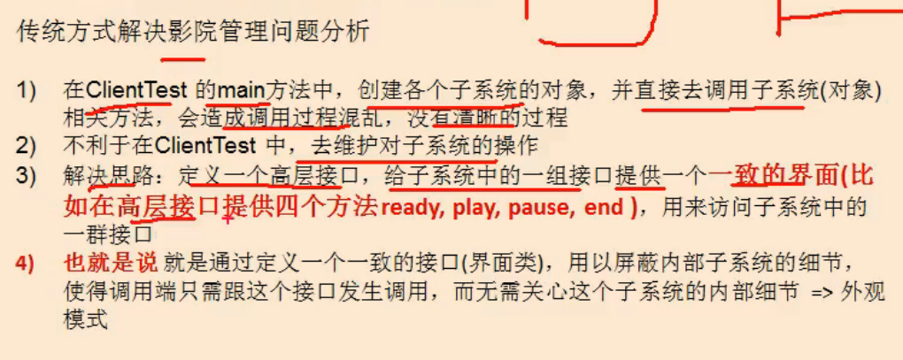
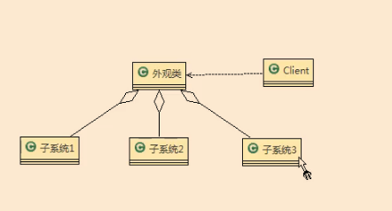
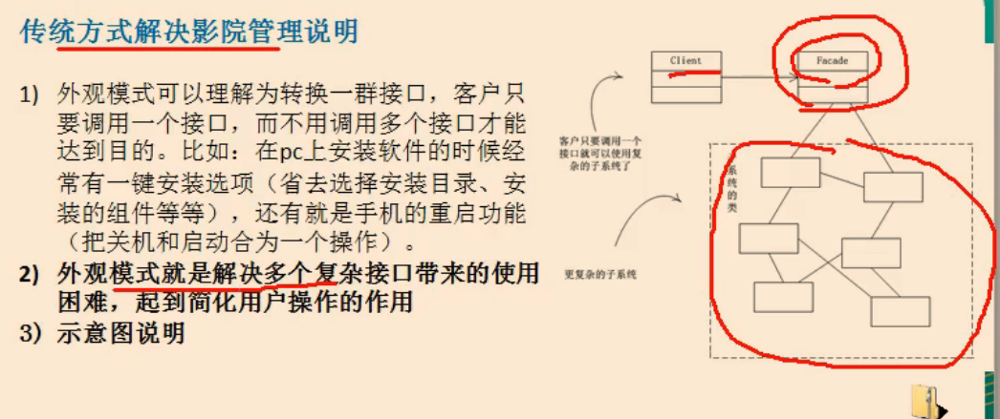

//案例背景 家庭影院

DVD播放器，投影仪。自动屏幕。。。。有很多个遥控器

使用的时候就需要开多个系统

传统方式解决影院管理问题分析

1）在 ClientTest的main方法中，创建各个子系统的对象，并直接去调用子系统（对象）

相关方法，会造成调用过程混乱，没有清晰的过程

2）不利于在 Client Test中，去维护对子系统的操作

3）解决思路：定义一个高层接口，给子系统中的一组接口提供一个一致的界面（比

如在高层接口提供四个方法 ready, play, pause,end），用来访问子系统中的

群接口

4）也就是说就是通过定义一个一致的接口（界面类），用以屏蔽内部子系统的细节，

使得调用端只需跟这个接口发生调用，而无需关心这个子系统的内部细节=>外观

模式

facade 外观模式 也叫过程模式

1）外观模式（ Facade ，美 /fəˈsɑːd/ 发音：佛撒的），外观模式为子系统中的一组接口提供一个一致的界面，此模式定

一个高层接口，这个接口使得这一子系统更加容易使用

2）外观模式通过定义一个一致的接口，用以屏蔽内部子系统的细节，使得调用端只需跟这个接口发生调用，而无需关心这个子系统的内部细节

感觉像是做一个 前端控制台，该控制台调用各种设备的使用。 而用户只需要在前端控制台上进行操作。

角色类图

外观类：Facade 为调用提供统一调用接口，该类知道子系统的各个功能。

调用者就是Client

//图

//code

mybastis 有用到外观模式。自己看着办。有时间就去看看

小结外观模式：

外观模式的注意事项和细节

1）外观模式对外屝了子系统的细节2因此外观模式降低了客户端对子系统使用的复

2）外观模式对客户端与子系统的耦合关系，让子系统内部的模块更易维护和扩展

3）通过合理的使用外观模式，可以帮我们更好的划分访问的层次

4）当系统需要进行分层设计时，可以考虑使用 Facade模式

5）在维护一个遗留的大型系统时，可能这个系统已经变得非常难以维护和扩展，此时可以考虑为新系统开发一个 Facade类，来提供遗留系统的比较清晰简单的接口，让新系统与 Facade类交互，提高复用性

6}不能过多的或者不合理的使用外观模式，使用外观模式好，还是直接调用模块好要以让系统有层次，利于维护为目的。