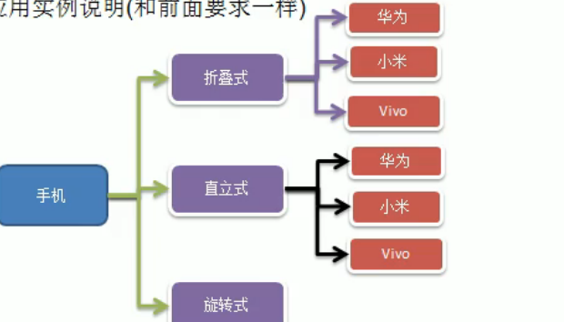
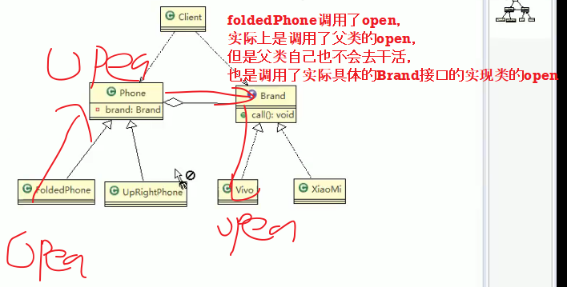

桥接模式

传统方式：扩展性，产生类爆炸

基本介绍

1）桥接模式（ Bridge模式）是指：将实现行抽象放在两个不同的类层次中，使两个层次可以独立改变

2）是一种结构型设计模式

3） Bridge模式基于类的最小设计原则，通过使用封装、聚合及继承等行为让不同的类承担不同的职责。它的主要特点是把抽象（ Abstraction）与行为实现

（ implementation）分离开来，从而可以保持各部分的独立性以及应对他们的功能扩展

//案例背景：使用手机操作的形式 

//code

//JDBC使用了桥接模式，有兴趣自己看下源码怎么写的

桥接模式的注意事项和细节

1）实现了抽象和实现部分的分离，从而极大的提供了系统的灵活性，让抽象部分和实

现部分独立开来，这有助于系统进行分层设计，从而产生更好的结构化系统。

2）对于系统的高层部分，只需要知道抽象部分和实现部分的接口就可以了，其它的部

分由具体业务来完成

3）桥接模式替代多层继承方案，可以减少子类的个数，降低系统的管理和维护成本。

4）桥接模式的引入增加了系统的理解和设计难度，由于聚合关联关系建立在抽象层，

要求开发者针对抽象进行设计和编程

桥接模式要求正确识别出系统中两个独立变化的维度，因此其使用范围有一定的局

限性，即需要有这样的应用场景。

●桥接模式其它应用场景

桥接模式其它应用场景

1）对于那些不希望使用继承或因为多层次继承导致系统类的个数急剧增加的系统，桥

接模式尤为适用

2）常见的应用场景

JDBC驱动程序

银行转账系统

转账分类：网上转账，柜台转账，AM转账

转账用户类型：普通用户，银卡用户，金卡用

消息类型：即时消息，延时消息

消息分类：

信，邮件消息，QQ消息